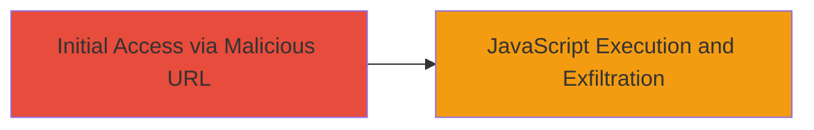

# Reflected XSS Exploitation in DoD Web Application Parameter

Multi-stage attack chain demonstrating a complete attack workflow.

## Chain Metrics Dashboard

| Metric | Value |
|--------|-------|
| Chain Status | Unverified |
| Total Steps | 1 |
| Execution Time | ~1 minutes |
| Skill Level | Intermediate |
| Complexity | Medium |
| Impact Level | High |

## Attack Flow Visualization



## Prerequisites & Requirements

### Required Tools

- Web browser (e.g., Chrome, Firefox)

### Target Environment

- Web application hosted by U.S. Department of Defense
- Vulnerable parameter in a search or input field
- No specific ports or services beyond standard HTTP/HTTPS

### Initial Access Requirements

- Ability to send victim a link to the malicious URL (e.g., via phishing)
- Victim must visit the URL in their browser
- No prior credentials or network access needed

## Detailed Attack Procedures

### Step 1: Inject Payload into Vulnerable Parameter

procedure: [[procedures/Injecting-JavaScript-Payload-for-Reflected-XSS]]

**Objective**: Deliver a reflected XSS payload via a URL parameter to execute JavaScript in the victim's browser, enabling cookie exfiltration, SOAP/CORS bypass, and arbitrary code execution.

**Instructions**: Craft a URL with the encoded JavaScript payload injected into the vulnerable parameter. Use a web browser to navigate to the URL, simulating how a victim would trigger the exploit. The payload uses an autofocus event to trigger the alert immediately upon page load.

Example URL construction (with redacted parts):

```url
https://████?███████=%22onfocus%3d%22alert(document.domain)%22autofocus%3d%22&█████████████████=Search
```

- Replace placeholders with actual values if known.
- The payload decodes to: `"onfocus="alert(document.domain)"autofocus="`
- This injects an onfocus handler that executes `alert(document.domain)` when the autofocus attribute triggers it.

For testing in a controlled environment, use a browser's developer tools to inspect the response and confirm script execution.

**Expected Output**: Upon visiting the URL, an alert box displays the document domain (e.g., the target's domain), confirming JavaScript execution. In a real attack, this could be replaced with code to exfiltrate cookies via a beacon to an attacker-controlled server.

**Success Indicators**:
- Alert box pops up showing the domain
- Browser console logs show script execution
- Network requests (if modified payload) send data to attacker server

## Attack Chain Summary

### Key Achievements

1. Successful injection and reflection of JavaScript payload without sanitization
2. Execution of arbitrary code in victim's browser context
3. Potential for data exfiltration and bypass of security restrictions like SOAP and CORS

## Technique & Tactic Coverage

### MITRE ATT&CK Techniques

- [[JavaScript]]

### MITRE ATT&CK Tactics

- [[Execution]]

---
*Last updated: 2023-10-01T00:00:00Z*
