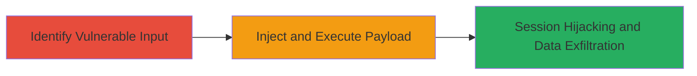

---
tags:
  - xss
  - reflected-xss
  - cve-2020-3580
  - dod
  - webapp
  - session-hijacking
type: attack_chain
tools: []
tactics:
  - '[[Execution]]'
  - '[[Credential Access]]'
verified: false
platforms:
  - Web
submitted: true
complexity: medium
created_at: '2024-10-01T00:00:00Z'
procedures:
  - '[[procedures/Identify-and-Exploit-Reflected-XSS-Vulnerability]]'
step_count: 2
techniques:
  - '[[JavaScript]]'
  - '[[Steal Web Session Cookie]]'
updated_at: '2025-12-13T23:52:39.318Z'
description: >-
  A multi-step attack chain exploiting a reflected XSS vulnerability in a U.S.
  Department of Defense web application to inject and execute malicious
  JavaScript, enabling session hijacking via cookie theft.
skill_level: intermediate
impact_level: high
id: 69f7b112-0902-4995-8158-00466472193f
validated: true
mitre_tactics:
  - '[[Execution]]'
  - '[[Credential Access]]'
mitre_techniques:
  - '[[JavaScript]]'
  - '[[Steal Web Session Cookie]]'
---
# Reflected XSS Exploitation in DoD Web Application for Session Hijacking (CVE-2020-3580)

Multi-stage attack chain demonstrating a complete attack workflow exploiting CVE-2020-3580 in a U.S. Department of Defense web application.

## Chain Metrics Dashboard

| Metric | Value |
|--------|-------|
| Chain Status | Unverified |
| Total Steps | 2 |
| Execution Time | ~5 minutes |
| Skill Level | Intermediate |
| Complexity | Medium |
| Impact Level | High |

## Attack Flow Visualization

## Prerequisites & Requirements

### Required Tools

- Web browser (e.g., Chrome with Developer Tools)
- Proxy tool like Burp Suite for payload crafting (optional but recommended)

### Target Environment

- Web application hosted on a DoD server (redacted as ███████)
- Accessible via standard HTTP/HTTPS
- Form submission endpoint vulnerable to reflected XSS

### Initial Access Requirements

- Public or authenticated access to the web application
- Ability to interact with user input fields (e.g., search or comment forms)
- No special credentials required for initial testing

## Detailed Attack Procedures

### Step 1: Identify Vulnerable Input Point
procedure: [[procedures/Identify-and-Exploit-Reflected-XSS-Vulnerability]]

**Objective**: Locate an input field in the web application that reflects user input without sanitization, allowing XSS payload injection.

**Instructions**: Access the web application and inspect form fields or search parameters using browser developer tools. Submit test inputs like `` to check for reflection in the response. If the script executes (e.g., alert pops up), the endpoint is vulnerable.

**Expected Output**: JavaScript alert or reflected payload visible in the browser, confirming lack of sanitization.

**Success Indicators**:
- Payload reflects and executes without encoding
- No server-side filtering observed

### Step 2: Submit XSS Payload to Exploit
procedure: [[procedures/Identify-and-Exploit-Reflected-XSS-Vulnerability]]

**Objective**: Inject a malicious JavaScript payload via the vulnerable form to steal cookies, forge requests, or prompt malware downloads.

**Instructions**: Craft a payload such as `` and submit it through the form. When a victim interacts with the reflected page (e.g., via phishing link), the script executes in their browser.

**Expected Output**: Attacker server receives stolen cookies or victim browser performs unintended actions like downloading malware.

**Success Indicators**:
- Cookies transmitted to attacker-controlled server
- Arbitrary requests forged from victim's session
- Potential defacement or malware prompt observed

## Attack Chain Summary

### Key Achievements

1. Identified unsanitized input reflection in DoD web app form
2. Successfully injected and executed JavaScript payload for cookie theft
3. Enabled session hijacking, request forgery, and potential malware distribution

## Technique & Tactic Coverage

### MITRE ATT&CK Techniques

- [[JavaScript]]
- [[Steal Web Session Cookie]]

### MITRE ATT&CK Tactics

- [[Execution]]
- [[Credential Access]]

---
*Last updated: 2024-10-01T00:00:00Z*
