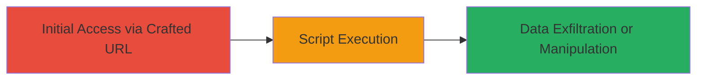

# Reflected XSS Exploitation in DoD Web Application via URL Parameter

Multi-stage attack chain demonstrating a complete attack workflow.

## Chain Metrics Dashboard

| Metric | Value |
|--------|-------|
| Chain Status | Unverified |
| Total Steps | 1 |
| Execution Time | ~1 minutes |
| Skill Level | Beginner |
| Complexity | Low |
| Impact Level | High |

## Attack Flow Visualization

## Prerequisites & Requirements

### Required Tools

- Web browser (e.g., Chrome, Firefox)

### Target Environment

- Web application hosted by U.S. Department of Defense
- Accessible public-facing endpoint with URL parameter vulnerability

### Initial Access Requirements

- No credentials required
- Direct network access to the target URL
- No prior access needed

## Detailed Attack Procedures

### Step 1: Inject Malicious Payload via URL Parameter
procedure: [[procedures/Exploit-Reflected-XSS-via-URL-Parameter]]

**Objective**: Deliver a crafted URL to a victim that triggers execution of injected JavaScript in their browser, potentially stealing session data or modifying page content.

**Instructions**: Construct a malicious URL by appending an encoded XSS payload to the vulnerable 'url' parameter in the target endpoint. For example, use the following payload which decodes to alert('XSS By OldMan'):

The full crafted URL is: `https://www.███████/███████?url=https://www.███████/%22%3Cscript%3Ealert(String.fromCharCode(88,%20115,%20115,%2032,%2066,%20121,%2032,%2079,%20108,%20100,%2077,%20111,%20104,%2097,%20109,%20109))%3C/script%3E`

Send this URL to the victim via email, social engineering, or a shortened link. When the victim clicks it and the page loads in their browser, the payload reflects back unsanitized, executing the JavaScript.

**Expected Output**: An alert box in the victim's browser displaying 'XSS By OldMan', confirming successful injection. In a real attack, this could be replaced with code to exfiltrate cookies.

**Success Indicators**:
- Alert box appears in browser
- Browser developer tools show injected script execution
- No server-side errors; page loads normally with payload reflected

## Attack Chain Summary

### Key Achievements

1. Successful injection and execution of arbitrary JavaScript in victim browsers
2. Potential access to session cookies and local storage for session hijacking
3. Ability to modify page content for phishing or social engineering attacks

## Technique & Tactic Coverage

### MITRE ATT&CK Techniques

- [[JavaScript]]

### MITRE ATT&CK Tactics

- [[Execution]]

---

*Last updated: 2023-10-01T00:00:00Z*
