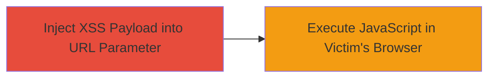

# Reflected XSS Exploitation in DoD Web Application via Unsanitized URL Parameter

Multi-stage attack chain demonstrating a complete attack workflow.

## Chain Metrics Dashboard

| Metric | Value |
|--------|-------|
| Chain Status | Unverified |
| Total Steps | 1 |
| Execution Time | ~1 minute |
| Skill Level | Novice |
| Complexity | Low |
| Impact Level | High |

## Attack Flow Visualization

## Prerequisites & Requirements

### Required Tools

- Web browser (e.g., Chrome, Firefox)

### Target Environment

- Web application hosted on .mil domain
- Accessible via HTTP/HTTPS
- No specific ports beyond standard 80/443

### Initial Access Requirements

- Ability to send malicious links to victims (e.g., via phishing)
- No prior credentials needed
- Network access to the public-facing DoD web application

## Detailed Attack Procedures

### Step 1: Inject and Execute XSS Payload
procedure: [[procedures/Inject-Reflected-XSS-Payload-via-URL-Parameter]]

**Objective**: Deliver a malicious URL to the victim that triggers execution of arbitrary JavaScript in their browser session, allowing data theft or session hijacking.

**Instructions**: Construct a URL with the target DoD web application endpoint and append the vulnerable parameter with an encoded JavaScript payload. For example, use the payload ';alert('XSS!')//' encoded as %27%3Balert(%27XSS!%27)%2F%2F. The full URL would be https://www.example.mil/search?q=%27%3Balert(%27XSS!%27)%2F%2F. Send this link to the victim via email, social engineering, or other means. When the victim clicks and loads the page, the payload is reflected unsanitized in the response, executing the JavaScript.

**Expected Output**: An alert box pops up in the victim's browser displaying 'XSS!', confirming execution. In a real attack, replace alert with code to steal cookies (e.g., document.cookie) or perform other actions.

**Success Indicators**:
- Alert box or equivalent JavaScript execution observed
- Browser console shows no errors and payload runs
- Victim's session cookies or data can be exfiltrated if payload is modified

## Attack Chain Summary

### Key Achievements

1. Successful injection of JavaScript payload via URL parameter
2. Arbitrary code execution in the context of the victim's authenticated session
3. Potential for session hijacking, data theft, or unauthorized actions on behalf of the user

## Technique & Tactic Coverage

### MITRE ATT&CK Techniques

- [[JavaScript]]

### MITRE ATT&CK Tactics

- [[Execution]]
- [[Collection]]

---
*Last updated: 2024-01-01T12:00:00Z*
