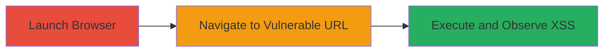

---
tags:
  - xss
  - reflected-xss
  - flash
  - swf
  - javascript
type: attack_chain
tools:
  - '[[tools/Firefox]]'
tactics:
  - '[[Initial Access]]'
  - '[[Execution]]'
  - '[[Collection]]'
verified: false
platforms:
  - Web
submitted: true
complexity: low
created_at: '2023-10-01T00:00:00Z'
procedures:
  - '[[procedures/Launch-Browser-for-XSS-Testing]]'
  - '[[procedures/Trigger-XSS-via-SWF-Parameter]]'
  - '[[procedures/Observe-JavaScript-Execution]]'
step_count: 3
techniques:
  - '[[Exploit Public-Facing Application]]'
  - '[[JavaScript]]'
updated_at: '2025-12-13T23:55:20.862Z'
description: >-
  A multi-step attack chain exploiting a reflected XSS vulnerability in a Flash
  SWF file via the 'playerready' parameter, allowing arbitrary JavaScript
  execution in the browser context.
skill_level: beginner
impact_level: low
id: a15eaefe-a6af-4b7d-99c7-05b3c527c1c7
validated: true
mitre_tactics:
  - '[[Initial Access]]'
  - '[[Execution]]'
  - '[[Collection]]'
mitre_techniques:
  - '[[Exploit Public-Facing Application]]'
  - '[[JavaScript]]'
---
# Reflected XSS Exploitation in Flash-Based JW Player SWF

Multi-stage attack chain demonstrating the exploitation of a reflected cross-site scripting (XSS) vulnerability in the JW Player SWF file hosted on www.grouplogic.com. The attack involves injecting JavaScript into the 'playerready' parameter, which executes in the browser context upon loading the SWF, potentially allowing attackers to steal session cookies or perform actions on behalf of the user. This vulnerability was reported via HackerOne and fixed by the vendor, rated as low severity due to its client-side nature and Flash deprecation.

## Chain Metrics Dashboard

| Metric | Value |
|--------|-------|
| Chain Status | Unverified |
| Total Steps | 3 |
| Execution Time | ~1 minute |
| Skill Level | Beginner |
| Complexity | Low |
| Impact Level | Low |

## Attack Flow Visualization

## Prerequisites & Requirements

### Required Tools

- [[tools/Firefox]]

### Target Environment

- Web platform with Flash support (note: Flash is deprecated, but relevant for historical context)
- No specific services or ports required beyond HTTP access to the target URL
- Publicly accessible website hosting the vulnerable SWF

### Initial Access Requirements

- No credentials needed
- Direct network access to http://www.grouplogic.com
- Browser with Flash plugin enabled (for reproduction)

## Detailed Attack Procedures

### Step 1: Launch Browser for XSS Testing
procedure: [[procedures/Launch-Browser-for-XSS-Testing]]

**Objective**: Prepare the testing environment by opening a web browser capable of rendering Flash content and executing JavaScript.

**Instructions**: Launch Firefox, ensuring Flash is enabled if testing in a legacy environment. This sets up the client-side context for loading the malicious SWF.

**Expected Output**: Firefox browser window opens, ready for navigation.

**Success Indicators**:
- Browser launches without errors
- Flash plugin is detected and enabled

### Step 2: Navigate to Vulnerable URL
procedure: [[procedures/Trigger-XSS-via-SWF-Parameter]]

**Objective**: Access the SWF file with an injected JavaScript payload in the 'playerready' parameter to trigger the reflected XSS.

**Instructions**: In the browser address bar, enter the URL `http://www.grouplogic.com/jwplayer/player.swf?playerready=alert(document.domain)`. This injects the JavaScript payload directly into the parameter, which the SWF processes without sanitization.

**Expected Output**: The SWF loads, and the JavaScript executes immediately upon rendering.

**Success Indicators**:
- SWF file loads in the browser
- No blocking errors from Flash or browser security

### Step 3: Observe JavaScript Execution
procedure: [[procedures/Observe-JavaScript-Execution]]

**Objective**: Verify the XSS by observing the execution of the injected script, confirming arbitrary code runs in the domain's context.

**Instructions**: Upon loading the URL, watch for the alert dialog to appear, displaying the document domain (e.g., www.grouplogic.com). This confirms the payload execution.

**Expected Output**: Alert box pops up showing the domain name.

**Success Indicators**:
- JavaScript alert triggers
- Domain name is displayed, indicating context execution

## Attack Chain Summary

### Key Achievements

1. Successful injection and execution of arbitrary JavaScript via Flash parameter
2. Demonstration of reflected XSS in a legacy SWF file
3. Potential for session cookie theft or user impersonation in affected browsers

## Technique & Tactic Coverage

### MITRE ATT&CK Techniques

- [[Exploit Public-Facing Application]] Exploit Public-Facing Application
- [[JavaScript]] JavaScript

### MITRE ATT&CK Tactics

- [[Initial Access]] Initial Access
- [[Execution]] Execution
- [[Collection]] Collection

---

*Last updated: 2023-10-01T00:00:00Z*
