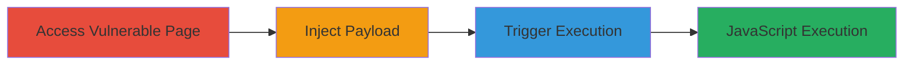

---
tags:
  - xss
  - reflected-xss
  - javascript-execution
  - glassdoor
  - web-vulnerability
type: attack_chain
tools:
  - '[[tools/Safari]]'
  - '[[tools/Chrome]]'
  - '[[tools/Firefox]]'
tactics:
  - '[[Execution]]'
  - '[[Collection]]'
verified: false
platforms:
  - Web
submitted: true
complexity: low
created_at: '2024-10-01T00:00:00Z'
procedures:
  - '[[procedures/Access-Vulnerable-Glassdoor-FAQ-Page]]'
  - '[[procedures/Inject-XSS-Payload-into-URL-Path]]'
  - '[[procedures/Trigger-Reflected-XSS-via-Browser]]'
step_count: 3
techniques:
  - '[[Exploit Public-Facing Application]]'
  - '[[JavaScript]]'
updated_at: '2025-12-14T17:26:22.226Z'
description: >-
  A multi-step attack chain exploiting a reflected XSS vulnerability in the path
  parameter of Glassdoor's FAQ page to execute arbitrary JavaScript, enabling
  cookie theft or malicious redirects.
skill_level: beginner
impact_level: high
id: 66208df2-4b49-46f4-811e-00780c9604fa
validated: true
mitre_tactics:
  - '[[Execution]]'
  - '[[Collection]]'
mitre_techniques:
  - '[[Exploit Public-Facing Application]]'
  - '[[JavaScript]]'
---
# Reflected XSS Exploitation in Glassdoor FAQ URL Path for JavaScript Execution

Multi-stage attack chain demonstrating the exploitation of a reflected Cross-Site Scripting (XSS) vulnerability in the path parameter of Glassdoor's FAQ page. The attack involves navigating to the vulnerable page, injecting a malicious JavaScript payload into the URL path, and loading the modified URL in a browser to execute the payload, which can steal user cookies or redirect to attacker-controlled sites.

## Chain Metrics Dashboard

| Metric | Value |
|--------|-------|
| Chain Status | Unverified |
| Total Steps | 3 |
| Execution Time | ~2 minutes |
| Skill Level | Beginner |
| Complexity | Low |
| Impact Level | High |

## Attack Flow Visualization

## Prerequisites & Requirements

### Required Tools

- [[tools/Safari]]
- [[tools/Chrome]]
- [[tools/Firefox]]

### Target Environment

- Web platform
- Access to Glassdoor's public FAQ page
- No authentication required

### Initial Access Requirements

- Public internet access
- No credentials needed
- Victim must visit the crafted URL (e.g., via phishing)

## Detailed Attack Procedures

### Step 1: Access Vulnerable FAQ Page
procedure: [[procedures/Access-Vulnerable-Glassdoor-FAQ-Page]]

**Objective**: Navigate to the original vulnerable URL to confirm the base page structure and identify the path parameter for injection.

**Instructions**: Open a web browser and directly access the base URL of the Glassdoor FAQ page for Microsoft questions.

**Expected Output**: The FAQ page loads without errors, displaying content related to Microsoft interview questions.

**Success Indicators**:
- Page loads successfully
- URL path includes 'Microsoft-Question-FAQ200086-E1651.htm'

### Step 2: Inject XSS Payload into URL Path
procedure: [[procedures/Inject-XSS-Payload-into-URL-Path]]

**Objective**: Modify the URL path by inserting a URL-encoded JavaScript payload to bypass sanitization and prepare for reflection.

**Instructions**: Manually edit the URL in the browser's address bar or construct it externally. Insert the encoded payload `%22%3e%3cimg%20onerro%3d%3e%3cimg%20src%3dx%20onerror%3dalert%601%60%3e` after 'Mic' in 'Microsoft'.

**Expected Output**: A modified URL ready for loading, such as `https://www.glassdoor.co.in/FAQ/Mic%22%3e%3cimg%20onerro%3d%3e%3cimg%20src%3dx%20onerror%3dalert%601%60%3erosoft-Question-FAQ200086-E1651.htm?countryRedirect=true`.

**Success Indicators**:
- Payload correctly URL-encoded and inserted
- No syntax errors in the constructed URL

### Step 3: Trigger Reflected XSS via Browser
procedure: [[procedures/Trigger-Reflected-XSS-via-Browser]]

**Objective**: Load the tampered URL to reflect the payload in the page content, executing the JavaScript and demonstrating the vulnerability.

**Instructions**: Paste the modified URL into the browser and press enter to load the page. The payload should execute automatically upon rendering.

**Expected Output**: An alert box pops up displaying '1', confirming JavaScript execution. The page may show malformed content due to the injection.

**Success Indicators**:
- JavaScript alert triggers
- Browser console shows no blocking errors
- Potential for further payloads to steal cookies or redirect

## Attack Chain Summary

### Key Achievements

1. Successful identification and access of the vulnerable FAQ page path parameter.
2. Injection of a reflected XSS payload without server-side sanitization.
3. Execution of arbitrary JavaScript in the victim's browser context.

## Technique & Tactic Coverage

### MITRE ATT&CK Techniques

- [[Exploit Public-Facing Application]]
- [[JavaScript]]

### MITRE ATT&CK Tactics

- [[Execution]]
- [[Collection]]

---
*Last updated: 2024-10-01T00:00:00Z*
