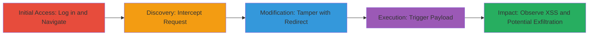

---
tags:
  - xss
  - reflected-xss
  - imgur
  - javascript
  - session-hijacking
type: attack_chain
tools: []
tactics:
  - '[[Initial Access]]'
  - '[[Execution]]'
  - '[[Collection]]'
verified: false
platforms:
  - Web
submitted: true
complexity: medium
created_at: '2023-10-01T00:00:00Z'
procedures:
  - '[[procedures/Access-Imgur-Profile-and-Intercept-Request]]'
  - '[[procedures/Extract-and-Modify-Redirect-URL]]'
  - '[[procedures/Execute-XSS-Payload-and-Verify]]'
step_count: 6
techniques:
  - '[[JavaScript]]'
updated_at: '2025-12-14T03:46:38.115Z'
description: >-
  A multi-step attack chain exploiting a reflected XSS vulnerability in the
  Imgur emerald gifting feature's redirect parameter to execute arbitrary
  JavaScript and potentially steal session cookies.
skill_level: intermediate
impact_level: high
id: 56daf961-7597-4ea5-bf3a-75d754f42aad
validated: true
mitre_tactics:
  - '[[Initial Access]]'
  - '[[Execution]]'
  - '[[Collection]]'
mitre_techniques:
  - '[[JavaScript]]'
---
# Reflected XSS Exploitation in Imgur Emerald Gifting Redirect Parameter

Multi-stage attack chain demonstrating a complete reflected XSS workflow on Imgur's emerald gifting feature, allowing arbitrary JavaScript execution to steal session cookies or perform client-side attacks on authenticated users.

## Chain Metrics Dashboard

| Metric | Value |
|--------|-------|
| Chain Status | Unverified |
| Total Steps | 6 |
| Execution Time | ~5 minutes |
| Skill Level | Intermediate |
| Complexity | Medium |
| Impact Level | High |

## Attack Flow Visualization

## Prerequisites & Requirements

### Required Tools

- Web browser (e.g., Chrome or Firefox)
- Proxy tool for request interception (e.g., Burp Suite or browser dev tools)

### Target Environment

- Imgur web platform
- Authenticated Imgur account
- Access to another user's profile

### Initial Access Requirements

- Valid Imgur credentials for login
- Network access to imgur.com and api.imgur.com
- No prior elevated access needed; standard user account suffices

## Detailed Attack Procedures

### Step 1: Log in to Imgur Account and Navigate to User's Profile
procedure: [[procedures/Access-Imgur-Profile-and-Intercept-Request]]

**Objective**: Gain initial access to the target profile to initiate the emerald gifting flow.

**Instructions**: Open a web browser and log in to your Imgur account. Then, navigate to the target user's profile page.

**Expected Output**: Successful login and profile page load at https://imgur.com/user/[username].

**Success Indicators**:
- Profile page displays without errors
- User is authenticated (visible in account menu)

### Step 2: Intercept the Request When Clicking 'Give Emerald'
procedure: [[procedures/Access-Imgur-Profile-and-Intercept-Request]]

**Objective**: Capture the POST request to the gifting API to identify the vulnerable redirect parameter.

**Instructions**: On the profile page, locate and click the 'Give Emerald' button. Use a proxy tool or browser developer tools to intercept the outgoing POST request to the API endpoint.

**Expected Output**: Intercepted POST request to https://api.imgur.com/account/v1/gifting/purchase?client_id=546c25a59c58ad7 with JSON body containing 'redirect_url'.

**Success Indicators**:
- Request intercepted successfully
- JSON payload visible in proxy tool

### Step 3: Notice and Extract the 'redirect_url' from the Request Body
procedure: [[procedures/Extract-and-Modify-Redirect-URL]]

**Objective**: Identify the unsanitized 'redirect' parameter within the 'redirect_url' for modification.

**Instructions**: Inspect the JSON body of the intercepted request and extract the value of the 'redirect_url' field.

**Expected Output**: Extracted URL like 'https://imgur.com/emerald/give-emerald?username=hermawanferdi&redirect=https://imgur.com/user/hermawanferdi'.

**Success Indicators**:
- 'redirect_url' parameter located and copied
- Original redirect value noted

### Step 4: Modify the 'redirect' Parameter in the Extracted URL with XSS Payload
procedure: [[procedures/Extract-and-Modify-Redirect-URL]]

**Objective**: Inject a JavaScript payload into the 'redirect' parameter to exploit the reflection.

**Instructions**: Edit the extracted 'redirect_url' by replacing the 'redirect' value with a javascript: URI payload, such as 'javascript:alert(document.cookie)'.

**Expected Output**: Modified URL: 'https://imgur.com/emerald/give-emerald?username=hermawanferdi&redirect=javascript:alert(document.cookie)'.

**Success Indicators**:
- Payload successfully inserted into URL
- URL syntax validated (no parsing errors)

### Step 5: Open the Modified URL in the Browser
procedure: [[procedures/Execute-XSS-Payload-and-Verify]]

**Objective**: Trigger the reflected XSS by loading the tampered URL in the victim's browser context.

**Instructions**: Paste the modified URL into the browser's address bar and navigate to it while authenticated.

**Expected Output**: Page loads and immediately executes the JavaScript payload.

**Success Indicators**:
- No URL blocking or sanitization errors
- Payload execution begins

### Step 6: Observe the XSS Alert
procedure: [[procedures/Execute-XSS-Payload-and-Verify]]

**Objective**: Confirm the vulnerability by verifying arbitrary code execution and assess potential impact.

**Instructions**: Watch for the alert popup displaying document.cookie contents.

**Expected Output**: Alert box pops up showing session cookies.

**Success Indicators**:
- Alert executes without errors
- Cookie data visible, indicating successful theft potential

## Attack Chain Summary

### Key Achievements

1. Successful identification of reflected XSS in Imgur's redirect parameter
2. Execution of arbitrary JavaScript in authenticated user context
3. Demonstration of session cookie theft capability for account takeover

## Technique & Tactic Coverage

### MITRE ATT&CK Techniques

- [[JavaScript]]

### MITRE ATT&CK Tactics

- [[Initial Access]]
- [[Execution]]
- [[Collection]]

---
*Last updated: 2023-10-01T00:00:00Z*
