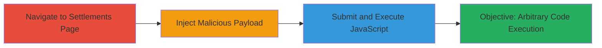

---
tags:
  - xss
  - reflected-xss
  - javascript
  - web-vulnerability
type: attack_chain
tools: []
tactics:
  - '[[Execution]]'
  - '[[Initial Access]]'
verified: false
platforms:
  - Web
submitted: true
complexity: low
created_at: '2025-12-14T03:15:30.660Z'
procedures:
  - '[[procedures/Navigate-to-Merchant-Settlements-Page]]'
  - '[[procedures/Inject-Malicious-Payload-into-Search-Field]]'
  - '[[procedures/Submit-Search-and-Execute-Payload]]'
step_count: 3
techniques:
  - '[[JavaScript]]'
  - '[[Exploit Public-Facing Application]]'
updated_at: '2025-12-14T03:15:30.660Z'
description: >-
  A multi-step attack demonstrating the exploitation of a reflected XSS
  vulnerability in the search parameter of the Kartpay merchant settlements
  page, allowing arbitrary JavaScript execution in the victim's browser.
skill_level: beginner
impact_level: high
id: 7f794cfa-5e27-4e62-a350-d53364c90759
validated: true
mitre_tactics:
  - '[[Execution]]'
  - '[[Initial Access]]'
mitre_techniques:
  - '[[JavaScript]]'
  - '[[Exploit Public-Facing Application]]'
---
---

# Reflected XSS Exploitation in Kartpay Merchant Settlements Search Parameter

Multi-stage attack chain demonstrating a complete attack workflow for exploiting a reflected Cross-Site Scripting (XSS) vulnerability in the search functionality of the Kartpay merchant settlements page.

## Chain Metrics Dashboard

| Metric | Value |
|--------|-------|
| Chain Status | Unverified |
| Total Steps | 3 |
| Execution Time | ~2 minutes |
| Skill Level | Beginner |
| Complexity | Low |
| Impact Level | High |

## Attack Flow Visualization

## Prerequisites & Requirements

### Required Tools

- Web browser (e.g., Chrome, Firefox)

### Target Environment

- Web platform
- Access to https://merchant.kartpay.com/settlements
- No special services or ports required beyond standard HTTPS (443)

### Initial Access Requirements

- Valid network access to the internet
- No credentials required for public-facing page
- Attacker positioned as a legitimate user or via phishing/social engineering to lure victim

## Detailed Attack Procedures

### Step 1: Navigate to Settlements Page
procedure: [[procedures/Navigate-to-Merchant-Settlements-Page]]

**Objective**: Gain access to the vulnerable search interface on the merchant settlements page.

**Instructions**: Open a web browser and directly access the target URL to load the page containing the search field.

**Expected Output**: The settlements page loads, displaying a search input field for filtering settlements.

**Success Indicators**:
- Page loads without errors
- Search input field is visible and interactive

### Step 2: Inject Malicious Payload into Search Field
procedure: [[procedures/Inject-Malicious-Payload-into-Search-Field]]

**Objective**: Introduce unsanitized user input containing JavaScript code into the search parameter.

**Instructions**: Locate the search input field on the page and manually enter the payload to test for reflection.

**Expected Output**: The payload is accepted into the input field without immediate rejection or sanitization.

**Success Indicators**:
- Payload entered successfully
- No client-side validation blocks the input

### Step 3: Submit Search and Execute Payload
procedure: [[procedures/Submit-Search-and-Execute-Payload]]

**Objective**: Trigger the reflection of the payload, resulting in JavaScript execution within the browser context.

**Instructions**: Submit the search form or trigger the query to observe the execution of the injected code.

**Expected Output**: An alert box pops up displaying the domain name, confirming JavaScript execution.

**Success Indicators**:
- JavaScript alert executes
- Arbitrary code runs in the victim's browser session

## Attack Chain Summary

### Key Achievements

1. Successful navigation to the vulnerable endpoint
2. Injection and reflection of malicious JavaScript payload
3. Achievement of arbitrary code execution, enabling potential session theft or account hijacking

## Technique & Tactic Coverage

### MITRE ATT&CK Techniques

- [[JavaScript]]
- [[Exploit Public-Facing Application]]

### MITRE ATT&CK Tactics

- [[Execution]]
- [[Initial Access]]

---

*Last updated: *
