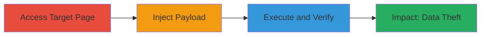

---
tags:
  - xss
  - reflected-xss
  - web-vulnerability
  - javascript-execution
type: attack_chain
tools:
  - '[[tools/Chrome]]'
  - '[[tools/Firefox]]'
  - '[[tools/OWASP-XSS-Reference]]'
tactics:
  - '[[Execution]]'
  - '[[Collection]]'
verified: false
platforms:
  - Web
submitted: true
complexity: low
created_at: '2023-10-01T00:00:00Z'
procedures:
  - '[[procedures/Access-Target-Webpage-for-XSS-Testing]]'
  - '[[procedures/Inject-XSS-Payload-in-Search-Input]]'
  - '[[procedures/Verify-XSS-Payload-Execution]]'
step_count: 3
techniques:
  - '[[JavaScript]]'
updated_at: '2025-12-13T23:55:20.491Z'
description: >-
  A multi-step attack chain demonstrating the exploitation of a reflected XSS
  vulnerability in the search functionality of the MTN Investor website,
  allowing JavaScript execution to steal cookies and enable session hijacking.
skill_level: beginner
impact_level: high
id: bbc100e1-71da-4640-9b84-741d3d0dffb3
validated: true
mitre_tactics:
  - '[[Execution]]'
  - '[[Collection]]'
mitre_techniques:
  - '[[JavaScript]]'
---
# Reflected XSS Exploitation in MTN Investor Search Functionality

Multi-stage attack chain demonstrating a complete attack workflow for exploiting a reflected cross-site scripting (XSS) vulnerability in the search functionality of the MTN Investor website.

## Chain Metrics Dashboard

| Metric | Value |
|--------|-------|
| Chain Status | Unverified |
| Total Steps | 3 |
| Execution Time | ~2 minutes |
| Skill Level | Beginner |
| Complexity | Low |
| Impact Level | High |

## Attack Flow Visualization

## Prerequisites & Requirements

### Required Tools

- [[tools/Chrome]]
- [[tools/Firefox]]
- [[tools/OWASP-XSS-Reference]]

### Target Environment

- Web platform
- PHP-based web application
- Access to public-facing search functionality at https://mtn-investor.com

### Initial Access Requirements

- Internet access
- No credentials required (public website)
- Browser with JavaScript enabled

## Detailed Attack Procedures

### Step 1: Access Target Webpage
procedure: [[procedures/Access-Target-Webpage-for-XSS-Testing]]

**Objective**: Navigate to the vulnerable search page to prepare for payload injection.

**Instructions**: Open a web browser and load the target URL. This establishes the initial access point for testing the search functionality.

**Expected Output**: The MTN Investor homepage or search interface loads successfully.

**Success Indicators**:
- Page loads without errors
- Search input field is visible

### Step 2: Inject XSS Payload in Search Input
procedure: [[procedures/Inject-XSS-Payload-in-Search-Input]]

**Objective**: Submit a malicious JavaScript payload through the search parameter to test for reflection.

**Instructions**: Locate the search input field and enter the payload `'-alert(1)-'`. Submit the search to trigger reflection in the response.

**Expected Output**: The search results page reflects the payload in the URL or page content, such as in the `zoom_query` parameter.

**Success Indicators**:
- Payload appears in the page source or URL
- No immediate sanitization errors

### Step 3: Verify XSS Payload Execution
procedure: [[procedures/Verify-XSS-Payload-Execution]]

**Objective**: Confirm that the reflected payload executes JavaScript in the victim's browser context.

**Instructions**: Observe the page after submission. The payload should trigger an alert dialog box, indicating successful execution.

**Expected Output**: A JavaScript alert box pops up displaying '1'.

**Success Indicators**:
- Alert box appears in Chrome or Firefox
- JavaScript executes without blocking

## Attack Chain Summary

### Key Achievements

1. Successful navigation to the vulnerable endpoint
2. Injection and reflection of XSS payload without sanitization
3. Execution of JavaScript, enabling potential cookie theft and session hijacking

## Technique & Tactic Coverage

### MITRE ATT&CK Techniques

- [[JavaScript]]

### MITRE ATT&CK Tactics

- [[Execution]]
- [[Collection]]

---
*Last updated: 2023-10-01T00:00:00Z*
