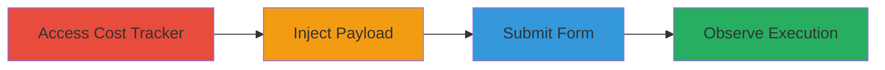

---
tags:
  - xss
  - reflected-xss
  - mainwp
  - wordpress
type: attack_chain
tools: []
tactics:
  - '[[Execution]]'
verified: false
platforms:
  - Web
  - WordPress
submitted: true
complexity: low
created_at: '2023-10-01T00:00:00Z'
procedures:
  - '[[procedures/Inject-and-Execute-XSS-Payload-in-MainWP-Notes-Field]]'
step_count: 4
techniques:
  - '[[JavaScript]]'
  - '[[Exploit Public-Facing Application]]'
updated_at: '2025-12-13T23:55:20.907Z'
description: >-
  A multi-step attack demonstrating the exploitation of a reflected XSS
  vulnerability in the MainWP Cost Tracker module's Notes field, allowing
  arbitrary JavaScript execution in the user's browser session.
skill_level: beginner
impact_level: medium
id: 288584ae-fb91-4bcf-900a-859baa3c4fa6
validated: true
mitre_tactics:
  - '[[Execution]]'
mitre_techniques:
  - '[[JavaScript]]'
  - '[[Exploit Public-Facing Application]]'
---
# Reflected XSS Exploitation in MainWP Cost Tracker Notes Field

Multi-stage attack chain demonstrating the exploitation of a reflected Cross-Site Scripting (XSS) vulnerability in MainWP version 5.4.0.11's Cost Tracker module. The attack involves injecting a malicious JavaScript payload into the Notes field, which is reflected and executed upon form submission without proper sanitization, leading to client-side code execution in the attacker's browser session. This can be used to demonstrate risks such as session hijacking or further reconnaissance, though it does not persist across sessions.

## Chain Metrics Dashboard

| Metric | Value |
|--------|-------|
| Chain Status | Unverified |
| Total Steps | 4 |
| Execution Time | ~2 minutes |
| Skill Level | Beginner |
| Complexity | Low |
| Impact Level | Medium |

## Attack Flow Visualization

## Prerequisites & Requirements

### Required Tools

- Web browser (e.g., Chrome Developer Tools for payload testing)

### Target Environment

- MainWP dashboard version 5.4.0.11 or vulnerable equivalent
- WordPress-based platform with Cost Tracker module enabled
- No specific ports required; access via standard HTTP/HTTPS (e.g., port 80/443)

### Initial Access Requirements

- Authenticated access to the MainWP client management panel (admin credentials)
- Direct network access to the target WordPress instance
- No prior compromise needed; assumes legitimate user session

## Detailed Attack Procedures

### Step 1: Access the Cost Tracker Module
procedure: [[procedures/Inject-and-Execute-XSS-Payload-in-MainWP-Notes-Field]]

**Objective**: Gain entry to the vulnerable input area to prepare for payload injection.

**Instructions**: Log in to the MainWP dashboard and navigate to the Cost Tracker section in the client management panel. Select an option to add a new cost entry or edit an existing one, focusing on the form with the Notes input field.

**Expected Output**: The form interface loads, displaying the Notes textarea ready for input.

**Success Indicators**:
- Cost Tracker module accessible
- Notes field visible and editable

### Step 2: Inject Malicious Payload into Notes Field
procedure: [[procedures/Inject-and-Execute-XSS-Payload-in-MainWP-Notes-Field]]

**Objective**: Introduce arbitrary JavaScript code that will be reflected upon submission.

**Instructions**: In the Notes field, enter a basic XSS payload such as ``. Ensure the payload is not escaped and targets JavaScript execution.

**Expected Output**: The payload is accepted without validation errors.

**Success Indicators**:
- Payload entered successfully
- No immediate sanitization blocking the input

### Step 3: Save the Cost Entry
procedure: [[procedures/Inject-and-Execute-XSS-Payload-in-MainWP-Notes-Field]]

**Objective**: Trigger the reflection of the unsanitized input in the HTML response.

**Instructions**: Submit the form by clicking the save or update button. The server processes the input and reflects it back in the response without proper encoding.

**Expected Output**: Form submission succeeds, and the page reloads with the reflected payload embedded in the HTML.

**Success Indicators**:
- Form saves without errors
- Page response contains the raw payload

### Step 4: Observe Payload Execution
procedure: [[procedures/Inject-and-Execute-XSS-Payload-in-MainWP-Notes-Field]]

**Objective**: Confirm the vulnerability by verifying JavaScript execution in the browser.

**Instructions**: Upon page load after submission, monitor the browser console or visual alerts. The payload executes immediately in the current session.

**Expected Output**: An alert box or console log appears, indicating successful XSS execution (e.g., "XSS Executed" alert).

**Success Indicators**:
- JavaScript runs client-side
- No persistence, but immediate session impact confirmed

## Attack Chain Summary

### Key Achievements

1. Successful injection and reflection of XSS payload in a WordPress plugin
2. Demonstration of client-side execution risks without storage
3. Identification of sanitization gaps for potential chaining with other attacks

## Technique & Tactic Coverage

### MITRE ATT&CK Techniques

- [[JavaScript]]
- [[Exploit Public-Facing Application]]

### MITRE ATT&CK Tactics

- [[Execution]]

---
*Last updated: 2023-10-01T00:00:00Z*
