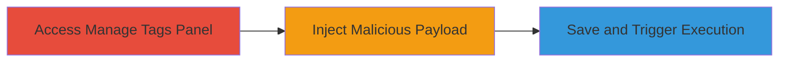

# Reflected XSS Exploitation in MainWP Manage Tags Notes Field

Multi-stage attack chain demonstrating a complete attack workflow exploiting a reflected XSS vulnerability in the MainWP WordPress plugin.

## Chain Metrics Dashboard

| Metric | Value |
|--------|-------|
| Chain Status | Unverified |
| Total Steps | 3 |
| Execution Time | ~2 minutes |
| Skill Level | Intermediate |
| Complexity | Medium |
| Impact Level | High |

## Attack Flow Visualization

## Prerequisites & Requirements

### Required Tools

- Web browser (e.g., Chrome with developer tools for payload testing)

### Target Environment

- WordPress site with MainWP plugin installed and configured for client management
- PHP-based web server hosting the WordPress instance
- Administrative access to the MainWP dashboard

### Initial Access Requirements

- Valid authenticated session as an admin user in the MainWP panel
- No special network access beyond standard HTTP/HTTPS to the WordPress admin interface
- Prior knowledge of the MainWP plugin's client management features

## Detailed Attack Procedures

### Step 1: Access Manage Tags Section

procedure: [[procedures/Exploit-Reflected-XSS-in-MainWP-Manage-Tags-Notes-Field]]

**Objective**: Gain access to the vulnerable Manage Tags module in the MainWP client management panel to prepare for payload injection.

**Instructions**: Log in to the MainWP dashboard with admin credentials, then navigate to the client management section and select the Manage Tags module. This positions the attacker at the interface where tags can be added or edited.

**Expected Output**: The Manage Tags interface loads, displaying options to add or edit tags, including the Notes input field.

**Success Indicators**:
- Admin dashboard accessible without errors
- Manage Tags section visible and interactive

### Step 2: Inject Malicious JavaScript Payload

procedure: [[procedures/Exploit-Reflected-XSS-in-MainWP-Manage-Tags-Notes-Field]]

**Objective**: Introduce an arbitrary JavaScript payload into the unsanitized Notes field to set up the reflected XSS execution.

**Instructions**: While adding a new tag or editing an existing one, locate the Notes input field and enter a malicious JavaScript payload, such as ``. This payload is not sanitized at input time.

**Expected Output**: The payload is accepted in the form without validation errors, ready for submission.

**Success Indicators**:
- Payload entered successfully in the Notes field
- No immediate client-side blocking or sanitization observed

### Step 3: Save Tag to Trigger Reflection and Execution

procedure: [[procedures/Exploit-Reflected-XSS-in-MainWP-Manage-Tags-Notes-Field]]

**Objective**: Submit the form to reflect the payload back in the HTML response, causing immediate JavaScript execution in the current browser session.

**Instructions**: Click the Save button to submit the tag details. The server reflects the unsanitized Notes content back into the page's HTML, executing the JavaScript payload.

**Expected Output**: The alert (or other payload effects) pops up immediately after saving, confirming execution. The vulnerability is reflected, not stored, so it affects only the current session.

**Success Indicators**:
- JavaScript payload executes (e.g., alert dialog appears)
- Page reloads with reflected content visible in source (use browser dev tools to inspect)

## Attack Chain Summary

### Key Achievements

1. Successful navigation to the vulnerable admin interface without detection
2. Injection and reflection of arbitrary JavaScript, demonstrating client-side code execution
3. Highlighting broader input validation flaws in the MainWP plugin, potentially aiding further reconnaissance

## Technique & Tactic Coverage

### MITRE ATT&CK Techniques

- [[Exploit Public-Facing Application]]
- [[JavaScript]]

### MITRE ATT&CK Tactics

- [[Initial Access]]
- [[Execution]]

---
*Last updated: 2023-10-01T00:00:00Z*
