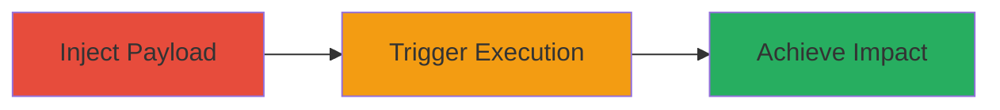

---
tags:
  - xss
  - reflected-xss
  - web-vulnerability
type: attack_chain
tools: []
tactics:
  - '[[Initial Access]]'
  - '[[Execution]]'
commands:
  - '[[commands/curl-send-malicious-message]]'
platforms:
  - Web
complexity: medium
procedures:
  - '[[procedures/Craft-and-Inject-XSS-Payload]]'
  - '[[procedures/Trigger-XSS-Execution]]'
step_count: 2
techniques:
  - '[[JavaScript]]'
description: >-
  Exploitation of a reflected XSS vulnerability in a web messaging service to
  execute arbitrary JavaScript in the victim's browser
skill_level: intermediate
impact_level: high
id: 804ad5b0-98ef-443c-a6d8-a0aad10eaad0
created_at: '2025-12-14T00:11:16.724Z'
updated_at: '2025-12-14T00:11:16.724Z'
verified: false
validated: true
submitted: true
mitre_tactics:
  - '[[Initial Access]]'
  - '[[Execution]]'
mitre_techniques:
  - '[[JavaScript]]'
---
# Reflected XSS Exploitation in Messaging Service

Multi-stage attack chain demonstrating the exploitation of a reflected XSS vulnerability in Bumble's messaging service, allowing arbitrary JavaScript execution in the victim's browser, potentially leading to session hijacking or data theft. The vulnerability stems from insufficient input sanitization in message handling.

## Chain Metrics Dashboard

| Metric | Value |
|--------|-------|
| Chain Status | Unverified |
| Total Steps | 2 |
| Execution Time | ~5 minutes |
| Skill Level | Intermediate |
| Complexity | Medium |
| Impact Level | High |

## Attack Flow Visualization



## Prerequisites & Requirements

### Required Tools

- None

### Target Environment

- Web-based messaging platform
- No specific ports required
- Network access to the messaging service

### Initial Access Requirements

- Ability to send messages to the victim (e.g., matched user in the app)
- No prior credentials needed beyond standard user access

## Detailed Attack Procedures

### Step 1: Craft and Inject XSS Payload
procedure: [[procedures/Craft-and-Inject-XSS-Payload]]

**Objective**: Create a malicious message containing an XSS payload and send it to the victim via the messaging service.

**Instructions**: Craft a reflected XSS payload such as '<script>alert("XSS")</script>'. Use [[commands/curl-send-malicious-message]] to send the message via the service's API endpoint:

```bash
curl -X POST https://messaging.service/api/send -H "Content-Type: application/json" -d '{"recipient": "victim_id", "message": "<script>alert(\"XSS\")</script>"}'
```

**Expected Output**: The message is successfully sent and stored, ready for reflection.

**Success Indicators**:
- Message delivery confirmed
- No immediate errors from the service

### Step 2: Trigger XSS Execution
procedure: [[procedures/Trigger-XSS-Execution]]

**Objective**: Have the victim view the malicious message, causing the reflected XSS payload to execute in their browser.

**Instructions**: Social engineer or wait for the victim to open the messaging interface and view the sent message. The reflected content will execute the injected script without proper sanitization.

**Expected Output**: Arbitrary JavaScript executes in the victim's browser context, such as displaying an alert or stealing session data.

**Success Indicators**:
- Script execution observed (e.g., alert popup)
- Potential for further exploitation like cookie theft

## Attack Chain Summary

### Key Achievements

1. Successful injection of XSS payload into messaging service
2. Execution of arbitrary code in victim's browser
3. Potential for session hijacking or data exfiltration

## Technique & Tactic Coverage

### MITRE ATT&CK Techniques

- [[JavaScript]]

### MITRE ATT&CK Tactics

- [[Initial Access]]
- [[Execution]]

*Last updated: 2023-10-01*
