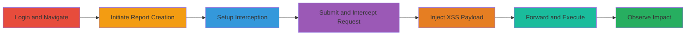

---
tags:
  - xss
  - reflected-xss
  - web-vulnerability
  - mopub
type: attack_chain
tools:
  - '[[tools/Burp-Suite]]'
tactics:
  - '[[Initial Access]]'
  - '[[Execution]]'
verified: false
platforms:
  - Web
submitted: true
complexity: medium
created_at: '2023-10-01T00:00:00Z'
procedures:
  - '[[procedures/Authenticate-to-MoPub-Application]]'
  - '[[procedures/Setup-Burp-Suite-for-Interception]]'
  - '[[procedures/Exploit-Reflected-XSS-in-Custom-Report]]'
step_count: 7
techniques:
  - '[[Exploit Public-Facing Application]]'
  - '[[JavaScript]]'
updated_at: '2025-12-14T00:11:16.128Z'
description: >-
  A multi-step attack demonstrating the exploitation of a reflected XSS
  vulnerability in the MoPub application's custom network report feature via the
  'nrnew-interval' parameter.
skill_level: intermediate
impact_level: high
id: e09ed56b-7e3b-496f-acf2-873fde69477b
validated: true
mitre_tactics:
  - '[[Initial Access]]'
  - '[[Execution]]'
mitre_techniques:
  - '[[Exploit Public-Facing Application]]'
  - '[[JavaScript]]'
---
# Reflected XSS Exploitation in MoPub Custom Network Report Creation

Multi-stage attack chain demonstrating a complete attack workflow for exploiting a reflected XSS vulnerability in the MoPub application's custom network report creation feature.

## Chain Metrics Dashboard

| Metric | Value |
|--------|-------|
| Chain Status | Unverified |
| Total Steps | 7 |
| Execution Time | ~10 minutes |
| Skill Level | Intermediate |
| Complexity | Medium |
| Impact Level | High |

## Attack Flow Visualization

## Prerequisites & Requirements

### Required Tools

- [[tools/Burp-Suite]]

### Target Environment

- Web application: MoPub dashboard at https://app.mopub.com
- Required services/ports: HTTPS (443)
- Network access requirements: Direct internet access to the MoPub domain

### Initial Access Requirements

- Valid user credentials for MoPub account
- Network position: Attacker's browser proxied through Burp Suite
- Prior access needed: None, but authenticated session required

## Detailed Attack Procedures

### Step 1: Login with Credentials
procedure: [[procedures/Authenticate-to-MoPub-Application]]

**Objective**: Gain authenticated access to the MoPub dashboard to reach the custom reports feature.

**Instructions**: Open a web browser and navigate to the MoPub login page. Enter valid credentials to authenticate.

**Expected Output**: Successful login redirecting to the dashboard.

**Success Indicators**:
- Dashboard loads without errors
- User session cookie is set

### Step 2: Navigate to the Custom Reports Page
procedure: [[procedures/Authenticate-to-MoPub-Application]]

**Objective**: Access the section where custom network reports can be created.

**Instructions**: From the dashboard, click on the 'Reports' menu and select 'Custom' to go to https://app.mopub.com/reports/custom/.

**Expected Output**: Custom reports page loads, showing options to create new reports.

**Success Indicators**:
- Page title indicates custom reports
- 'New Network Report' button is visible

### Step 3: Initiate Creation of a New Network Performance Report
procedure: [[procedures/Exploit-Reflected-XSS-in-Custom-Report]]

**Objective**: Start the process of creating a new report to trigger the vulnerable POST request.

**Instructions**: On the custom reports page, click 'New Network Report' to open the form for entering report details, including the 'nrnew-interval' parameter.

**Expected Output**: Form fields appear for report configuration.

**Success Indicators**:
- Form is populated and ready for input
- 'Run and Save' button is enabled

### Step 4: Start Burp Suite Proxy and Enable Interception
procedure: [[procedures/Setup-Burp-Suite-for-Interception]]

**Objective**: Configure traffic interception to modify the outgoing request.

**Instructions**: Launch Burp Suite, ensure the proxy is running on the default port (8080), and configure the browser to use it as a proxy. Turn on intercept mode in the Proxy tab to capture POST requests.

**Expected Output**: Browser traffic routes through Burp; intercept is active.

**Success Indicators**:
- Burp shows 'Intercept is on'
- Test request is captured

### Step 5: Submit the Report by Clicking 'Run and Save'
procedure: [[procedures/Setup-Burp-Suite-for-Interception]]

**Objective**: Trigger the vulnerable POST request and intercept it before it reaches the server.

**Instructions**: Fill in minimal form details if needed, then click 'Run and Save' to submit the POST to /reports/custom/add_network_report/. The request should be paused in Burp.

**Expected Output**: Intercepted multipart/form-data POST request visible in Burp.

**Success Indicators**:
- Request body shows 'nrnew-interval' parameter
- No submission error in browser

### Step 6: Inject the XSS Payload into the Vulnerable Parameter
procedure: [[procedures/Exploit-Reflected-XSS-in-Custom-Report]]

**Objective**: Modify the request to include a malicious JavaScript payload that will be reflected and executed.

**Instructions**: In the Burp Repeater or Intercept tab, locate the 'nrnew-interval' field in the POST body and append or replace with a payload like ">. Ensure the request remains valid multipart/form-data.

**Expected Output**: Modified request ready for forwarding.

**Success Indicators**:
- Payload is properly encoded in the field
- Request syntax is intact

### Step 7: Forward the Request and Observe Execution
procedure: [[procedures/Exploit-Reflected-XSS-in-Custom-Report]]

**Objective**: Send the tampered request and verify JavaScript execution in the browser.

**Instructions**: Forward the request in Burp to complete submission. Observe the response in the browser for reflection of the payload.

**Expected Output**: Alert box pops up displaying the domain or cookie value.

**Success Indicators**:
- JavaScript alert executes
- No server-side error; payload reflected unsanitized

## Attack Chain Summary

### Key Achievements

1. Successful authentication and navigation to the vulnerable feature
2. Interception and modification of the POST request using Burp Suite
3. Execution of arbitrary JavaScript via reflected XSS, enabling potential session hijacking or data theft

## Technique & Tactic Coverage

### MITRE ATT&CK Techniques

- [[Exploit Public-Facing Application]]
- [[JavaScript]]

### MITRE ATT&CK Tactics

- [[Initial Access]]
- [[Execution]]

---

*Last updated: 2023-10-01T00:00:00Z*
