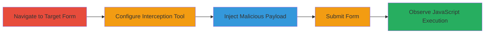

---
tags:
  - xss
  - reflected-xss
  - web-vulnerability
  - javascript-injection
type: attack_chain
tools:
  - '[[tools/Burp-Suite]]'
tactics:
  - '[[Initial Access]]'
  - '[[Collection]]'
verified: false
platforms:
  - Web
submitted: true
complexity: medium
created_at: '2023-10-01T00:00:00Z'
procedures:
  - '[[procedures/Exploiting-Reflected-XSS-in-MoPub-Custom-Reports]]'
step_count: 5
techniques:
  - '[[Drive-by Compromise]]'
  - '[[JavaScript]]'
updated_at: '2025-12-13T23:52:33.986Z'
description: >-
  A multi-step attack demonstrating the exploitation of a reflected XSS
  vulnerability in the MoPub custom reports creation form, allowing arbitrary
  JavaScript execution in the victim's browser.
skill_level: intermediate
impact_level: high
id: 5584e630-4f3a-4b69-9ed3-530f8d54b9c1
validated: true
mitre_tactics:
  - '[[Initial Access]]'
  - '[[Collection]]'
mitre_techniques:
  - '[[Drive-by Compromise]]'
  - '[[JavaScript]]'
---
# Reflected XSS Exploitation in MoPub Custom Reports via new-d1 Parameter

Multi-stage attack chain demonstrating the exploitation of a reflected Cross-Site Scripting (XSS) vulnerability in the custom reports creation form on https://app.mopub.com/reports/custom/add/. The attack intercepts a POST request, injects a malicious payload into the 'new-d1' parameter, and triggers JavaScript execution upon form submission, enabling potential session hijacking or data theft.

## Chain Metrics Dashboard

| Metric | Value |
|--------|-------|
| Chain Status | Unverified |
| Total Steps | 5 |
| Execution Time | ~5 minutes |
| Skill Level | Intermediate |
| Complexity | Medium |
| Impact Level | High |

## Attack Flow Visualization

## Prerequisites & Requirements

### Required Tools

- [[tools/Burp-Suite]]

### Target Environment

- Web application: MoPub platform at https://app.mopub.com
- Required services/ports: HTTPS (443)
- Network access requirements: Valid session cookies for authenticated access to the reports module

### Initial Access Requirements

- Credential requirements: Authenticated user account on MoPub
- Network position: Direct access to the web application
- Prior access needed: Logged-in session to reach the custom reports page

## Detailed Attack Procedures

### Step 1: Navigate to the Custom Reports Add Page
procedure: [[procedures/Exploiting-Reflected-XSS-in-MoPub-Custom-Reports]]

**Objective**: Load the vulnerable form to prepare for payload injection.

**Instructions**: Open a web browser and navigate to the custom reports creation page at https://app.mopub.com/reports/custom/add/. Ensure you are authenticated with a valid session to access the form.

**Expected Output**: The form loads, displaying fields for report configuration including the 'new-d1' parameter field.

**Success Indicators**:
- Form page is accessible and editable
- No errors in loading the page

### Step 2: Configure Burp Suite Proxy to Intercept Requests
procedure: [[procedures/Exploiting-Reflected-XSS-in-MoPub-Custom-Reports]]

**Objective**: Set up interception to capture and modify the outgoing POST request.

**Instructions**: Launch [[tools/Burp-Suite]] and enable the proxy interception feature. Configure your browser to route traffic through Burp Suite's proxy (typically localhost:8080). Start capturing HTTP requests from the browser.

**Expected Output**: Burp Suite dashboard shows incoming traffic from the browser, ready to intercept the form submission.

**Success Indicators**:
- Proxy is active and intercepting requests
- Browser traffic is routed correctly without errors

### Step 3: Inject the XSS Payload into the Vulnerable Parameter
procedure: [[procedures/Exploiting-Reflected-XSS-in-MoPub-Custom-Reports]]

**Objective**: Insert the malicious payload into the 'new-d1' field to test for reflection.

**Instructions**: In the form, fill the 'new-d1' field with the payload `</img>`. Complete other fields with sample data, such as report name 'hello xss', timezone 'UTC', interval 'yesterday', start date '09/10/2019', and end date '09/10/2019'. Proceed to submit but allow Burp to intercept.

**Expected Output**: The intercepted request in Burp shows the payload in the 'new-d1' parameter within the multipart/form-data body.

**Success Indicators**:
- Payload is visible and unmodified in the intercepted request
- Form data is correctly structured as multipart/form-data

### Step 4: Submit the Form
procedure: [[procedures/Exploiting-Reflected-XSS-in-MoPub-Custom-Reports]]

**Objective**: Send the modified request to the server to trigger the reflection.

**Instructions**: In Burp Suite, forward the intercepted POST request to /reports/custom/add/. The request includes headers like Content-Type: multipart/form-data; boundary=---------------------------200821510612490, X-CSRFToken, and session cookies. Click 'Run and Save' in the form if not already intercepted.

**Expected Output**: Server responds with the reflected payload in the HTML response body.

**Success Indicators**:
- Request is successfully forwarded without errors
- Response contains the injected payload unescaped

### Step 5: Observe JavaScript Execution
procedure: [[procedures/Exploiting-Reflected-XSS-in-MoPub-Custom-Reports]]

**Objective**: Confirm the vulnerability by executing the payload and observing the alert.

**Instructions**: After forwarding, inspect the response in Burp or the browser. The onerror handler in the payload should trigger, displaying an alert box with the domain value.

**Expected Output**: A JavaScript alert pops up showing 'alert(domain)', confirming execution.

**Success Indicators**:
- Alert dialog appears in the browser
- No sanitization errors; payload executes as intended

## Attack Chain Summary

### Key Achievements

1. Successful identification and access to the vulnerable form endpoint.
2. Interception and modification of the POST request using Burp Suite.
3. Injection and reflection of arbitrary JavaScript, demonstrating XSS.

## Technique & Tactic Coverage

### MITRE ATT&CK Techniques

- [[Drive-by Compromise]]
- [[JavaScript]]

### MITRE ATT&CK Tactics

- [[Initial Access]]
- [[Collection]]

---

*Last updated: 2023-10-01T00:00:00Z*
