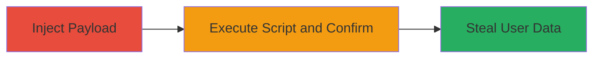

---
tags:
  - xss
  - reflected-xss
  - javascript
  - web-vulnerability
type: attack_chain
tools: []
tactics:
  - '[[Initial Access]]'
  - '[[Execution]]'
  - '[[Collection]]'
verified: false
platforms:
  - Web
submitted: true
created_at: '2023-10-01T00:00:00Z'
procedures:
  - '[[procedures/Exploit-Reflected-XSS-via-Profile-ID]]'
step_count: 2
techniques:
  - '[[Drive-by Compromise]]'
  - '[[JavaScript]]'
updated_at: '2025-12-14T03:15:30.619Z'
description: >-
  A multi-step attack chain exploiting a reflected XSS vulnerability in the
  profile_id parameter of a U.S. Department of Defense website to execute
  JavaScript and steal user information via malicious links.
id: d053141d-dde9-4922-9662-c4563f6911eb
validated: true
mitre_tactics:
  - '[[Initial Access]]'
  - '[[Execution]]'
  - '[[Collection]]'
mitre_techniques:
  - '[[Drive-by Compromise]]'
  - '[[JavaScript]]'
---
---

# Reflected XSS Exploitation in Profile ID Parameter for User Data Theft

Multi-stage attack chain demonstrating a complete attack workflow exploiting reflected XSS on a government website.

## Chain Metrics Dashboard

| Metric | Value |
|--------|-------|
| Chain Status | Unverified |
| Total Steps | 2 |
| Execution Time | ~1 minutes |
| Skill Level | Intermediate |
| Complexity | Medium |
| Impact Level | High |

## Attack Flow Visualization

## Prerequisites & Requirements

### Required Tools

- Web browser (e.g., Chrome, Firefox)

### Target Environment

- Web platform
- Access to public-facing website
- No specific ports or services required beyond HTTP/HTTPS

### Initial Access Requirements

- Public access to the target URL
- No credentials needed
- Ability to craft and visit malicious URLs

## Detailed Attack Procedures

### Step 1: Inject XSS Payload into Profile ID Parameter
procedure: [[procedures/Exploit-Reflected-XSS-via-Profile-ID]]

**Objective**: Inject a JavaScript payload into the profile_id parameter to test for reflection without sanitization.

**Instructions**: Open a web browser and navigate to the vulnerable URL with the crafted payload. The payload closes any existing HTML tags and injects a script to execute an alert for testing.

**Expected Output**: The page loads with the injected script reflected in the HTML source.

**Success Indicators**:
- Payload appears in the page source without encoding
- No errors in browser console related to sanitization

### Step 2: Execute and Verify XSS
procedure: [[procedures/Exploit-Reflected-XSS-via-Profile-ID]]

**Objective**: Observe the execution of the injected script to confirm the vulnerability and understand potential for data theft.

**Instructions**: Upon loading the URL, the script should auto-execute. For exploitation, replace the alert with code to capture cookies or form data and exfiltrate to an attacker-controlled server.

**Expected Output**: Alert box pops up displaying 'xss', confirming execution.

**Success Indicators**:
- JavaScript alert triggers
- Ability to modify payload for real attacks like session hijacking

## Attack Chain Summary

### Key Achievements

1. Successful injection and reflection of XSS payload in a high-value target.
2. Confirmation of client-side script execution.
3. Potential for phishing users to steal sensitive DoD user information.

## Technique & Tactic Coverage

### MITRE ATT&CK Techniques

- [[Drive-by Compromise]]
- [[JavaScript]]

### MITRE ATT&CK Tactics

- [[Initial Access]]
- [[Execution]]
- [[Collection]]

---

*Last updated: 2023-10-01T00:00:00Z*
