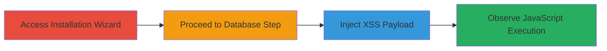

---
tags:
  - xss
  - reflected-xss
  - revive-adserver
  - installation-wizard
  - javascript-execution
type: attack_chain
tools:
  - '[[tools/Firefox]]'
tactics:
  - '[[Initial Access]]'
  - '[[Execution]]'
commands:
  - '[[commands/curl-post-xss-payload]]'
verified: false
platforms:
  - Web
  - PHP
submitted: true
complexity: low
procedures:
  - '[[procedures/Access-Revive-Adserver-Installation-Wizard]]'
  - '[[procedures/Proceed-to-Database-Configuration]]'
  - '[[procedures/Inject-XSS-Payload-in-dbName]]'
  - '[[procedures/Verify-JavaScript-Execution]]'
step_count: 4
techniques:
  - '[[Exploit Public-Facing Application]]'
  - '[[JavaScript]]'
description: >-
  A multi-step attack chain exploiting a reflected XSS vulnerability in the
  database name parameter during the Revive Adserver installation process,
  allowing arbitrary JavaScript execution in the attacker's browser.
skill_level: beginner
impact_level: medium
id: 31ef73ea-92b7-4678-8f9d-4b87f65114fc
created_at: '2025-12-14T03:16:02.977Z'
updated_at: '2025-12-14T03:16:02.977Z'
validated: true
mitre_tactics:
  - '[[Initial Access]]'
  - '[[Execution]]'
mitre_techniques:
  - '[[Exploit Public-Facing Application]]'
  - '[[JavaScript]]'
---
# Reflected XSS Exploitation in Revive Adserver Installation Wizard via dbName Parameter

Multi-stage attack chain demonstrating a reflected Cross-Site Scripting (XSS) vulnerability in the Revive Adserver installation wizard. The attack targets the dbName parameter in Step 2, where invalid input is echoed unsanitized in an error message, enabling JavaScript execution. This can lead to client-side attacks like phishing or keylogging during the sensitive installation phase. A similar issue affects the dbUser parameter.

## Chain Metrics Dashboard

| Metric | Value |
|--------|-------|
| Chain Status | Unverified |
| Total Steps | 4 |
| Execution Time | ~2 minutes |
| Skill Level | Beginner |
| Complexity | Low |
| Impact Level | Medium |

## Attack Flow Visualization



## Prerequisites & Requirements

### Required Tools

- [[tools/Firefox]]

### Target Environment

- Web platform running Revive Adserver (PHP-based)
- Required services/ports: HTTP (80/443), MySQL on port 3306
- Network access requirements: Direct access to the web server hosting the installation wizard

### Initial Access Requirements

- No credentials required (public-facing installation page)
- Attacker positioned as a legitimate installer or via social engineering to guide the victim
- Prior access needed: None, but assumes the target is setting up Revive Adserver

## Detailed Attack Procedures

### Step 1: Access Installation Wizard
procedure: [[procedures/Access-Revive-Adserver-Installation-Wizard]]

**Objective**: Gain entry to the Revive Adserver setup process to reach the vulnerable step.

**Instructions**: Open a web browser and navigate to the installation page at `/www/admin/install.php` on the target server.

**Expected Output**: The initial installation form loads, prompting agreement to terms and conditions.

**Success Indicators**:
- Installation wizard page is accessible
- No authentication barriers encountered

### Step 2: Proceed to Database Configuration
procedure: [[procedures/Proceed-to-Database-Configuration]]

**Objective**: Complete the preliminary steps to advance to the vulnerable database setup form.

**Instructions**: Fill out and submit the initial form by agreeing to the terms and conditions.

**Expected Output**: The wizard progresses to Step 2, displaying the database configuration fields (dbName, dbUser, dbPassword, dbHost, dbType).

**Success Indicators**:
- Form submission succeeds without errors
- Database configuration page appears

### Step 3: Inject XSS Payload
procedure: [[procedures/Inject-XSS-Payload-in-dbName]]

**Objective**: Submit a malicious payload in the dbName field to trigger the reflected XSS.

**Instructions**: In the database form, enter a payload like `something<script>alert('xss');</script>` in the dbName field. Set other fields normally (e.g., dbUser=root, dbPassword=roots, dbHost=localhost, dbType=mysql) and submit the form using action=database. This can be done manually in the browser or via [[commands/curl-post-xss-payload]]:

```bash
curl -X POST 'http://target/www/admin/install.php' -d 'action=database&dbType=mysql&dbHost=localhost&dbUser=root&dbPassword=roots&dbName=something<script>alert("xss");</script>'
```

**Expected Output**: The form returns an error page echoing the unsanitized input in a span element.

**Success Indicators**:
- POST request is sent with the payload
- Error response includes the reflected input

### Step 4: Verify JavaScript Execution
procedure: [[procedures/Verify-JavaScript-Execution]]

**Objective**: Confirm the payload executes, demonstrating the XSS vulnerability.

**Instructions**: Observe the response in the browser; the script should execute automatically.

**Expected Output**: An alert box pops up displaying 'xss', confirming JavaScript execution.

**Success Indicators**:
- Alert box appears
- No blocking by browser XSS protections (use Firefox if Chrome blocks)

## Attack Chain Summary

### Key Achievements

1. Successful navigation to the vulnerable installation step without authentication.
2. Injection and reflection of arbitrary JavaScript via unsanitized error messages.
3. Demonstration of potential for client-side attacks during setup.

## Technique & Tactic Coverage

### MITRE ATT&CK Techniques

- [[Exploit Public-Facing Application]] Exploit Public-Facing Application
- [[JavaScript]] JavaScript

### MITRE ATT&CK Tactics

- [[Initial Access]] Initial Access
- [[Execution]] Execution

---
*Last updated: 2023-10-01*
