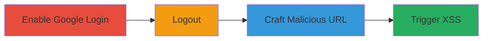

---
tags:
  - xss
  - reflected-xss
  - shopify
  - google-apps
type: attack_chain
tools: []
tactics:
  - '[[Initial Access]]'
  - '[[Execution]]'
commands: []
platforms:
  - Web
complexity: medium
procedures:
  - '[[procedures/Enable-Google-Apps-Login-in-Shopify-Admin]]'
  - '[[procedures/Logout-from-Shopify-Account]]'
  - '[[procedures/Craft-and-Access-Malicious-Login-URL-with-XSS-Payload]]'
  - '[[procedures/Trigger-XSS-via-Google-Login-Attempt]]'
step_count: 4
techniques:
  - '[[Exploit Public-Facing Application]]'
  - '[[JavaScript]]'
description: >-
  Exploitation of a reflected XSS vulnerability in Shopify's Google Apps login
  integration to execute arbitrary JavaScript and steal sensitive data.
skill_level: intermediate
impact_level: high
id: fb65fd91-16b6-4771-b56a-b9115eb26266
created_at: '2025-12-14T00:11:16.785Z'
updated_at: '2025-12-14T00:11:16.785Z'
verified: false
validated: true
submitted: true
mitre_tactics:
  - '[[Initial Access]]'
  - '[[Execution]]'
mitre_techniques:
  - '[[Exploit Public-Facing Application]]'
  - '[[JavaScript]]'
---
# Reflected XSS Exploitation in Shopify Google Apps Login

Multi-stage attack chain demonstrating the exploitation of a reflected XSS vulnerability in Shopify's login functionality when Google Apps integration is enabled, allowing arbitrary JavaScript execution to steal cookies or domain information.

## Chain Metrics Dashboard

| Metric | Value |
|--------|-------|
| Chain Status | Unverified |
| Total Steps | 4 |
| Execution Time | ~5 minutes |
| Skill Level | Intermediate |
| Complexity | Medium |
| Impact Level | High |

## Attack Flow Visualization



## Prerequisites & Requirements

### Required Tools

- None

### Target Environment

- Web platform
- Shopify account with admin access
- Google Apps integration available

### Initial Access Requirements

- Access to Shopify admin settings
- Ability to manipulate URLs in a browser

## Detailed Attack Procedures

### Step 1: Enable Google Apps Login
procedure: [[procedures/Enable-Google-Apps-Login-in-Shopify-Admin]]

**Objective**: Configure the target Shopify instance to allow Google Apps login, setting up the environment for the vulnerability.

**Instructions**: Navigate to the Shopify admin settings and enable the Google login option.

Access the URL in a browser:

```bash
https://YOURSHOP.myshopify.com/admin/settings/account
```

Enable 'Staff can use Google Apps to log in'.

**Expected Output**: Google login option activated on the login page.

**Success Indicators**:
- Google login button appears on the login page
- No errors in admin settings

### Step 2: Logout from Account
procedure: [[procedures/Logout-from-Shopify-Account]]

**Objective**: Ensure the user is logged out to access the vulnerable login page.

**Instructions**: Log out from the Shopify account to reach the login interface.

**Expected Output**: Redirected to the login page.

**Success Indicators**:
- Session cleared
- Login page displayed

### Step 3: Craft Malicious URL
procedure: [[procedures/Craft-and-Access-Malicious-Login-URL-with-XSS-Payload]]

**Objective**: Create a specially crafted URL with an injected JavaScript payload in the google_apps_uri parameter.

**Instructions**: Modify the login URL to include the XSS payload, such as 'javascript:prompt(document.domain)' or 'javascript:prompt(document.cookie)'.

Use a POC URL like:

```bash
https://app.shopify.com/services/login/identity?destination_uuid=79b5c315-b5ac-4b19-bd33-13554433fa31&google_apps_uri=javascript:prompt(document.domain)&return_to=...
```

Access this URL in the browser.

**Expected Output**: The login page loads with the manipulated parameter.

**Success Indicators**:
- URL loads without errors
- Parameter injection successful

### Step 4: Trigger XSS
procedure: [[procedures/Trigger-XSS-via-Google-Login-Attempt]]

**Objective**: Execute the injected JavaScript by attempting to log in with Google.

**Instructions**: On the loaded page, click 'Log in with Google' to trigger the XSS payload.

**Expected Output**: JavaScript executes, prompting document domain or cookies.

**Success Indicators**:
- Prompt appears with sensitive data
- Arbitrary code execution confirmed

## Attack Chain Summary

### Key Achievements

1. Enabled vulnerable login integration
2. Crafted and accessed malicious URL
3. Triggered XSS to steal sensitive browser data

## Technique & Tactic Coverage

### MITRE ATT&CK Techniques

- [[Exploit Public-Facing Application]]
- [[JavaScript]]

### MITRE ATT&CK Tactics

- [[Initial Access]]
- [[Execution]]

*Last updated: 2023-10-01*
