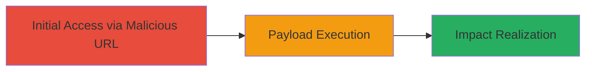

---
id: ac-uuid-1234
name: Reflected XSS Exploitation in THREDDS/DAP4 Endpoint
type: attack_chain
description: A multi-stage attack chain exploiting a reflected XSS vulnerability in the THREDDS/DAP4 endpoint of a web application to execute JavaScript in the victim's browser context.
verified: false
submitted: false
step_count: 2
created_at: 2023-10-01T00:00:00Z
updated_at: 2023-10-01T00:00:00Z
procedures: [[procedures/Exploit-Reflected-XSS-in-THREDDS-Path]]
techniques: [[JavaScript]], [[Exploit Public-Facing Application]]
tactics: [[Execution]], [[Initial Access]]
tags: xss, reflected-xss, web, thredds, dap4
platforms: Web
tools: []
---

# Reflected XSS Exploitation in THREDDS/DAP4 Endpoint

Multi-stage attack chain demonstrating a complete attack workflow exploiting reflected XSS in a U.S. Department of Defense web application using the THREDDS/DAP4 endpoint.

## Chain Metrics Dashboard

| Metric | Value |
|--------|-------|
| Chain Status | Unverified |
| Total Steps | 2 |
| Execution Time | ~1 minutes |
| Skill Level | Beginner |
| Complexity | Low |
| Impact Level | High |

## Attack Flow Visualization



## Prerequisites & Requirements

### Required Tools

- Web browser (e.g., Chrome, Firefox)
- Optional: [[tools/curl]]

### Target Environment

- Web platform with THREDDS server exposing DAP4 endpoint
- No specific ports required beyond standard HTTP/HTTPS (80/443)
- Publicly accessible web application

### Initial Access Requirements

- No credentials needed
- Direct network access to the target URL
- Victim must visit the crafted malicious URL

## Detailed Attack Procedures

### Step 1: Craft and Navigate to Vulnerable URL
procedure: [[procedures/Exploit-Reflected-XSS-in-THREDDS-Path]]

**Objective**: Inject a URL-encoded JavaScript payload into the THREDDS/DAP4 path parameter to trigger reflected XSS upon page load.

**Instructions**: Construct the malicious URL by appending the encoded payload to the endpoint. The payload "<ScRiPt>alert(9218)</ScRiPt>" is URL-encoded as %221%3CScRiPt%3Ealert%289218%29%3C%2FScRiPt%3E and prefixed with a quote for context. Use a browser or curl to access: https://█████████/thredds/dap4/%221%3CScRiPt%3Ealert%289218%29%3C%2FScRiPt%3E.

For verification with curl:

```bash
curl -v "https://█████████/thredds/dap4/%221%3CScRiPt%3Ealert%289218%29%3C%2FScRiPt%3E"
```

**Expected Output**: The response includes the decoded and reflected payload in the page content, ready for JavaScript execution in a browser.

**Success Indicators**:
- Payload appears unescaped in the server response
- No sanitization errors or blocks

### Step 2: Observe and Confirm XSS Execution
procedure: [[procedures/Exploit-Reflected-XSS-in-THREDDS-Path]]

**Objective**: Load the page in a browser to execute the injected JavaScript and confirm the vulnerability.

**Instructions**: Open the crafted URL in a web browser. The reflected payload executes immediately upon page load, popping an alert box.

**Expected Output**: An alert dialog displays "9218", indicating successful JavaScript execution in the browser's context.

**Success Indicators**:
- Alert box appears with the specified message
- Browser console shows no errors blocking script execution
- Potential for further payloads like cookie theft via document.cookie

## Attack Chain Summary

### Key Achievements

1. Successful injection and reflection of JavaScript payload via URL path
2. Confirmed execution leading to arbitrary code in victim browser
3. Demonstrated high-impact potential including session hijacking and defacement

## Technique & Tactic Coverage

### MITRE ATT&CK Techniques

- [[JavaScript]]
- [[Exploit Public-Facing Application]]

### MITRE ATT&CK Tactics

- [[Execution]]
- [[Initial Access]]

---
*Last updated: 2023-10-01T00:00:00Z*
