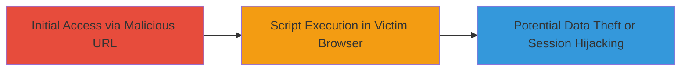

# Reflected XSS Exploitation in UPS Web Application via 'loc' Parameter

Multi-stage attack chain demonstrating a complete attack workflow.

## Chain Metrics Dashboard

| Metric | Value |
|--------|-------|
| Chain Status | Unverified |
| Total Steps | 1 |
| Execution Time | ~1 minutes |
| Skill Level | Beginner |
| Complexity | Low |
| Impact Level | Medium |

## Attack Flow Visualization



## Prerequisites & Requirements

### Required Tools

- Web browser (e.g., Chrome, Firefox)

### Target Environment

- Web application (UPS platform)
- Accessible via HTTP/HTTPS
- No specific ports required beyond standard web (80/443)

### Initial Access Requirements

- Valid URL to the vulnerable endpoint (e.g., https://example.ups.com/page?loc=)
- Ability to craft and share malicious URLs (e.g., via phishing or direct link)
- No prior credentials needed for reflection

## Detailed Attack Procedures

### Step 1: Inject Malicious Payload into 'loc' Parameter
procedure: [[procedures/Exploit-Reflected-XSS-in-URL-Parameter]]

**Objective**: Inject a JavaScript payload into the 'loc' URL parameter to trigger reflected XSS, executing arbitrary code in the victim's browser upon visiting the crafted URL.

**Instructions**: Construct a malicious URL by appending a script payload to the 'loc' parameter. For testing, use a simple alert payload. In a real attack, replace with more sophisticated scripts for session theft or phishing.

First, access the vulnerable endpoint using [[commands/curl-inject-xss-payload]] to verify reflection:

```bash
curl "https://example.ups.com/page?loc=%3Cscript%3Ealert('XSS')%3C/script%3E" -v
```

Observe the response for the unencoded payload reflection. Then, craft the full URL for victim delivery:

https://example.ups.com/page?loc=<script>alert(document.cookie)</script>

Share this URL via email, social engineering, or embedding in a site.

**Expected Output**: The browser executes the script, displaying an alert with the victim's cookies or performing other actions like keylogging.

**Success Indicators**:
- Payload reflected without encoding in the page source
- JavaScript alert or other effect triggers in the browser
- No server-side errors blocking execution

## Attack Chain Summary

### Key Achievements

1. Successful injection and reflection of malicious JavaScript via the 'loc' parameter
2. Execution of arbitrary code in the victim's browser context
3. Potential for medium-impact outcomes like session hijacking or phishing without account compromise

## Technique & Tactic Coverage

### MITRE ATT&CK Techniques

- [[JavaScript]]

### MITRE ATT&CK Tactics

- [[Execution]]
- [[Collection]]

---
*Last updated: 2023-10-01T00:00:00Z*
