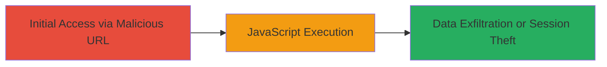

---
tags:
  - xss
  - reflected-xss
  - web-vulnerability
  - javascript-execution
type: attack_chain
tools:
  - '[[tools/Firefox]]'
tactics:
  - '[[Execution]]'
  - '[[Collection]]'
commands: []
platforms:
  - Web
complexity: low
procedures:
  - '[[procedures/Exploit-Reflected-XSS-in-Type-Parameter]]'
step_count: 1
techniques:
  - '[[JavaScript]]'
  - '[[Exploit Public-Facing Application]]'
description: >-
  A single-stage attack exploiting a reflected XSS vulnerability in the 'type'
  parameter of Zomato's /php/fb_login_pass_reset endpoint to execute arbitrary
  JavaScript in the victim's browser.
skill_level: beginner
impact_level: high
id: 9f0b3750-81c1-4f34-bffa-ab481032d975
created_at: '2025-12-14T03:15:31.660Z'
updated_at: '2025-12-14T03:15:31.660Z'
verified: false
validated: true
submitted: true
mitre_tactics:
  - '[[Execution]]'
  - '[[Collection]]'
mitre_techniques:
  - '[[JavaScript]]'
  - '[[Exploit Public-Facing Application]]'
---
# Reflected XSS Exploitation in Zomato Facebook Login Password Reset Endpoint

## Overview

This attack chain demonstrates the exploitation of a reflected Cross-Site Scripting (XSS) vulnerability in Zomato's website, specifically in the 'type' parameter of the /php/fb_login_pass_reset endpoint. By crafting a malicious URL that injects an SVG tag with an onload JavaScript event, an attacker can execute arbitrary code in the victim's browser context. This enables potential theft of session cookies, phishing attacks, or other client-side manipulations, compromising user data and sessions.

## Chain Metrics Dashboard

| Metric | Value |
|--------|-------|
| Chain Status | Unverified |
| Total Steps | 1 |
| Execution Time | ~1 minute |
| Skill Level | Beginner |
| Complexity | Low |
| Impact Level | High |

## Attack Flow Visualization

## Prerequisites & Requirements

### Required Tools

- [[tools/Firefox]]

### Target Environment

- Web platform
- PHP-based web application
- Access to the /php/fb_login_pass_reset endpoint

### Initial Access Requirements

- No credentials required
- Direct network access to the target website (https://www.zomato.com)
- Ability to send or trick a victim into accessing a crafted URL

## Detailed Attack Procedures

### Step 1: Craft and Access Malicious URL
procedure: [[procedures/Exploit-Reflected-XSS-in-Type-Parameter]]

**Objective**: Inject and execute malicious JavaScript via the reflected 'type' parameter to demonstrate arbitrary code execution in the browser.

**Instructions**: Construct a URL with a payload that breaks out of the parameter quotes and injects an SVG element triggering JavaScript on load. Open the URL in a web browser to reproduce the vulnerability.

The payload example is: https://www.zomato.com/php/fb_login_pass_reset?type=%22%3E%3Csvg/onload=alert%28document.domain%29%3E%3Ch1%3EBoooooya!!%3C/h1%3E

Navigate to this URL using [[tools/Firefox]].

**Expected Output**: A browser popup alert displaying the domain (www.zomato.com) and the text 'Boooooya!!', confirming JavaScript execution.

**Success Indicators**:
- Alert popup appears with the domain name
- SVG element is reflected in the page source without sanitization
- No server-side errors blocking the injection

## Attack Chain Summary

### Key Achievements

1. Successful reflection of user-controlled input into HTML without escaping
2. Arbitrary JavaScript execution in the victim's browser context
3. Potential for session cookie theft or phishing via extended payloads

## Technique & Tactic Coverage

### MITRE ATT&CK Techniques

- [[JavaScript]]
- [[Exploit Public-Facing Application]]

### MITRE ATT&CK Tactics

- [[Execution]]
- [[Collection]]

---
*Last updated: 2023-10-01*
