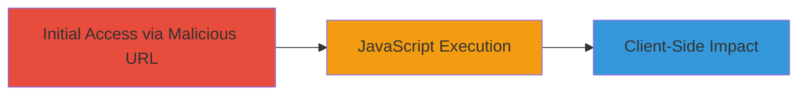

---
tags:
  - xss
  - reflected-xss
  - javascript
  - web-vulnerability
type: attack_chain
tools: []
tactics:
  - '[[Initial Access]]'
verified: false
platforms:
  - Web
submitted: true
complexity: low
created_at: '2023-10-01T00:00:00Z'
procedures:
  - '[[procedures/Exploit-Reflected-XSS-via-JWT-Parameter]]'
step_count: 2
techniques:
  - '[[Exploit Public-Facing Application]]'
  - '[[JavaScript]]'
updated_at: '2025-12-13T23:55:37.916Z'
description: >-
  A multi-stage attack chain demonstrating the exploitation of a reflected XSS
  vulnerability in the JWT parameter of the inDrive watchdocs web application,
  leading to arbitrary JavaScript execution in the victim's browser.
skill_level: beginner
impact_level: medium
id: 84f02307-2256-40bf-a5f3-16d1405d00cf
validated: true
mitre_tactics:
  - '[[Initial Access]]'
mitre_techniques:
  - '[[Exploit Public-Facing Application]]'
  - '[[JavaScript]]'
---
# Reflected XSS Exploitation in inDrive Watchdocs JWT Parameter

Multi-stage attack chain demonstrating a complete attack workflow for exploiting a reflected cross-site scripting vulnerability in the watchdocs.indriverapp.com web application.

## Chain Metrics Dashboard

| Metric | Value |
|--------|-------|
| Chain Status | Unverified |
| Total Steps | 2 |
| Execution Time | ~1 minute |
| Skill Level | Beginner |
| Complexity | Low |
| Impact Level | Medium |

## Attack Flow Visualization

## Prerequisites & Requirements

### Required Tools

- Web browser (e.g., Chrome, Firefox)

### Target Environment

- Web application at https://watchdocs.indriverapp.com
- No specific services or ports beyond standard HTTPS (443)
- Publicly accessible URL

### Initial Access Requirements

- No credentials required
- Direct network access to the target URL
- No prior access needed; social engineering to lure victim to URL

## Detailed Attack Procedures

### Step 1: Craft and Visit Malicious URL
procedure: [[procedures/Exploit-Reflected-XSS-via-JWT-Parameter]]

**Objective**: Inject a malicious XSS payload into the JWT parameter to trigger JavaScript execution upon page load.

**Instructions**: Construct the vulnerable URL with the encoded payload in the JWT parameter. The base endpoint is https://watchdocs.indriverapp.com/webview/v1, with additional parameters: phone (arbitrary), token (arbitrary), service=cargo, locale=en, and jwt set to the encoded payload "%22%3E%3Cimg%20src=raw%20onerror=alert(%22hackerone%22)%3E". Visit the URL in a browser to deliver the payload.

**Expected Output**: The page loads, and the injected script executes, popping an alert dialog.

**Success Indicators**:
- Alert box displays 'hackerone'
- Browser console shows JavaScript execution errors or logs if modified

### Step 2: Verify and Observe Impact
procedure: [[procedures/Exploit-Reflected-XSS-via-JWT-Parameter]]

**Objective**: Confirm the XSS execution and assess potential for further client-side attacks like session hijacking.

**Instructions**: After visiting the URL, inspect the browser's developer tools to verify the payload injection. The payload uses an img tag with a non-existent src ("raw") to trigger the onerror event, executing alert("hackerone").

**Expected Output**: Successful alert popup confirming arbitrary JavaScript execution in the context of the domain.

**Success Indicators**:
- JavaScript executes without errors
- Potential for stealing cookies or redirecting user if payload is escalated

## Attack Chain Summary

### Key Achievements

1. Successful injection of XSS payload via reflected JWT parameter
2. Demonstration of arbitrary JavaScript execution in victim browser
3. Highlighted risk of session hijacking or phishing attacks

## Technique & Tactic Coverage

### MITRE ATT&CK Techniques

- [[Exploit Public-Facing Application]]
- [[JavaScript]]

### MITRE ATT&CK Tactics

- [[Initial Access]]

---

*Last updated: 2023-10-01T00:00:00Z*
