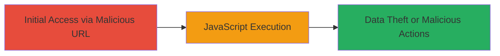

# Reflected XSS Exploitation on U.S. DoD Website via Unsanitized JavaScript Parameter

Multi-stage attack chain demonstrating a complete attack workflow.

## Chain Metrics Dashboard

| Metric | Value |
|--------|-------|
| Chain Status | Unverified |
| Total Steps | 1 |
| Execution Time | ~1 minute |
| Skill Level | Beginner |
| Complexity | Low |
| Impact Level | High |

## Attack Flow Visualization



## Prerequisites & Requirements

### Required Tools

- Web browser (e.g., Firefox or Chrome with developer tools)

### Target Environment

- Web platform
- Vulnerable page at http://█████/
- No specific services or ports required beyond HTTP/HTTPS access

### Initial Access Requirements

- Public access to the DoD website
- No credentials needed
- Direct network access to the target URL

## Detailed Attack Procedures

### Step 1: Craft and Access Malicious URL
procedure: [[procedures/Exploit-Reflected-XSS-in-JavaScript-Context]]

**Objective**: Inject a malicious JavaScript payload into the unsanitized '██████' parameter to execute arbitrary code on the vulnerable page, demonstrating XSS exploitation.

**Instructions**: Construct a URL with a payload that breaks out of the JavaScript string context and injects an alert function. Access the URL in a web browser to trigger the payload. For verification, use developer tools to inspect the reflected parameter and confirm execution.

Use a browser to navigate to the crafted URL:

```url
http://█████/?██████=%27;}alert(%22chron0x%22);%20function%20clickit(){//
```

**Expected Output**: An alert box pops up displaying "chron0x", indicating successful JavaScript execution. In a real attack, this could be replaced with code to steal cookies or session data.

**Success Indicators**:
- Alert dialog appears on page load
- Browser console shows no errors, and injected code executes
- Reflected parameter visible in page source without sanitization

## Attack Chain Summary

### Key Achievements

1. Successful injection of JavaScript payload via reflected parameter
2. Arbitrary code execution on the DoD website
3. Potential for data exfiltration, such as stealing user sessions or sensitive information

## Technique & Tactic Coverage

### MITRE ATT&CK Techniques

- [[JavaScript]]

### MITRE ATT&CK Tactics

- [[Execution]]
- [[Collection]]

---
*Last updated: 2023-10-01T00:00:00Z*
