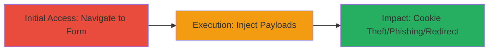

---
tags:
  - xss
  - reflected-xss
  - web-vulnerability
type: attack_chain
tools: []
tactics:
  - '[[Initial Access]]'
  - '[[Execution]]'
verified: false
platforms:
  - Web
submitted: true
complexity: medium
created_at: '2023-10-01T00:00:00Z'
procedures:
  - '[[procedures/Exploit-Reflected-XSS-in-Contact-Form]]'
step_count: 2
techniques:
  - '[[Exploit Public-Facing Application]]'
  - '[[JavaScript]]'
updated_at: '2025-12-13T23:52:24.378Z'
description: >-
  A multi-step attack chain exploiting a reflected XSS vulnerability in the
  Acronis Czech website's contact form to inject JavaScript and HTML payloads,
  enabling potential cookie theft, phishing, and unauthorized redirects.
skill_level: intermediate
impact_level: high
id: ad1a05d0-6c3f-4a30-b52f-d2b4713a3a14
validated: true
mitre_tactics:
  - '[[Initial Access]]'
  - '[[Execution]]'
mitre_techniques:
  - '[[Exploit Public-Facing Application]]'
  - '[[JavaScript]]'
---
# Reflected XSS Exploitation via Acronis Contact Form

Multi-stage attack chain demonstrating the exploitation of a reflected Cross-Site Scripting (XSS) vulnerability in the contact form on the Acronis Czech website. The attack involves navigating to the vulnerable page and injecting malicious JavaScript and HTML payloads into form fields, which are reflected unsanitized in the response. This can lead to session hijacking via cookie theft, phishing by displaying fake content, or redirecting users to malicious sites.

## Chain Metrics Dashboard

| Metric | Value |
|--------|-------|
| Chain Status | Unverified |
| Total Steps | 2 |
| Execution Time | ~5 minutes |
| Skill Level | Intermediate |
| Complexity | Medium |
| Impact Level | High |

## Attack Flow Visualization

## Prerequisites & Requirements

### Required Tools

- Web browser (e.g., Chrome with Developer Tools)

### Target Environment

- Web platform
- Access to public-facing website: https://www.acronis.cz/poptavka-acronis/
- No authentication required

### Initial Access Requirements

- Internet connectivity
- No credentials needed
- Direct public access to the contact form page

## Detailed Attack Procedures

### Step 1: Navigate to Vulnerable Form
procedure: [[procedures/Access-Vulnerable-Contact-Form]]

**Objective**: Locate and access the contact form page to prepare for payload injection.

**Instructions**: Open a web browser and directly navigate to the target URL. Inspect the page source to confirm the form fields are present and unsanitized reflections are possible.

**Expected Output**: The contact form loads, displaying fields such as name, email, or message where inputs can be entered.

**Success Indicators**:
- Page loads without errors
- Form fields are visible and interactive

### Step 2: Inject XSS and HTML Payloads
procedure: [[procedures/Exploit-Reflected-XSS-in-Contact-Form]]

**Objective**: Submit malicious payloads into form fields to trigger reflected XSS and HTML injection, verifying execution via alert or link rendering.

**Instructions**: Enter the JavaScript payload "> into a form field (e.g., message or comments). Submit the form and observe if the alert pops up in the reflected response. For HTML injection, use <a href="https://bing.com">Test</a> and check if the link renders clickable.

**Expected Output**: Upon submission, the page reflects the payload, executing the JavaScript alert or rendering the HTML link without escaping.

**Success Indicators**:
- JavaScript alert(1) executes
- HTML link appears as a clickable element
- No sanitization errors or blocking

## Attack Chain Summary

### Key Achievements

1. Successful navigation to the vulnerable contact form at https://www.acronis.cz/poptavka-acronis/
2. Injection and reflection of JavaScript payload, confirming XSS exploitability
3. Demonstration of HTML injection, enabling potential phishing or redirects

## Technique & Tactic Coverage

### MITRE ATT&CK Techniques

- [[Exploit Public-Facing Application]] Exploit Public-Facing Application
- [[JavaScript]] JavaScript

### MITRE ATT&CK Tactics

- [[Initial Access]] Initial Access
- [[Execution]] Execution

---
*Last updated: 2023-10-01T00:00:00Z*
