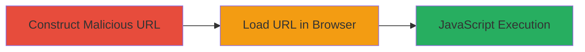

---
tags:
  - xss
  - reflected-xss
  - javascript-injection
  - uber
  - web-vulnerability
type: attack_chain
tools:
  - '[[tools/Firefox-Browser]]'
tactics:
  - '[[Initial Access]]'
  - '[[Execution]]'
verified: false
platforms:
  - Web
submitted: true
complexity: low
created_at: '2023-10-01T00:00:00Z'
procedures:
  - '[[procedures/Construct-Malicious-URL-for-Reflected-XSS]]'
  - '[[procedures/Trigger-XSS-by-Loading-Malicious-URL]]'
step_count: 2
techniques:
  - '[[Exploit Public-Facing Application]]'
  - '[[JavaScript]]'
updated_at: '2025-12-14T03:16:31.062Z'
description: >-
  A multi-stage attack demonstrating reflected XSS on Uber's careers page by
  injecting JavaScript into the 'city' GET parameter, leading to arbitrary code
  execution in the victim's browser.
skill_level: beginner
impact_level: medium
id: f540cf56-9f5a-4aee-a589-f5406998ca20
validated: true
mitre_tactics:
  - '[[Initial Access]]'
  - '[[Execution]]'
mitre_techniques:
  - '[[Exploit Public-Facing Application]]'
  - '[[JavaScript]]'
---
# Reflected XSS Exploitation via City Parameter on Uber Careers Page

Multi-stage attack chain demonstrating a complete reflected XSS workflow on Uber's careers page.

## Chain Metrics Dashboard

| Metric | Value |
|--------|-------|
| Chain Status | Unverified |
| Total Steps | 2 |
| Execution Time | ~1 minute |
| Skill Level | Beginner |
| Complexity | Low |
| Impact Level | Medium |

## Attack Flow Visualization

## Prerequisites & Requirements

### Required Tools

- [[tools/Firefox-Browser]]

### Target Environment

- Web platform
- Access to Uber's careers page at www.uber.com/careers/list/
- No special services or ports required

### Initial Access Requirements

- Public internet access
- No credentials needed
- Victim must visit the malicious URL

## Detailed Attack Procedures

### Step 1: Construct Malicious URL
procedure: [[procedures/Construct-Malicious-URL-for-Reflected-XSS]]

**Objective**: Create a URL with a JavaScript payload injected into the 'city' GET parameter to bypass sanitization and enable reflection.

**Instructions**: Manually append the payload `</script>` to the base 'city' value 'allicg', resulting in the full parameter `city=allicg</script>fupaiiz`. Combine with other parameters like `country=all&keywords=&subteam=all&team=all` to form the complete URL: `https://www.uber.com/careers/list/?city=allicg</script>fupaiiz&country=all&keywords=&subteam=all&team=all`.

**Expected Output**: A valid URL that, when loaded, reflects the injected script without sanitization.

**Success Indicators**:
- URL constructed without syntax errors
- Payload visible in the parameter string

### Step 2: Trigger XSS by Loading Malicious URL
procedure: [[procedures/Trigger-XSS-by-Loading-Malicious-URL]]

**Objective**: Load the crafted URL in a web browser to execute the injected JavaScript, demonstrating the vulnerability.

**Instructions**: Open the malicious URL in [[tools/Firefox-Browser]] (version 44.0.2 or similar). The page will load, and the script will execute automatically.

**Expected Output**: An alert box pops up displaying 'xss by pavanw3b' upon page load.

**Success Indicators**:
- Alert box appears confirming JavaScript execution
- No errors in browser console related to script blocking

## Attack Chain Summary

### Key Achievements

1. Successful injection of JavaScript payload into the 'city' parameter
2. Reflection and execution of arbitrary code in the browser context
3. Demonstration of potential for phishing, defacement, or credential theft

## Technique & Tactic Coverage

### MITRE ATT&CK Techniques

- [[Exploit Public-Facing Application]]
- [[JavaScript]]

### MITRE ATT&CK Tactics

- [[Initial Access]]
- [[Execution]]

---
*Last updated: 2023-10-01T00:00:00Z*
