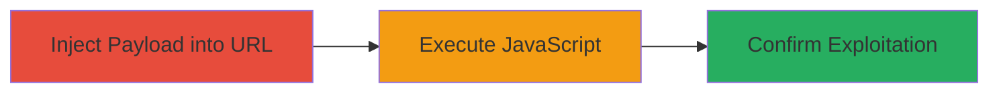

---
tags:
  - xss
  - reflected-xss
  - javascript-injection
  - web-vulnerability
  - dod
type: attack_chain
tools: []
tactics:
  - '[[Initial Access]]'
  - '[[Execution]]'
verified: false
platforms:
  - Web
submitted: true
complexity: low
created_at: '2024-01-01T00:00:00Z'
procedures:
  - '[[procedures/Inject-JavaScript-Payload-for-Reflected-XSS]]'
step_count: 2
techniques:
  - '[[Exploit Public-Facing Application]]'
  - '[[JavaScript]]'
updated_at: '2025-12-14T03:16:20.076Z'
description: >-
  A multi-step attack chain exploiting a reflected XSS vulnerability in a URL
  parameter on a U.S. Department of Defense website, allowing arbitrary
  JavaScript execution in the victim's browser.
skill_level: beginner
impact_level: high
id: 84f17e9f-4b98-4218-9620-99e1c0a73f5d
validated: true
mitre_tactics:
  - '[[Initial Access]]'
  - '[[Execution]]'
mitre_techniques:
  - '[[Exploit Public-Facing Application]]'
  - '[[JavaScript]]'
---
# Reflected XSS Exploitation via Crafted JavaScript Payload in DoD Website URL Parameter

Multi-stage attack chain demonstrating a complete reflected XSS workflow on a U.S. Department of Defense website.

A reflected cross-site scripting (XSS) vulnerability exists in a URL parameter, allowing attackers to inject and execute arbitrary JavaScript code in the victim's browser by crafting a payload that bypasses the web application firewall (WAF). This can lead to session hijacking, phishing, or data theft.

## Chain Metrics Dashboard

| Metric | Value |
|--------|-------|
| Chain Status | Unverified |
| Total Steps | 2 |
| Execution Time | ~1 minute |
| Skill Level | Beginner |
| Complexity | Low |
| Impact Level | High |

## Attack Flow Visualization



## Prerequisites & Requirements

### Required Tools

- Web browser (e.g., Chrome, Firefox)

### Target Environment

- Web platform
- Publicly accessible DoD website at https://www.██████████/█████
- No specific ports or services required beyond standard HTTP/HTTPS (ports 80/443)

### Initial Access Requirements

- Internet access
- No credentials needed for initial exploitation
- Victim must visit the malicious URL (e.g., via phishing)

## Detailed Attack Procedures

### Step 1: Inject Payload into Vulnerable URL Parameter

procedure: [[procedures/Inject-JavaScript-Payload-for-Reflected-XSS]]

**Objective**: Craft and inject a JavaScript payload into the URL parameter to bypass WAF and close an existing string context for code execution.

**Instructions**: Open a web browser and navigate directly to the vulnerable URL with the injected payload. The payload ">-20a")});a=alert;a(1);// closes a string literal, terminates any function or object, redefines 'a' as alert, and executes alert(1) to test execution.

Use the following URL (redacted for security):

```
https://www.██████████/█████?██████=-20a")});a=alert;a(1);//
```

In the redacted Unicode form for evasion testing:

```
https://www.xn--4zhaaa/%E2%96%88%E2%96%88%E2%96%88%E2%96%88%E2%96%88?%E2%96%88%E2%96%88%E2%96%88%E2%96%88%E2%96%88=-20a%22)%7D);a=alert;a(1);//
```

**Expected Output**: The page loads, and the payload executes immediately upon rendering.

**Success Indicators**:
- No WAF block or error page
- JavaScript begins executing in the browser context

### Step 2: Observe Payload Execution and Confirm Vulnerability

procedure: [[procedures/Inject-JavaScript-Payload-for-Reflected-XSS]]

**Objective**: Verify that the injected JavaScript runs in the victim's browser, confirming the reflected XSS.

**Instructions**: After navigating to the URL from Step 1, monitor the browser for execution signs. The payload triggers an alert box displaying '1', indicating successful injection and execution. In a real attack, replace alert(1) with malicious code like document.cookie to steal sessions.

Inspect the page source or use browser developer tools (F12) to confirm the payload reflection in the HTML without sanitization.

**Expected Output**: An alert popup with the value '1' appears, and the browser console may log any errors or additional execution details.

**Success Indicators**:
- Alert box pops up confirming JavaScript execution
- No sanitization; payload visible in reflected content
- Potential for further payloads to perform actions like session hijacking

## Attack Chain Summary

### Key Achievements

1. Bypassed WAF restrictions with a crafted payload closing string contexts
2. Achieved arbitrary JavaScript execution in the browser
3. Demonstrated potential for client-side attacks like session theft or phishing on a high-value DoD target

## Technique & Tactic Coverage

### MITRE ATT&CK Techniques

- [[Exploit Public-Facing Application]]
- [[JavaScript]]

### MITRE ATT&CK Tactics

- [[Initial Access]]
- [[Execution]]

---

*Last updated: 2024-01-01T00:00:00Z*
