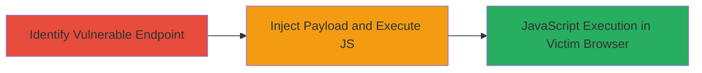

---
tags:
  - xss
  - reflected-xss
  - web-vulnerability
  - dod
type: attack_chain
tools: []
tactics:
  - '[[Initial Access]]'
  - '[[Execution]]'
verified: false
platforms:
  - Web
submitted: true
complexity: medium
created_at: '2023-10-05T12:00:00Z'
procedures:
  - '[[procedures/Identify-Reflected-XSS-Vulnerable-Parameter]]'
  - '[[procedures/Inject-Malicious-Payload-for-Reflected-XSS]]'
step_count: 2
techniques:
  - '[[Exploit Public-Facing Application]]'
  - '[[JavaScript]]'
updated_at: '2025-12-14T03:16:02.401Z'
description: >-
  A two-step attack chain exploiting a reflected XSS vulnerability in a URL
  parameter on a U.S. Department of Defense web system, allowing arbitrary
  JavaScript execution in the victim's browser.
skill_level: intermediate
impact_level: high
id: 477860ed-e64b-4d36-b2c9-9760ce902f70
validated: true
mitre_tactics:
  - '[[Initial Access]]'
  - '[[Execution]]'
mitre_techniques:
  - '[[Exploit Public-Facing Application]]'
  - '[[JavaScript]]'
---
# Reflected XSS Exploitation via Unsanitized Parameter on DoD Web Endpoint

Multi-stage attack chain demonstrating a complete attack workflow for exploiting reflected XSS on a public-facing DoD web endpoint.

## Chain Metrics Dashboard

| Metric | Value |
|--------|-------|
| Chain Status | Unverified |
| Total Steps | 2 |
| Execution Time | ~5 minutes |
| Skill Level | Intermediate |
| Complexity | Medium |
| Impact Level | High |

## Attack Flow Visualization

## Prerequisites & Requirements

### Required Tools

- Browser developer tools for manual testing
- [[tools/curl]] (optional for automated requests)

### Target Environment

- Web platform with public-facing endpoints
- No specific ports required (HTTP/HTTPS)
- Access to the target URL (e.g., https://target-dod-site.com)

### Initial Access Requirements

- No credentials needed (public endpoint)
- Direct network access to the web server
- No prior access required

## Detailed Attack Procedures

### Step 1: Identify Vulnerable Endpoint
procedure: [[procedures/Identify-Reflected-XSS-Vulnerable-Parameter]]

**Objective**: Locate the web endpoint and parameter that reflects user input without sanitization, confirming potential for XSS.

**Instructions**: Manually test the target URL by appending test strings to the parameter and observing if they are reflected in the response.

**Expected Output**: The injected string appears unsanitized in the HTML response, indicating reflection.

**Success Indicators**:
- Parameter value echoed back in page source
- No encoding or escaping applied to input

### Step 2: Exploit with Malicious Payload
procedure: [[procedures/Inject-Malicious-Payload-for-Reflected-XSS]]

**Objective**: Inject a JavaScript payload into the vulnerable parameter to execute arbitrary code in the browser context.

**Instructions**: URL-encode the payload and append it to the parameter. Visit the crafted URL in a browser to trigger execution.

**Expected Output**: Alert box displaying the document domain or execution of the script.

**Success Indicators**:
- JavaScript alert fires
- Potential for session data theft if payload is adapted (e.g., to exfiltrate cookies)

## Attack Chain Summary

### Key Achievements

1. Identified unsanitized parameter in DoD web endpoint
2. Successfully executed JavaScript via reflected XSS
3. Demonstrated potential for client-side attacks like session hijacking

## Technique & Tactic Coverage

### MITRE ATT&CK Techniques

- [[Exploit Public-Facing Application]]
- [[JavaScript]]

### MITRE ATT&CK Tactics

- [[Initial Access]]
- [[Execution]]

---
*Last updated: 2023-10-05T12:00:00Z*
