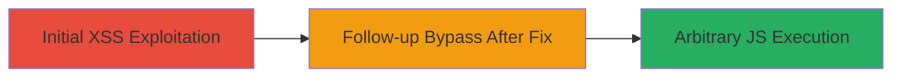

---
tags:
  - xss
  - reflected-xss
  - web-vuln
  - javascript-injection
type: attack_chain
tools:
  - '[[tools/Firefox]]'
tactics:
  - '[[Execution]]'
  - '[[Collection]]'
commands:
  - '[[commands/access-xss-poc-url]]'
  - '[[commands/access-backtick-xss-poc-url]]'
platforms:
  - Web
complexity: medium
procedures:
  - '[[procedures/Exploit-Reflected-XSS-via-utm_source]]'
  - '[[procedures/Bypass-Partial-XSS-Fix-with-Backticks]]'
step_count: 2
techniques:
  - '[[JavaScript]]'
description: >-
  Multi-stage exploitation of a reflected XSS vulnerability in the utm_source
  parameter on Glassdoor's employer page, including initial discovery and
  follow-up after insufficient fix.
skill_level: intermediate
impact_level: high
id: f4438b2c-7f77-4e49-ae59-c7888b9b9af6
created_at: '2025-12-11T06:10:28.668Z'
updated_at: '2025-12-11T06:10:28.668Z'
verified: false
validated: true
submitted: true
mitre_tactics:
  - '[[TA0002]]'
  - '[[TA0009]]'
mitre_techniques:
  - '[[T1059.007]]'
---
# Reflected XSS Exploitation via utm_source Parameter on Glassdoor

Multi-stage attack chain demonstrating the exploitation of a reflected cross-site scripting (XSS) vulnerability in the utm_source parameter on https://www.glassdoor.com/employers/sem-dual-lp/. The attack involves injecting URL-encoded payloads to bypass WAF and execute arbitrary JavaScript, potentially leading to session cookie theft, phishing, or actions on behalf of the user.

## Chain Metrics Dashboard

| Metric | Value |
|--------|-------|
| Chain Status | Unverified |
| Total Steps | 2 |
| Execution Time | ~5 minutes |
| Skill Level | Intermediate |
| Complexity | Medium |
| Impact Level | High |

## Attack Flow Visualization



## Prerequisites & Requirements

### Required Tools

- [[tools/Firefox]]

### Target Environment

- Web platform
- Glassdoor web application using JavaScript and jQuery
- Network access to https://www.glassdoor.com

### Initial Access Requirements

- No credentials required
- Direct access to the target URL

## Detailed Attack Procedures

### Step 1: Initial XSS Exploitation - [[procedures/Exploit-Reflected-XSS-via-utm_source]]

**Procedure**: [[procedures/Exploit-Reflected-XSS-via-utm_source]]

**Objective**: Trigger the reflected XSS by injecting a URL-encoded payload that closes jQuery functions and executes arbitrary JavaScript.

**Expected Output**: An alert box displaying 'xss' confirms successful execution.

**Success Indicators**:
- Alert box appears in the browser
- JavaScript executes in the page's context

First, access the POC URL using [[commands/access-xss-poc-url]] in [[tools/Firefox]]:

```bash
# Use browser to visit:
https://www.glassdoor.com/employers/sem-dual-lp/?utm_source=abc%60%3breturn+false%7d%29%3b%7d%29%3balert%60xss%60;%3c%2f%73%63%72%69%70%74%3e
```

This injects a payload that closes existing jQuery functions, executes alert('xss'), and closes the script tag.

### Step 2: Follow-up Bypass After Fix - [[procedures/Bypass-Partial-XSS-Fix-with-Backticks]]

**Procedure**: [[procedures/Bypass-Partial-XSS-Fix-with-Backticks]]

**Objective**: Demonstrate persisting vulnerability after initial fix by using backticks to close strings and inject JavaScript.

**Expected Output**: An alert box displaying '1' confirms the bypass.

**Success Indicators**:
- Alert box appears despite the fix
- Arbitrary JavaScript execution persists

After the initial fix, retest by accessing the updated POC URL using [[commands/access-xss-poc-url]] in [[tools/Firefox]]:

```bash
# Use browser to visit:
https://www.glassdoor.com/employers/sem-dual-lp/?utm_source=%60%2balert/**/(1)%2b%60
```

This uses backticks to close the string in JavaScript context and execute alert(1).

## Attack Chain Summary

### Key Achievements

1. Successful injection and execution of arbitrary JavaScript via reflected XSS
2. Bypass of initial remediation using alternative string closure with backticks
3. Potential for session hijacking, phishing, or user impersonation

## Technique & Tactic Coverage

### MITRE ATT&CK Techniques

- [[JavaScript]]

### MITRE ATT&CK Tactics

- [[Execution]]
- [[Collection]]

*Last updated: 2023-10-01*
