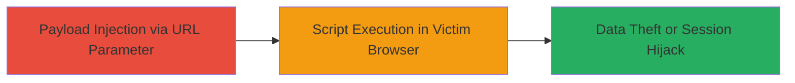

---
tags:
  - xss
  - reflected-xss
  - web-injection
type: attack_chain
tools: []
tactics:
  - '[[Execution]]'
commands:
  - '[[commands/curl-send-xss-payload]]'
platforms:
  - Web
complexity: low
procedures:
  - '[[procedures/Exploit-Reflected-XSS-in-Veris]]'
step_count: 1
techniques:
  - '[[JavaScript]]'
description: >-
  A single-stage attack exploiting a reflected cross-site scripting
  vulnerability in the Veris web application to inject and execute arbitrary
  JavaScript in a victim's browser.
skill_level: basic
impact_level: medium
id: e1c836d5-96b4-4726-9723-4a656cc66402
created_at: '2025-12-14T03:15:41.370Z'
updated_at: '2025-12-14T03:15:41.370Z'
verified: false
validated: true
submitted: true
mitre_tactics:
  - '[[Execution]]'
mitre_techniques:
  - '[[JavaScript]]'
---
# Reflected XSS Injection in Veris Web Application

## Overview

This attack chain demonstrates the exploitation of a reflected cross-site scripting (XSS) vulnerability in the Veris web application. The vulnerability allows attackers to inject malicious JavaScript payloads through unsanitized user input that is reflected back in the server's response. When a victim visits a crafted URL containing the payload, the script executes in their browser context, potentially enabling session hijacking, phishing, or data theft. The issue was reported via HackerOne (Report #174909) and assessed as medium severity, though closed as informative due to limited exploitability or prior awareness.

## Chain Metrics Dashboard

| Metric | Value |
|--------|-------|
| Chain Status | Unverified |
| Total Steps | 1 |
| Execution Time | ~1 minute |
| Skill Level | Basic |
| Complexity | Low |
| Impact Level | Medium |

## Attack Flow Visualization



## Prerequisites & Requirements

### Required Tools

- Web browser or proxy tool like Burp Suite for payload testing

### Target Environment

- Veris web application (public-facing web platform)
- No specific ports required beyond standard HTTP/HTTPS (80/443)
- Network access to the vulnerable endpoint

### Initial Access Requirements

- No credentials needed for reflected XSS (non-authenticated)
- Ability to craft and send HTTP requests to the target
- Victim interaction required (e.g., clicking a malicious link)

## Detailed Attack Procedures

### Step 1: Inject and Execute XSS Payload
procedure: [[procedures/Exploit-Reflected-XSS-in-Veris]]

**Objective**: Inject a malicious JavaScript payload into a reflected user input field to execute arbitrary code in the victim's browser.

**Instructions**: Identify a vulnerable endpoint where user input (e.g., a search parameter) is reflected without sanitization. Craft a URL with an XSS payload, such as `<script>alert('XSS')</script>`, and use [[commands/curl-send-xss-payload]] to test injection:

```bash
curl "https://veris.example.com/search?q=<script>alert('XSS')</script>" -v
```

Observe the response to confirm reflection. For exploitation, host the payload on a controllable domain or use a simple alert for proof-of-concept. Deliver the link to the victim via phishing or social engineering.

**Expected Output**: The server's response includes the unsanitized payload, and in a browser, it triggers script execution (e.g., alert popup).

**Success Indicators**:
- Payload reflected in HTML response without encoding
- JavaScript executes in browser (e.g., alert fires)
- Potential for cookie theft via `document.cookie` in payload

## Attack Chain Summary

### Key Achievements

1. Successful injection of JavaScript payload via reflected input
2. Execution of arbitrary code in victim browser context
3. Potential for session hijacking or data exfiltration

## Technique & Tactic Coverage

### MITRE ATT&CK Techniques

- [[JavaScript]]

### MITRE ATT&CK Tactics

- [[Execution]]

---
*Last updated: 2023-10-01*
