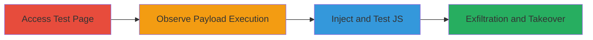

# Reflected XSS Regression in Shopify Linkpop for Arbitrary JavaScript Execution

Multi-stage attack chain demonstrating the discovery and exploitation of a reflected Cross-Site Scripting (XSS) vulnerability in Shopify's Linkpop service, which regressed after previous fixes due to recent website changes. The attack allows injection and execution of arbitrary JavaScript in victims' browsers, potentially leading to cookie exfiltration and account takeover.

## Chain Metrics Dashboard

| Metric | Value |
|--------|-------|
| Chain Status | Unverified |
| Total Steps | 3 |
| Execution Time | ~5 minutes |
| Skill Level | Intermediate |
| Complexity | Medium |
| Impact Level | High |

## Attack Flow Visualization

## Prerequisites & Requirements

### Required Tools

- [[tools/XSS-Hunter]]

### Target Environment

- Web platform
- Access to Linkpop URLs like https://linkpop.com/[username]
- No specific ports or services required beyond standard HTTP/HTTPS

### Initial Access Requirements

- Public access to Linkpop pages
- No credentials needed for initial discovery
- Prior knowledge of previously reported XSS payloads

## Detailed Attack Procedures

### Step 1: Access Test Page
procedure: [[procedures/Access-Linkpop-Test-Page-for-XSS-Reflection]]

**Objective**: Identify reflection of previously injected blind XSS payloads in unsanitized page content.

**Instructions**: Navigate to a known test page URL where an old payload was submitted. Inspect the page source to confirm reflection without sanitization.

**Expected Output**: Payload visible in HTML source, such as `">`.

**Success Indicators**:
- Payload reflected in page content
- No encoding or escaping applied to user input

### Step 2: Observe Payload Execution
procedure: [[procedures/Observe-Blind-XSS-Execution-with-XSS-Hunter]]

**Objective**: Confirm execution of the reflected blind XSS payload by monitoring external script loading and alerts.

**Instructions**: Load the page and observe if the external script triggers alerts via the monitoring tool. Check the tool's dashboard for incoming alerts.

**Expected Output**: Alert notification in XSS Hunter instance, confirming script execution.

**Success Indicators**:
- External script loaded successfully
- Alert received with execution details

### Step 3: Test JavaScript Injection
procedure: [[procedures/Test-JavaScript-Injection-in-Linkpop-Profile]]

**Objective**: Validate XSS by injecting code to close existing script tags and execute new JavaScript, demonstrating arbitrary code execution.

**Instructions**: Access a profile page and append the injection payload to the URL. Observe the resulting alert in the browser.

**Expected Output**: JavaScript alert box displaying '1' or custom message.

**Success Indicators**:
- Alert triggered in browser
- Confirmation of script tag closure and new injection

## Attack Chain Summary

### Key Achievements

1. Discovered regression in fixed XSS vulnerability
2. Confirmed blind XSS execution via external monitoring
3. Demonstrated direct JavaScript injection for immediate impact

## Technique & Tactic Coverage

### MITRE ATT&CK Techniques

- [[JavaScript]]

### MITRE ATT&CK Tactics

- [[Execution]]

---
*Last updated: 2023-10-01T00:00:00Z*
