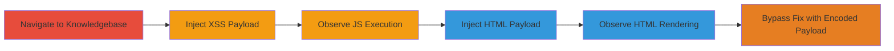

---
tags:
  - xss
  - reflected-xss
  - html-injection
  - phishing
  - cookie-theft
type: attack_chain
tools: []
tactics:
  - '[[Execution]]'
  - '[[Collection]]'
verified: false
platforms:
  - Web
submitted: true
complexity: medium
created_at: '2023-10-01T00:00:00Z'
procedures:
  - '[[procedures/Inject-Reflected-XSS-in-Search-Box]]'
  - '[[procedures/Inject-HTML-for-Phishing-in-Search-Box]]'
  - '[[procedures/Bypass-HTML-Escaping-with-Encoded-Payload]]'
step_count: 6
techniques:
  - '[[Exploit Public-Facing Application]]'
  - '[[JavaScript]]'
updated_at: '2025-12-13T23:52:55.029Z'
description: >-
  Multi-stage demonstration of reflected XSS and HTML injection vulnerabilities
  in the search box of pressable.com's knowledgebase, enabling JavaScript
  execution for cookie theft and arbitrary HTML rendering for phishing attacks.
skill_level: intermediate
impact_level: high
id: 578b1bb9-dce6-49f1-be35-0e7e8826c2f5
validated: true
mitre_tactics:
  - '[[Execution]]'
  - '[[Collection]]'
mitre_techniques:
  - '[[Exploit Public-Facing Application]]'
  - '[[JavaScript]]'
---
---

# Reflected XSS and HTML Injection in Pressable Knowledgebase Search Box

Multi-stage attack chain demonstrating reflected XSS and HTML injection in the search functionality of pressable.com's knowledgebase, allowing attackers to execute JavaScript for stealing user cookies and render arbitrary HTML for phishing links that could compromise credentials.

## Chain Metrics Dashboard

| Metric | Value |
|--------|-------|
| Chain Status | Unverified |
| Total Steps | 6 |
| Execution Time | ~5 minutes |
| Skill Level | Intermediate |
| Complexity | Medium |
| Impact Level | High |

## Attack Flow Visualization

## Prerequisites & Requirements

### Required Tools

- Web browser (e.g., Chrome with developer tools)

### Target Environment

- Web platform
- Access to https://pressable.com/knowledgebase/
- No authentication required

### Initial Access Requirements

- Public internet access
- No credentials needed
- Victim must interact with the reflected content (e.g., visit search results)

## Detailed Attack Procedures

### Step 1: Navigate to Knowledgebase

**Objective**: Access the vulnerable search functionality to begin testing.

**Instructions**: Open a web browser and visit the knowledgebase page.

**Expected Output**: The knowledgebase homepage loads with a search box visible.

**Success Indicators**:
- Page loads successfully at https://pressable.com/knowledgebase/
- Search box is present and functional

### Step 2: Inject XSS Payload

procedure: [[procedures/Inject-Reflected-XSS-in-Search-Box]]

**Objective**: Inject a crafted JavaScript payload into the search box to test for reflected XSS.

**Instructions**: Enter the payload "> into the search field, appending it to the URL parameters ?s= and post_type=knowledgebase. Submit the search.

**Expected Output**: The payload reflects in the search results page, triggering a JavaScript alert displaying the user's cookies.

**Success Indicators**:
- Alert box pops up with document.cookie contents
- JavaScript executes without errors

### Step 3: Observe JS Execution

**Objective**: Confirm the XSS vulnerability by verifying arbitrary code execution.

**Instructions**: After submission, inspect the page source or console for the reflected payload and executed script.

**Expected Output**: Reflected unsanitized input in the HTML, with onerror event firing the alert.

**Success Indicators**:
- Cookies are visible in the alert
- No sanitization prevents script execution

### Step 4: Inject HTML Payload

procedure: [[procedures/Inject-HTML-for-Phishing-in-Search-Box]]

**Objective**: Inject arbitrary HTML to render custom elements and links for phishing.

**Instructions**: Enter the payload <h1>Visit Our New WebSite </h1><h3><mark><a href="https://example.com">e x a m p l e . c o m </a></mark></h3> into the search field with ?s= and post_type=knowledgebase. Submit the search.

**Expected Output**: Custom HTML renders on the page, showing styled text and a clickable link to the malicious site.

**Success Indicators**:
- HTML tags are parsed and displayed with styling
- Link is functional and leads to the injected URL

### Step 5: Observe HTML Rendering

**Objective**: Verify that injected HTML is rendered without escaping, enabling visual manipulation.

**Instructions**: Inspect the rendered page to confirm HTML elements are active.

**Expected Output**: Page displays red heading, highlighted link, and arbitrary styling.

**Success Indicators**:
- Users could be tricked into clicking phishing links
- No escaping of tags or attributes

### Step 6: Bypass Partial Fix with Encoded Payload

procedure: [[procedures/Bypass-HTML-Escaping-with-Encoded-Payload]]

**Objective**: Test persistence of the vulnerability after a partial fix by using encoded payloads.

**Instructions**: After an initial fix attempt, input the escaped payload &lt;hr&gt;&lt;h1&gt;&lt;font Color=red&gt;Visit Our New WebSite &lt;/h1&gt;&lt;h3&gt;&lt;mark&gt;&lt;a href=&quot;https://example.com&quot;&gt;e x a m p l e . c o m &lt;/a&gt;&lt;/mark&gt;&lt;/h3&gt;&lt;hr&gt; into the search field with ?s= and post_type=knowledgebase. Submit.

**Expected Output**: The encoded HTML decodes and renders, bypassing the fix.

**Success Indicators**:
- HTML renders despite encoding
- Partial fix fails to prevent injection

## Attack Chain Summary

### Key Achievements

1. Successful execution of JavaScript via reflected XSS, stealing session cookies.
2. Rendering of phishing HTML links to divert users to malicious sites.
3. Bypassing a partial security fix using HTML entity encoding.

## Technique & Tactic Coverage

### MITRE ATT&CK Techniques

- [[Exploit Public-Facing Application]]
- [[JavaScript]]

### MITRE ATT&CK Tactics

- [[Execution]]
- [[Collection]]

---

*Last updated: 2023-10-01T00:00:00Z*
