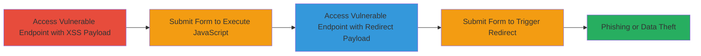

---
tags:
  - xss
  - reflected-xss
  - open-redirect
  - phishing
type: attack_chain
tools: []
tactics:
  - '[[Execution]]'
  - '[[Initial Access]]'
commands: []
platforms:
  - Web
complexity: low
procedures:
  - '[[procedures/Demonstrate-Reflected-XSS-via-Endpoint-Parameter]]'
  - '[[procedures/Exploit-Open-Redirect-via-Endpoint-Parameter]]'
step_count: 4
techniques:
  - '[[JavaScript]]'
  - '[[Drive-by Compromise]]'
description: >-
  A multi-stage attack demonstrating reflected XSS and open redirect
  vulnerabilities in the endpoint parameter of the Informatica Cloud Chat
  application, allowing JavaScript execution and unauthorized redirects for
  phishing.
skill_level: beginner
impact_level: high
id: 430e3acb-f58a-4a18-ab31-cd46a0f12967
created_at: '2025-12-14T03:16:30.809Z'
updated_at: '2025-12-14T03:16:30.809Z'
verified: false
validated: true
submitted: true
mitre_tactics:
  - '[[Execution]]'
  - '[[Initial Access]]'
mitre_techniques:
  - '[[JavaScript]]'
  - '[[Drive-by Compromise]]'
---
# Reflected XSS and Open Redirect via Endpoint Parameter in Informatica Cloud Chat

Multi-stage attack chain demonstrating reflected Cross-Site Scripting (XSS) and Open Redirect vulnerabilities in the 'endpoint' parameter of https://parc.informatica.com/partners/apex/Cloud_chat, allowing arbitrary JavaScript execution and redirects to malicious sites for session hijacking, data theft, or phishing.

## Chain Metrics Dashboard

| Metric | Value |
|--------|-------|
| Chain Status | Unverified |
| Total Steps | 4 |
| Execution Time | ~2 minutes |
| Skill Level | Beginner |
| Complexity | Low |
| Impact Level | High |

## Attack Flow Visualization

## Prerequisites & Requirements

### Required Tools

- Web browser (e.g., Chrome, Firefox)

### Target Environment

- Web application at https://parc.informatica.com/partners/apex/Cloud_chat
- No specific services or ports required beyond standard HTTPS (443)
- Publicly accessible URL

### Initial Access Requirements

- No credentials required
- Direct network access to the internet
- No prior access needed

## Detailed Attack Procedures

### Step 1: Access Vulnerable Endpoint with XSS Payload
procedure: [[procedures/Demonstrate-Reflected-XSS-via-Endpoint-Parameter]]

**Objective**: Inject a JavaScript payload into the endpoint parameter to test for reflected XSS.

**Instructions**: Open a web browser and navigate to the URL with the malicious payload in the endpoint parameter. For example, append `?endpoint=javascript:alert(document.domain)` to the base URL.

**Expected Output**: The page loads with the payload reflected in the form or content, ready for submission.

**Success Indicators**:
- Payload appears in the page source or form field without sanitization
- No immediate error or blocking occurs

### Step 2: Submit Form to Execute JavaScript
procedure: [[procedures/Demonstrate-Reflected-XSS-via-Endpoint-Parameter]]

**Objective**: Trigger the reflected XSS by submitting the form, executing arbitrary JavaScript in the victim's browser context.

**Instructions**: On the loaded page, fill out any required form fields if necessary and submit the form. The payload should execute, popping an alert with the document domain.

**Expected Output**: An alert box displays the domain (e.g., 'parc.informatica.com'), confirming JavaScript execution.

**Success Indicators**:
- Alert executes successfully
- Browser console shows no errors blocking the script

### Step 3: Access Vulnerable Endpoint with Open Redirect Payload
procedure: [[procedures/Exploit-Open-Redirect-via-Endpoint-Parameter]]

**Objective**: Inject an external URL into the endpoint parameter to test for open redirect.

**Instructions**: In the web browser, navigate to the URL with an external domain in the endpoint parameter, such as `?endpoint=http://evil.com`.

**Expected Output**: The page loads, reflecting the external URL in the form or content.

**Success Indicators**:
- External URL is accepted and displayed without validation errors
- Page remains accessible

### Step 4: Submit Form to Trigger Redirect
procedure: [[procedures/Exploit-Open-Redirect-via-Endpoint-Parameter]]

**Objective**: Trigger the open redirect by submitting the form, sending the user to a malicious site.

**Instructions**: Submit the form on the page. The application should redirect to the specified external URL.

**Expected Output**: Browser redirects to http://evil.com (or the injected URL).

**Success Indicators**:
- Successful redirect to the external site
- No whitelist checks block the domain

## Attack Chain Summary

### Key Achievements

1. Successful execution of arbitrary JavaScript via reflected XSS, demonstrating potential for session hijacking or data theft.
2. Unauthorized redirect to external malicious sites, enabling phishing attacks.
3. Exploitation of unsanitized 'endpoint' parameter in a public-facing web application.

## Technique & Tactic Coverage

### MITRE ATT&CK Techniques

- [[JavaScript]]
- [[Drive-by Compromise]]

### MITRE ATT&CK Tactics

- [[Execution]]
- [[Initial Access]]

---
*Last updated: 2023-10-01T00:00:00Z*
