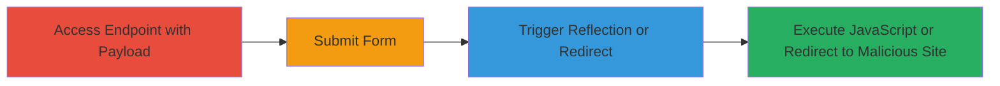

---
tags:
  - xss
  - open-redirect
  - javascript
  - phishing
  - web-vulnerability
type: attack_chain
tools: []
tactics:
  - '[[Execution]]'
  - '[[Initial Access]]'
verified: false
platforms:
  - Web
submitted: true
complexity: low
created_at: '2024-01-01T00:00:00Z'
procedures:
  - '[[procedures/Exploit-Reflected-XSS-via-Endpoint-Parameter]]'
  - '[[procedures/Exploit-Open-Redirect-via-Endpoint-Parameter]]'
step_count: 4
techniques:
  - '[[JavaScript]]'
  - '[[T1566.002]]'
updated_at: '2025-12-14T17:24:26.706Z'
description: >-
  A multi-stage attack exploiting unsanitized endpoint parameter in Cloud Chat
  to execute JavaScript or redirect to malicious sites, enabling session
  hijacking or phishing.
skill_level: low
impact_level: high
id: 161b5981-c71c-489d-8c45-7bb09d982303
validated: true
mitre_tactics:
  - '[[Execution]]'
  - '[[Initial Access]]'
mitre_techniques:
  - '[[JavaScript]]'
  - '[[T1566.002]]'
---
# Reflected XSS and Open Redirect via Endpoint Parameter in Informatica Cloud Chat

Multi-stage attack chain demonstrating exploitation of the 'endpoint' parameter in the Cloud Chat endpoint on parc.informatica.com for reflected XSS and open redirect.

## Chain Metrics Dashboard

| Metric | Value |
|--------|-------|
| Chain Status | Unverified |
| Total Steps | 4 |
| Execution Time | ~2 minutes |
| Skill Level | Low |
| Complexity | Low |
| Impact Level | High |

## Attack Flow Visualization

## Prerequisites & Requirements

### Required Tools

- Web browser (e.g., Chrome, Firefox)

### Target Environment

- Web platform
- Access to https://parc.informatica.com/partners/apex/Cloud_chat
- No authentication required for initial access

### Initial Access Requirements

- Public internet access
- No credentials needed
- Direct URL access to the endpoint

## Detailed Attack Procedures

### Step 1: Navigate to Vulnerable Endpoint with XSS Payload
procedure: [[procedures/Exploit-Reflected-XSS-via-Endpoint-Parameter]]

**Objective**: Inject a JavaScript payload into the endpoint parameter to test for reflection.

**Instructions**: Open a web browser and navigate to the URL with the XSS payload:

Access `https://parc.informatica.com/partners/apex/Cloud_chat?endpoint=javascript:alert(document.domain)`.

**Expected Output**: The page loads displaying a form, with the endpoint parameter value visible or processed.

**Success Indicators**:
- Page loads without errors
- Payload is reflected in the page source or form fields

### Step 2: Complete the Form on the Page
procedure: [[procedures/Exploit-Reflected-XSS-via-Endpoint-Parameter]]

**Objective**: Submit the form to trigger the reflection of the unsanitized input.

**Instructions**: Fill out any required fields in the form (e.g., name, message) and submit it. The backend processes the endpoint parameter during submission.

**Expected Output**: Form submission redirects or reloads the page, processing the endpoint.

**Success Indicators**:
- Form submits successfully
- No validation errors on the endpoint parameter

### Step 3: Observe XSS Execution
procedure: [[procedures/Exploit-Reflected-XSS-via-Endpoint-Parameter]]

**Objective**: Verify that the JavaScript payload executes in the victim's browser context.

**Instructions**: After submission, monitor the browser for execution of the alert box showing the document domain.

**Expected Output**: A JavaScript alert pops up displaying the domain (e.g., parc.informatica.com).

**Success Indicators**:
- Alert box appears
- JavaScript executes without blocking

### Step 4: Test Open Redirect with External URL
procedure: [[procedures/Exploit-Open-Redirect-via-Endpoint-Parameter]]

**Objective**: Inject an external URL to test for unrestricted redirection.

**Instructions**: Navigate to `https://parc.informatica.com/partners/apex/Cloud_chat?endpoint=http://evil.com` in the browser, then complete and submit the form as in previous steps.

**Expected Output**: The browser redirects to http://evil.com after form submission.

**Success Indicators**:
- Automatic redirect to the external site
- No domain restrictions enforced

## Attack Chain Summary

### Key Achievements

1. Successful injection and execution of arbitrary JavaScript via reflected XSS, allowing potential session hijacking or data theft.
2. Unrestricted redirection to external malicious sites, enabling phishing or malware delivery.
3. Demonstration of chained impacts like stealing cookies or bypassing security controls.

## Technique & Tactic Coverage

### MITRE ATT&CK Techniques

- [[JavaScript]]
- [[T1566.002]]

### MITRE ATT&CK Tactics

- [[Execution]]
- [[Initial Access]]

---
*Last updated: 2024-01-01T00:00:00Z*
