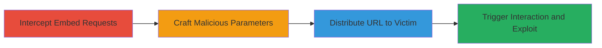

# Reflected XSS and Open Redirect via Malicious JWPlayer Configuration in Udemy Video Embed

Multi-stage attack chain demonstrating exploitation of Udemy's video embedding feature using JWPlayer 6, where unvalidated URL parameters allow attackers to inject malicious configurations for clickable logos that trigger JavaScript execution or redirects, primarily affecting Firefox and Opera users tricked into clicking disguised play buttons.

## Chain Metrics Dashboard

| Metric | Value |
|--------|-------|
| Chain Status | Unverified |
| Total Steps | 4 |
| Execution Time | ~5 minutes |
| Skill Level | Intermediate |
| Complexity | Medium |
| Impact Level | High |

## Attack Flow Visualization

## Prerequisites & Requirements

### Required Tools

- [[tools/Browser-Developer-Tools]]
- [[tools/JWPlayer-Configuration-Manual]]

### Target Environment

- Web platform with Udemy course pages
- Access to JWPlayer 6 embed endpoints
- No specific ports required; operates over HTTPS

### Initial Access Requirements

- Public access to Udemy course pages
- No credentials needed for embed testing
- Victim must be on Firefox or Opera for optimal impact

## Detailed Attack Procedures

### Step 1: Intercept and Analyze JWPlayer Embed Requests
procedure: [[procedures/Intercept-and-Analyze-JWPlayer-Embed-Requests]]

**Objective**: Identify the vulnerable JWPlayer embed endpoint and understand parameter passing to the player configuration.

**Instructions**: Open a Udemy course page in the browser, such as https://www.udemy.com/overview-of-big-data-hadoop/, and use developer tools to intercept network requests. Look for requests to /embed/video/ endpoints and examine the params[vars][playlist] parameters.

**Expected Output**: Captured request showing parameters like params[vars][playlist][0][image] being passed directly to JWPlayer setup.

**Success Indicators**:
- Embed URL identified, e.g., https://www.udemy.com/embed/video/E0IfdVtaQngT/?params[vars][playlist][0][image]=https://dujk9xa5fr1wz.cloudfront.net/course/750x422/211248_71a0_4.jpg
- Confirmation of unvalidated parameter injection

### Step 2: Craft Malicious JWPlayer Logo Parameters
procedure: [[procedures/Craft-Malicious-JWPlayer-Logo-Parameters]]

**Objective**: Modify the embed URL to inject a malicious logo configuration that overlays a clickable element for XSS or redirect.

**Instructions**: Append JWPlayer configuration parameters to the URL, such as params[vars][abouttext]=Play&params[vars][controls]=false&params[vars][logo][file]=https://dujk9xa5fr1wz.cloudfront.net/course/750x422/211248_71a0_4.jpg&params[vars][logo][link]=data:text/html;base64,PHNjcmlwdD5hbGVydCgiSGVsbG8iKTs8L3NjcmlwdD4=. Reference the JWPlayer manual for valid options.

**Expected Output**: A modified URL ready for distribution, resembling a legitimate video embed but with hidden malicious payload.

**Success Indicators**:
- URL parses without errors
- Logo parameter accepts data: URI for JS payload

### Step 3: Distribute Malicious Embed URL
procedure: [[procedures/Distribute-Malicious-Embed-URL]]

**Objective**: Deliver the crafted URL to the victim to load the tampered video player.

**Instructions**: Share the full malicious URL via email, social media, or phishing, e.g., https://www.udemy.com/embed/video/E0IfdVtaQngT/?params[vars][abouttext]=Play&params[vars][controls]=false&params[vars][width]=750&params[vars][height]=422&params[vars][logo][file]=https://dujk9xa5fr1wz.cloudfront.net/course/750x422/211248_71a0_4.jpg&params[vars][logo][link]=data:text/html;base64,PHNjcmlwdD5hbGVydCgiSGVsbG8iKTs8L3NjcmlwdD4=&params[trackVideoPlay]=true&xdm_e=https://www.udemy.com/overview-of-big-data-hadoop/&xdm_c=default2455&xdm_p=4.

**Expected Output**: Victim receives and clicks the link, loading the embed in their browser.

**Success Indicators**:
- Victim accesses the URL
- Player loads with disguised play button overlay

### Step 4: Trigger Exploitation via Victim Interaction
procedure: [[procedures/Trigger-Exploitation-via-Victim-Interaction]]

**Objective**: Cause the victim to interact with the malicious logo, executing the XSS or redirect payload.

**Instructions**: The victim clicks the disguised logo (appearing as a play button), which opens about:blank and executes the base64-encoded JavaScript like alert('Hello') or redirects to an external site.

**Expected Output**: JavaScript alert pops up or browser redirects to attacker-controlled site.

**Success Indicators**:
- Alert dialog appears in victim's browser
- Redirection to phishing site occurs

## Attack Chain Summary

### Key Achievements

1. Successful interception and analysis of vulnerable JWPlayer parameters
2. Crafting of a clickable malicious logo for payload delivery
3. Victim interaction leading to XSS execution or open redirect
4. Potential for session hijacking or phishing escalation

## Technique & Tactic Coverage

### MITRE ATT&CK Techniques

- [[JavaScript]]
- [[Drive-by Compromise]]

### MITRE ATT&CK Tactics

- [[Execution]]
- [[Initial Access]]

---

*Last updated: 2023-10-01T12:00:00Z*
