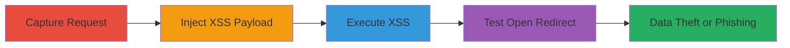

# Reflected XSS and Open Redirect via X-Forwarded-Host Header on Omise Website

Multi-stage attack chain demonstrating exploitation of reflected XSS and open redirect vulnerabilities through the X-Forwarded-Host HTTP header on https://www.omise.co/. The server unsafely reflects header input into responses, allowing JavaScript injection to steal sensitive data like cookies and enabling redirects to malicious sites for phishing.

## Chain Metrics Dashboard

| Metric | Value |
|--------|-------|
| Chain Status | Unverified |
| Total Steps | 4 |
| Execution Time | ~5 minutes |
| Skill Level | Intermediate |
| Complexity | Medium |
| Impact Level | High |

## Attack Flow Visualization

## Prerequisites & Requirements

### Required Tools

- [[tools/Burp-Suite]]

### Target Environment

- Web platform
- Access to https://www.omise.co/
- No specific ports or services beyond standard HTTP/HTTPS (ports 80/443)

### Initial Access Requirements

- Direct network access to the target website
- No credentials required for initial request interception
- Burp Suite proxy configured in browser

## Detailed Attack Procedures

### Step 1: Capture Initial HTTP Request
procedure: [[procedures/Capture-HTTP-Request-with-Burp-Suite]]

**Objective**: Intercept the initial GET request to the homepage to prepare for header manipulation.

**Instructions**: Configure your browser to route traffic through Burp Suite's proxy, then navigate to https://www.omise.co/ and enable Intercept to capture the request.

**Expected Output**: Captured GET request in Burp Suite's Intercept tab, including standard headers like Host: www.omise.co.

**Success Indicators**:
- Request successfully intercepted
- Target URL visible in the request

### Step 2: Inject XSS Payload into X-Forwarded-Host Header
procedure: [[procedures/Inject-XSS-Payload-into-X-Forwarded-Host]]

**Objective**: Modify the captured request by adding a malicious X-Forwarded-Host header to inject JavaScript.

**Instructions**: Forward the captured request to Repeater in Burp Suite, then add the custom header below the existing Host header: X-Forwarded-Host: bing.com'>.

**Expected Output**: Modified request ready in Repeater with the injected payload.

**Success Indicators**:
- Header successfully added without syntax errors
- Payload visible in the request viewer

### Step 3: Execute and Verify XSS Payload
procedure: [[procedures/Execute-and-Verify-XSS-Payload]]

**Objective**: Send the modified request to trigger the reflected XSS and confirm execution by observing the alert.

**Instructions**: From Repeater, send the request and inspect the response for reflection of the payload, which should execute the onerror handler to display an alert with document.cookie.

**Expected Output**: Response body containing the reflected payload, triggering a JavaScript alert box showing cookie data.

**Success Indicators**:
- Alert box pops up in the browser
- Cookie information displayed, confirming data access

### Step 4: Test Open Redirect
procedure: [[procedures/Test-Open-Redirect-via-X-Forwarded-Host]]

**Objective**: Demonstrate open redirect by simplifying the payload to an external domain and observing redirection during user flows like sign-in.

**Instructions**: Repeat the capture and modification but set X-Forwarded-Host: bing.com, then forward the request and interact with elements like 'Sign in' to trigger the redirect.

**Expected Output**: Browser redirects to the external site (e.g., bing.com) instead of the intended Omise page.

**Success Indicators**:
- Successful redirection to external domain
- No validation blocking the external host

## Attack Chain Summary

### Key Achievements

1. Successful injection and execution of arbitrary JavaScript via reflected XSS in the X-Forwarded-Host header.
2. Theft of sensitive data such as cookies and session tokens.
3. Exploitation of open redirect to facilitate phishing by pointing users to malicious external sites.

## Technique & Tactic Coverage

### MITRE ATT&CK Techniques

- [[JavaScript]]
- [[Drive-by Compromise]]
- [[Exploit Public-Facing Application]]

### MITRE ATT&CK Tactics

- [[Execution]]
- [[Initial Access]]
- [[Collection]]

---
*Last updated: 2023-10-01T12:00:00Z*
