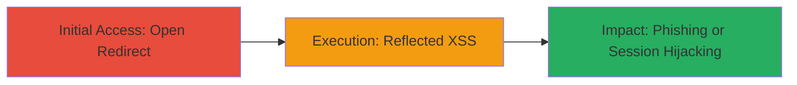

---
tags:
  - xss
  - open-redirect
  - reflected-xss
  - phishing
  - session-hijacking
type: attack_chain
tools: []
tactics:
  - '[[Initial Access]]'
  - '[[Execution]]'
verified: false
platforms:
  - Web
submitted: true
complexity: low
created_at: '2023-10-01T00:00:00Z'
procedures:
  - '[[procedures/Exploit-Open-Redirect-via-back_uri]]'
  - '[[procedures/Exploit-Reflected-XSS-via-back_uri]]'
step_count: 2
techniques:
  - '[[Drive-by Compromise]]'
  - '[[JavaScript]]'
updated_at: '2025-12-14T17:24:34.602Z'
description: >-
  Exploits a reflected XSS and open redirect in the back_uri parameter of
  larksuite.com, enabling JavaScript execution for session hijacking and
  redirection for phishing attacks.
skill_level: beginner
impact_level: high
id: b3cf1bf7-56cd-42d4-a8b6-70ecc4819f59
validated: true
mitre_tactics:
  - '[[Initial Access]]'
  - '[[Execution]]'
mitre_techniques:
  - '[[Drive-by Compromise]]'
  - '[[JavaScript]]'
---
---

# Reflected XSS and Open Redirect via back_uri Parameter on larksuite.com

Multi-stage attack chain demonstrating exploitation of vulnerabilities in the back_uri parameter on larksuite.com for phishing and JavaScript execution.

## Chain Metrics Dashboard

| Metric | Value |
|--------|-------|
| Chain Status | Unverified |
| Total Steps | 2 |
| Execution Time | ~1 minutes |
| Skill Level | Beginner |
| Complexity | Low |
| Impact Level | High |

## Attack Flow Visualization



## Prerequisites & Requirements

### Required Tools

- Web browser (e.g., Chrome, Firefox)
- [[commands/curl-open-redirect-test]]
- [[commands/curl-reflected-xss-test]]

### Target Environment

- Platform: Web application (larksuite.com)
- Required services/ports: HTTP/HTTPS on port 80/443
- Network access requirements: Public internet access to larksuite.com

### Initial Access Requirements

- No credentials required
- Direct network access to the target URL
- No prior access needed

## Detailed Attack Procedures

### Step 1: Exploit Open Redirect
procedure: [[procedures/Exploit-Open-Redirect-via-back_uri]]

**Objective**: Redirect the victim to an arbitrary external site, enabling phishing attacks by tricking users into visiting malicious domains.

**Instructions**: Construct a URL with the back_uri parameter set to a malicious domain. Use a browser to visit the URL or test with curl to follow the redirect:

First, test the redirect using [[commands/curl-open-redirect-test]]:

```bash
curl -L "https://larksuite.com/?back_uri=https://evil.com"
```

Then, in a browser, navigate to the crafted URL to confirm the redirect occurs without validation.

**Expected Output**: The response follows the redirect to the specified external URL (e.g., HTTP 302 to evil.com).

**Success Indicators**:
- Browser or curl output shows redirection to the arbitrary URL
- No error or blocking occurs on the redirect

### Step 2: Exploit Reflected XSS
procedure: [[procedures/Exploit-Reflected-XSS-via-back_uri]]

**Objective**: Inject and execute JavaScript in the victim's browser by reflecting unescaped user input from the back_uri parameter, leading to potential session hijacking or data theft.

**Instructions**: Craft a URL with a JavaScript payload in the back_uri parameter, URL-encoded to bypass basic filters. Test reflection using curl, then execute in a browser:

Use [[commands/curl-reflected-xss-test]] to verify reflection:

```bash
curl "https://larksuite.com/?back_uri=%22%3E%3Cscript%3Ealert(1)%3C/script%3E"
```

Look for the reflected payload in the HTML output. In a browser, visit the URL to trigger JS execution.

**Expected Output**: HTML response contains the unescaped payload (e.g., "><script>alert(1)</script>); browser alert pops up on visit.

**Success Indicators**:
- Payload reflected without HTML escaping in the page source
- JavaScript executes (e.g., alert dialog appears)

## Attack Chain Summary

### Key Achievements

1. Successful open redirect to external malicious site for phishing setup
2. Injection and execution of JavaScript via reflected XSS for client-side attacks
3. Potential for combined impact: Use redirect to deliver XSS payload to victims

## Technique & Tactic Coverage

### MITRE ATT&CK Techniques

- [[Drive-by Compromise]]
- [[JavaScript]]

### MITRE ATT&CK Tactics

- [[Initial Access]]
- [[Execution]]

---

*Last updated: 2023-10-01T00:00:00Z*
