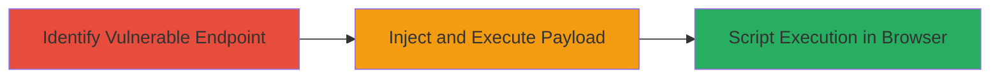

# Reflected XSS in 8x8 Beta Chat API for Malicious Script Execution

Multi-stage attack chain demonstrating a complete attack workflow.

## Chain Metrics Dashboard

| Metric | Value |
|--------|-------|
| Chain Status | Unverified |
| Total Steps | 1 |
| Execution Time | ~5 minutes |
| Skill Level | Intermediate |
| Complexity | Medium |
| Impact Level | Medium |

## Attack Flow Visualization



## Prerequisites & Requirements

### Required Tools

- Web browser (e.g., Chrome Developer Tools)
- Proxy tool like [[tools/Burp-Suite]] for payload testing

### Target Environment

- Web platform
- Access to 8x8.com subdomain hosting beta chat API
- No specific ports required beyond standard HTTPS (443)

### Initial Access Requirements

- Public access to the chat API endpoint
- No credentials needed for reflected XSS
- Victim must interact with the malicious link

## Detailed Attack Procedures

### Step 1: Exploit Reflected XSS
procedure: [[procedures/Exploit-Reflected-XSS-in-Chat-API]]

**Objective**: Inject a malicious script payload into the reflected input of the beta chat API to execute JavaScript in the victim's browser, enabling data theft or session manipulation.

**Instructions**: Identify the vulnerable parameter in the chat API endpoint (e.g., a search or message field that reflects user input without sanitization). Craft a URL with a JavaScript payload and send it to the victim. Use [[commands/curl-xss-payload-test]] to verify reflection:

```bash
curl -X GET "https://subdomain.8x8.com/chat/api?query=<script>alert('XSS')</script>" -v
```

Monitor the response for the unsanitized payload. If reflected, deliver the payload via phishing or social engineering to the victim.

**Expected Output**: The payload appears in the browser without encoding, triggering script execution (e.g., alert popup or console log).

**Success Indicators**:
- Payload reflected in response without sanitization
- JavaScript executes in victim's browser (e.g., alert fires)
- Potential access to session cookies via further payload refinement

## Attack Chain Summary

### Key Achievements

1. Successful identification of reflected input in chat API
2. Execution of arbitrary JavaScript in user browsers
3. Potential for medium-impact attacks like session theft (CVSS 6.4)

## Technique & Tactic Coverage

### MITRE ATT&CK Techniques

- [[JavaScript]]

### MITRE ATT&CK Tactics

- [[Execution]]
- [[Collection]]

---
*Last updated: 2023-10-01T00:00:00Z*
