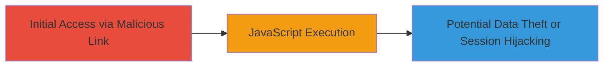

---
tags:
  - xss
  - reflected-xss
  - web-vulnerability
type: attack_chain
tools: []
tactics:
  - '[[Execution]]'
verified: false
platforms:
  - Web
submitted: true
complexity: low
created_at: '2023-10-01T00:00:00Z'
procedures:
  - '[[procedures/Exploit-Reflected-XSS-via-Tenant-Parameter]]'
step_count: 1
techniques:
  - '[[JavaScript]]'
updated_at: '2025-12-14T03:46:26.701Z'
description: >-
  A reflected Cross-site Scripting vulnerability in the password reset page of
  the 8x8 managers portal for VCC, exploiting the unencoded 'tenant' parameter
  to execute arbitrary JavaScript.
skill_level: beginner
impact_level: high
id: f22cac94-fd27-42c7-9b5a-344373a5f178
validated: true
mitre_tactics:
  - '[[Execution]]'
mitre_techniques:
  - '[[JavaScript]]'
---
# Reflected XSS in 8x8 VCC Managers Portal Password Reset

Multi-stage attack chain demonstrating a complete attack workflow.

## Chain Metrics Dashboard

| Metric | Value |
|--------|-------|
| Chain Status | Unverified |
| Total Steps | 1 |
| Execution Time | ~1 minutes |
| Skill Level | Beginner |
| Complexity | Low |
| Impact Level | High |

## Attack Flow Visualization



## Prerequisites & Requirements

### Required Tools

- Browser developer tools or proxy like Burp Suite for testing

### Target Environment

- Web platform
- 8x8 VCC Managers Portal password reset page
- Access to the 'tenant' parameter in the URL

### Initial Access Requirements

- Ability to craft and send a malicious URL to the victim
- Victim must click the link and visit the password reset page
- No prior credentials needed, as it's a public-facing page

## Detailed Attack Procedures

### Step 1: Exploit Reflected XSS
procedure: [[procedures/Exploit-Reflected-XSS-via-Tenant-Parameter]]

**Objective**: Inject and execute arbitrary JavaScript in the victim's browser by manipulating the 'tenant' parameter on the password reset page.

**Instructions**: Construct a URL with a malicious payload in the 'tenant' parameter, such as a script tag that alerts or steals data. For testing, use a simple payload like <script>alert('XSS')</script>. Send this URL to the victim via phishing or direct link. Upon visiting, the parameter is reflected without encoding, executing the JavaScript.

Use [[commands/curl-xss-test]] to verify the reflection server-side:

```bash
curl "https://portal.8x8.com/reset?tenant=%3Cscript%3Ealert('XSS')%3C%2Fscript%3E" -v
```

Then, in a browser, navigate to the crafted URL and check for execution in the developer console.

**Expected Output**: The page loads with the injected script reflected in the HTML, and JavaScript executes (e.g., alert popup or console log).

**Success Indicators**:
- Payload appears unencoded in the response HTML
- JavaScript executes in the browser context
- Potential for further actions like cookie theft if payload is advanced
