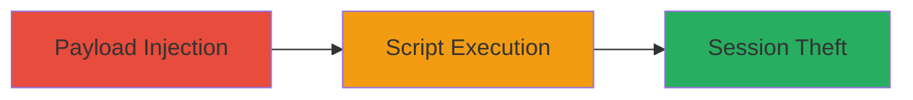

# Reflected XSS in 8x8.vc Account Setup for Session Hijacking

Multi-stage attack chain demonstrating exploitation of a reflected XSS vulnerability in the account setup workflow of the 8x8.vc web application.

## Chain Metrics Dashboard

| Metric | Value |
|--------|-------|
| Chain Status | Unverified |
| Total Steps | 1 |
| Execution Time | ~5 minutes |
| Skill Level | Intermediate |
| Complexity | Medium |
| Impact Level | High |

## Attack Flow Visualization

## Prerequisites & Requirements

### Required Tools

- Browser developer tools for payload testing
- Optional: Proxy tool like Burp Suite for request manipulation

### Target Environment

- Web platform
- Access to 8x8.vc account setup endpoint
- No specific ports or services required beyond standard HTTPS (443)

### Initial Access Requirements

- Public access to the web application
- Ability to craft and deliver malicious links (e.g., via phishing)
- No prior credentials needed for initial injection

## Detailed Attack Procedures

### Step 1: Exploit Reflected XSS
procedure: [[procedures/Inject-Malicious-Script-via-Reflected-XSS-in-Account-Setup]]

**Objective**: Inject a malicious JavaScript payload into the account setup workflow to execute arbitrary code in the victim's browser context, enabling session hijacking or data theft.

**Instructions**: Identify the vulnerable input field in the account setup form (likely a GET or POST parameter like 'name' or 'email'). Craft a payload such as `` and append it to the URL or form data. Deliver the link to the victim, who, upon interaction, triggers the reflection and execution.

For testing, navigate to the setup page and modify the input to include the payload. Observe the unsanitized reflection in the response.

**Expected Output**: The payload executes, displaying an alert with cookie data or performing other actions like sending data to an attacker-controlled server.

**Success Indicators**:
- Malicious script executes in the browser (e.g., alert pops up)
- Victim's session cookies are accessible or exfiltrated
- No sanitization errors or blocks occur

## Attack Chain Summary

### Key Achievements

1. Successful injection and reflection of malicious JavaScript
2. Execution of arbitrary code in the victim's browser
3. Potential theft of session data, leading to account takeover

## Technique & Tactic Coverage

### MITRE ATT&CK Techniques

- [[JavaScript]]

### MITRE ATT&CK Tactics

- [[Execution]]
- [[Collection]]

---
*Last updated: 2023-10-01T00:00:00Z*
